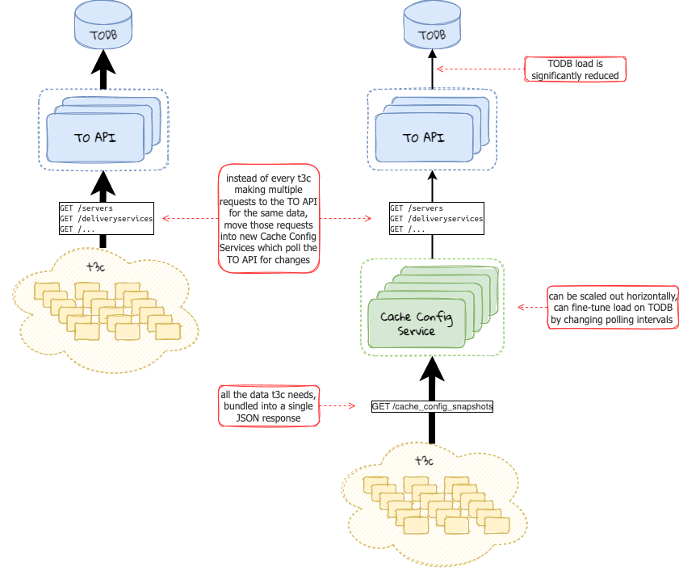

<!--
Licensed to the Apache Software Foundation (ASF) under one
or more contributor license agreements.  See the NOTICE file
distributed with this work for additional information
regarding copyright ownership.  The ASF licenses this file
to you under the Apache License, Version 2.0 (the
"License"); you may not use this file except in compliance
with the License.  You may obtain a copy of the License at

    http://www.apache.org/licenses/LICENSE-2.0

Unless required by applicable law or agreed to in writing,
software distributed under the License is distributed on an
"AS IS" BASIS, WITHOUT WARRANTIES OR CONDITIONS OF ANY
KIND, either express or implied.  See the License for the
specific language governing permissions and limitations
under the License.
-->
# Cache Config Service

## Problem Description
In order to remove the Traffic Ops database as a bottleneck in the distribution
of cache configuration data to CDN caching servers, we need a way to replicate
the data to a set of Cache Config Services (CCS) from which the caching servers
will request it from. Instead of having thousands of caching servers
simultaneously making requests to Traffic Ops (or to an intermediary
caching proxy in front of Traffic Ops), the Cache Config Services will request
the necessary data directly from Traffic Ops on behalf of the caching servers.
The Cache Config Services will then bundle the data into CDN-specific
"snapshots" which they will then serve to requesting caching servers (via
`t3c`). Because the Cache Config Services are horizontally scalable, the
bottleneck on the Traffic Ops database will be remediated, and caching servers
will be update to request and process updates much more frequently than they
can today.

Additionally, by reducing the number of Traffic Ops APIs used by `t3c`, it
reduces the amount of coupling between them, making each easier to change
without breaking the other. As long as the data snapshot is kept stable and
backwards-compatible, `t3c` won't be affected by most necessary breaking
changes made to the Traffic Ops API. If the Traffic Ops API has a breaking
change, backwards-compatibility changes would be made within the Cache Config
Service so that it does not impact `t3c`.

## Proposed Change
`t3c` will be updated to optionally request data from the Cache Config Snapshot
API which will be reverse-proxied by Traffic Ops to the Cache Config Services.
The Traffic Ops reverse proxy functionality will be implemented separately, and
this blueprint will depend on that functionality. The Cache Config Services
will periodically poll Traffic Ops to check for queued updates. If updates are
queued for a cache in a given CDN, the Cache Config Services will request all
the necessary data from Traffic Ops for generating cache configuration for that
given CDN then bundle it into a CDN-specific "snapshot" (with the timestamp of
when the cache was queued). Caches will then request the snapshot with that
particular timestamp from the Cache Config Service and use it to generate their
configuration files.



### Traffic Portal Impact
n/a

### Traffic Ops Impact
The new Cache Config Service(s) will be reverse-proxied through Traffic Ops.
Since they will increase the efficiency of propagating CDN configuration data,
load may be increased on the Traffic Ops servers themselves (mainly network,
some CPU), but load will be greatly removed from the Traffic Ops database.

To increase the efficiency of Cache Config Services polling Traffic Ops for
queued updates/revalidations, a new API will be added to Traffic Ops which
returns the latest `config_update_time` and `revalidate_update_time` of the
servers in a given CDN. Whenever this value increases for a given CDN, the
Cache Config Service(s) will request all the necessary data from Traffic Ops
then merge it into a single JSON snapshot to serve to caching servers.

#### REST API Impact
For Traffic Ops, something like this:

`GET /cdn_update_times`

Query params: none

Response:
```
{
  "response": [
    {
      "cdn": "foo-cdn",
      "latestConfigUpdateTime": "1970-01-01T00:00:01.234Z",
      "latestRevalUpdateTime": "1970-01-01T00:00:05.678Z"
    },
    {
      "cdn": "bar-cdn",
      "latestConfigUpdateTime": "1970-01-01T00:00:01.234Z",
      "latestRevalUpdateTime": "1970-01-01T00:00:05.678Z"
    }
  ]
}
```

For the Cache Config Service:

`GET /cache_config_snapshots?cdn=foo-cdn&t=1` (including but not limited to the following
top-level fields, and each object will only contain fields that `t3c` requires):

Query params:
`cdn`: the name of the CDN
`t`: the timestamp (in Unix epoch or RFC-3339 format) of the snapshot (which
will correspond to at least one server's `config_update_time` or
`revalidate_update_time`

Response:
```json
{
  "response": {
    "servers": [],
    "cachegroups": [],
    "globalParams": [],
    "cacheKeyConfigParams": [],
    "remapConfigParams": [],
    "parentConfigParams": [],
    "profiles": [],
    "deliveryServices": [],
    "deliveryServiceServers": [],
    "jobs": [],
    "cdn": {},
    "deliveryServiceRegexes": [],
    "serverCapabilities":{}, 
    "dsRequiredCapabilities": {},
    "uriSigningKeys": {},
    "urlSigKeys": {},
    "sslKeys": [],
    "topologies": [],
  }
}
```


#### Client Impact
A new TO Go client method will be added for the `GET /cdn_update_times` API,
but because `GET /cache_config_snapshot` will be served by the Cache Config
Service, it may not have a corresponding method in the TO Go client (although
the TO Go client "raw" method could still be used to request this API).

#### Data Model / Database Impact
The Traffic Ops data model and database schema will remain unchanged. The
proposed Cache Config Services may or may not use a traditional database --
they may just store the latest generated snapshots in memory.

### t3c Impact
`t3c` will be updated to optionally request data from the new Cache Config
Services (via the Traffic Ops reverse proxy functionality). This will likely be
a new CLI flag so that the new data request path can be enabled at-will.
Eventually, this option will be removed when `t3c` makes this the default
behavior so that `t3c` doesn't have to maintain two different data request
paths indefinitely.

### Traffic Monitor Impact
n/a

### Traffic Router Impact
n/a

### Traffic Stats Impact
n/a

### Traffic Vault Impact
n/a

### Documentation Impact
The new `cdn_update_times` Traffic Ops API will be documented in the usual
manner. Cache Config Service sections may be added to the existing
documentation, including the documentation of its `cache_config_snapshots` API.
Or, the Cache Config Service could provide a `README.rst` in its own directory
which is linked to from the main docs somehow.  The new `t3c` CLI flag will be
added to its documentation.

### Testing Impact
The new `cdn_update_times` Traffic Ops API will be tested via the Traffic Ops API tests.

The new Cache Config Service will have its own unit and integration tests.

The `t3c` integration tests may need to be updated to use the Cache Config
Service for data retrieval in addition to Traffic Ops.

### Performance Impact
One of the primary goals of this blueprint is to shift `t3c` request load off
of the Traffic Ops database bottleneck onto horizontally-scalable Cache Config
Services. This will allow CDNs to propagate changes much more quickly than they
can today. Because the Cache Config Services will be reverse-proxied through
Traffic Ops, network load will increase on Traffic Ops servers if `t3c` is run
more frequently, but the additional CPU load should be fairly minimal because
the reverse-proxying should not be CPU-intensive. That said, Traffic Ops can
also be scaled out horizontally if necessary to spread out network and CPU
load for effectively.

In order to minimize any Traffic Ops database load from requests to Traffic Ops
from the Cache Config Services, they will poll/query Traffic Ops in a
consistent, evenly-dispersed manner so that they are not all making requests to
Traffic Ops at the same time.

### Security Impact
Traffic Vault data (TLS keys, url_sig keys, URI signing keys) will be requested
by the Cache Config Services and served via their `cache_config_snapshots` API,
which is something to be aware of. They will likely be stored in the memory of
the Cache Config Services and will be encrypted in transit via HTTPS to the
caching servers that need them.

Traffic Ops will ensure that reverse-proxy requests to the Cache Config
Services are authenticated and authorized. Eventually, Traffic Ops will use
mutual TLS to authenticate with the Cache Config Services.

Cache Config Services will be given shared login credentials in order to
authenticate to Traffic Ops, and its role will only include the permissions
necessary to request the necessary cache configuration data and nothing else.

### Upgrade Impact
This blueprint might require a Traffic Ops database migration for the proposed
`cdn_update_times` API.

Once the Cache Config Services are up and running and configured in Traffic Ops
to be reverse-proxied, `t3c` will be able to enable the new CLI flag to start
using the Cache Config Services. In case of any issues, the CLI flag can be
disabled at any time in order for `t3c` to continue using its default Traffic
Ops request path. Eventually (in the next major release following the
introduction of this change), the flag will be removed and the `t3c` request
path will be forced to the Cache Config Services in order to remove the
maintenance of two separate request paths.

### Operations Impact
Operational overhead will be slightly increased due to the introduction of a
new service in the control plane, but the service itself will be relatively
simple with limited configuration. That said, this proposal aims to reduce
Traffic Ops database stability issues, which will reduce operational overhead
as well.

### Developer Impact
Developing the Cache Config Service will require a running TO/TODB instance,
similar to most of the other components. This proposal does make it somewhat
more difficult to develop `t3c` due to now requiring TO/TODB and the Cache
Config Service to be running, but it will be easy to develop `t3c` against any
changes to the Cache Config Snapshot (which can easily be hand-edited/mocked up
with a static file server). This way, `t3c` development could happen in
parallel to TO and Cache Config Service development, assuming the changes to
the Cache Config Snapshot response are defined in advance.

## Alternatives
Instead of implementing the `/cache_config_snapshots` API in a separate
service, it could be implemented in the existing Traffic Ops API. [1] However,
implementing it as a separate service allows it to be scaled more independently
of Traffic Ops and helps to break up the Traffic Ops monolith.

## Dependencies
This proposal requires no new build-time dependencies, but it does add a new
run-time dependency to the system (the Cache Config Service).

## References
[1]: https://github.com/apache/trafficcontrol/pull/4708
