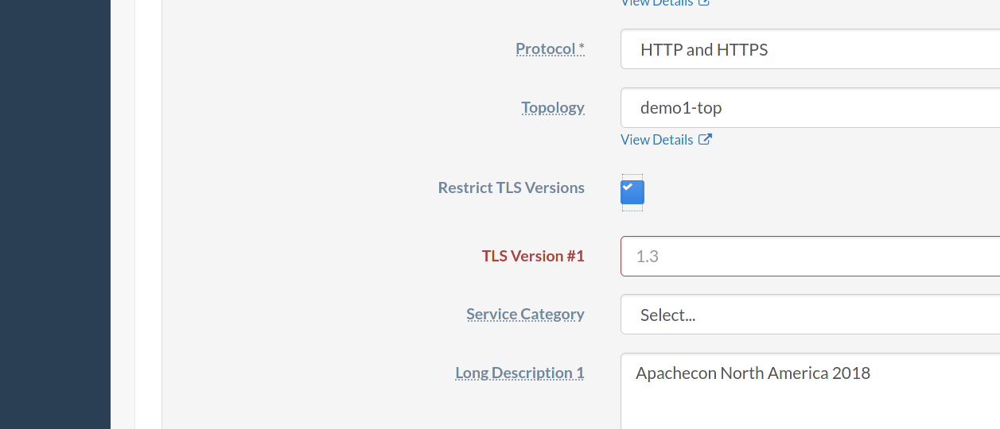

<!--
Licensed to the Apache Software Foundation (ASF) under one
or more contributor license agreements.  See the NOTICE file
distributed with this work for additional information
regarding copyright ownership.  The ASF licenses this file
to you under the Apache License, Version 2.0 (the
"License"); you may not use this file except in compliance
with the License.  You may obtain a copy of the License at

  http://www.apache.org/licenses/LICENSE-2.0

Unless required by applicable law or agreed to in writing,
software distributed under the License is distributed on an
"AS IS" BASIS, WITHOUT WARRANTIES OR CONDITIONS OF ANY
KIND, either express or implied.  See the License for the
specific language governing permissions and limitations
under the License.
-->

# Delivery Service TLS Versions

## Problem Description
Currently, supported TLS versions cannot be configured. This means that a
Delivery Service can have clients requesting its content over old, insecure
versions of TLS, and Tenants controlling that Delivery Service have no way to
force clients to use more recent versions.

## Proposed Changes
Changes to ATS in version 8.1 allow cache server configuration generation to
produce configuration files that can effectively control the TLS versions
allowed by a Delivery Service, causing clients using other versions to result
in request failure. Currently, (in unreleased behavior on the master branch),
this is implemented using a Delivery Service Profile Parameter. However,
Parameters are notorious for being unvalidated, unstructured data that can be
just obscure enough to escape notice, even when properly documented. For the
best possible user, operator, and developer experiences, the data should be
formally added to Delivery Service objects.

## Data Model Impact
Delivery Service objects will be augmented to include a set of allowed TLS
versions for the Delivery Service's content. Specifically, They will be
expanded to implement this interface:

```typescript
interface TLSVersionSpecifier {
	tlsVersions: [string, ...Array<string>] | null;
}
```

For those not super familiar with Typescript, this interface specifies a
`tlsVersions` property that can be either null, or an array of N strings,
where N is *at least one*. In other words, this can be null, but cannot be an
empty array.

The reason for this is best understood by first understanding what `null` means
for this field. If `tlsVersions` is `null`, it means that no TLS version
restrictions are in place; the behavior is the same as today without the field,
all TLS versions are implicitly supported.

An empty array would seem to signify that no TLS versions are supported, which
is an invalid configuration because then HTTPS content cannot be served - and
if that's the intention, the Delivery Service's Protocol should be modified
such that it doesn't serve HTTPs content.

Speaking of which, the only valid value for the `tlsVersions` of a Delivery
Service with a Protocol set to `0` (which is called "HTTP" in Traffic Portal)
is `null`.

## Component Impact
This change primarily concerns Traffic Ops, Traffic Portal, and
ORT/T3C/atstccfg.

Traffic Router should not concern itself with validating the TLS versions used
by routing requests for HTTP-routed and STEERING/CLIENT STEERING Delivery
Services. Doing so wouldn't significantly increase content security since that
would all be enforced by the caching layers anyway (even in the case of an
`HTTP_NO_CACHE`-Type Delivery Service) and would require invasive, complex
changes as well as a headache-inducing web of edge cases to handle for STEERING
and CLIENT STEERING routing.

### Traffic Portal Impact
Traffic Portal's Delivery Services forms (all types) will need to add two
controls. First, a checkbox that controls whether TLS Version settings will
exist on the Delivery Service. Secondly, a list of TLS Versions to be permitted
for the Delivery Service - shown if and only if the aforementioned checkbox is
checked. Below is a sample of what this would look like while the box is
unchecked:


... and while the box *is* checked:



If desired, the markup used for that sample may be found in
[Appendix A](#appendix-a).

These form fields should not appear on forms for STEERING-Type and
CLIENT_STEERING-Type Delivery Services. Traffic Portal should always submit
update and create requests for these types of Delivery Services with
`tlsVersions` set to `null`.

Traffic Portal should disallow the addition of a TLS version that is not a
"whole match" of the regular expression `\d+\.\d+`, and should issue a warning
if and when a TLS version is entered that is not known to exist (at the time of
this writing, that would be any version besides 1.0, 1.1, 1.2, and 1.3). In
keeping with the API restrictions, it MUST NOT disallow the addition of unknown
protocol versions, to facilitate the ability of system administrators to
quickly upgrade to a new protocol as it's released.

A warning should also be issued if any if the Delivery Service being edited is
the target of a Delivery Service which has other targets that support TLS
versions not supported by the Delivery Service being edited.

Traffic Portal should also display some kind of warning - possibly in a dialog
box - whenever the "Restrict TLS Versions" box is checked, advising that
clients using TLS versions not listed will become unable to retrieve the
Delivery Service's content.

Finally, Traffic Portal should display a warning whenever there are TLS versions
enabled that exclude newer versions but specify older versions (where unknown
versions are ignored). For example, at the time of this writing, the following
TLS version sets should produce this warning:

- 1.0
- 1.0 and 1.1
- 1.1
- 1.0, 1.1, and 1.2
- 1.1 and 1.2
- 1.0 and 1.2

### Traffic Ops Impact
Traffic Ops will require changes to its API endpoints that return or manipulate
Delivery Services and/or representations thereof. There are also a few database
changes that are required, but client code should be generally unaffected,
since it is using the the library structures that will already be changed as a
result of changes to Traffic Ops itself.

#### API Impact
The endpoints that will need to be updated to reflect the new structure of a
Delivery service are:

- `/deliveryservices`
- `/deliveryservices/{{ID}}`
- `/deliveryservices/{{ID}}/safe`
- `/deliveryservice_requests`
- `/deliveryservice_requests/{{ID}}/assign`
- `/deliveryservice_requests/{{ID}}/status`
- `/servers/{{ID}}/deliveryservices`

Endpoints relating to CDN Snapshots and/or monitoring configuration do not need
changes, since those already do not represent Delivery Services in the same way
as the rest of the API specifically because they omit data unnecessary for
Traffic Monitor and Traffic Router, and the supported TLS versions of a
Delivery Service do not affect monitoring or routing.

As a Delivery Service's Supported TLS Versions are not considered a "safe"
field, the only endpoints that will need changes beyond just the response
format are:

- `/deliveryservices`
- `/deliveryservices/{{ID}}`
- `/deliveryservice_requests`

When a Delivery Service or Delivery Service Request is created or modified
using one of these endpoints, the API MUST verify that the `tlsVersions`
property is either `null` or an array of strings that match the regular
expression `\d+\.\d+` (an empty array may be treated implicitly as `null` in
request bodies, but MUST ALWAYS be emitted as `null` in responses). In the
event that one or more entries in the array does not match the required
pattern, the response should be in the form of a 400 Bad Request with an
error-level Alert indicating the problematic entry(ies).

A 400 Bad Request response must also be returned if the user tries to create a
STEERING-Type or CLIENT_STEERING-Type Delivery Service with non-`null`
`tlsVersions`, or attempts to edit an existing so-Typed Delivery Service such
that its `tlsVersions` property is not `null`. The response must include an
error-level Alert indicating that this configuration is invalid.

Also, similar to Traffic Portal, Traffic Ops should emit warning-level alerts
whenever a Delivery Service is created with or modified to have a `tlsVersions`
property that is not `null`, indicating that this could cause problems for
certain clients.

It must also issue a warning-level Alert whenever the `tlsVersions` property is
set such that it includes TLS versions not known to exist - for example at the
time of this writing that would be in the case that it includes any element
that is not exactly one of:

- `"1.0"`
- `"1.1"`
- `"1.2"`
- `"1.3"`

Finally, a warning-level Alert is to be returned when the TLS versions exclude
newer versions but include older versions. For example the values that would
cause that warning to be issued today are:

- `["1.0"]`
- `["1.0", "1.1"]`
- `["1.1"]`
- `["1.0", "1.1", "1.2"]`
- `["1.1", "1.2"]`
- `["1.0", "1.2"]`

(Note that ordering is not important.)

#### Database Impact
To implement the storage of a Delivery Service's supported TLS versions, a new
table should be created like so:

```text
   Table "public.deliveryservice_supported_tls_version"
     Column      |  Type  | Collation | Nullable | Default
-----------------+--------+-----------+----------+---------
 deliveryservice | bigint |           | not null |
 tls_version     | text   |           | not null |
Check constraints:
    "valid_tls_version" CHECK (tls_version ~ similar_to_escape('[0-9]+.[0-9]+'::text))
Foreign-key constraints:
    "deliveryservice_supported_tls_version_deliveryservice_fkey" FOREIGN KEY (deliveryservice) REFERENCES deliveryservice(id) ON UPDATE CASCADE ON DELETE CASCADE
```

Additionally, a migration will be needed to set the value of `tlsVersions` on
existing Delivery Service Requests to `null`.

## Documentation Impact
The new field will need to be added to both the Delivery Services overview
section as well as all of the API documentation for endpoints in which it will
appear. Note also that the current documentation for the `PUT` method of
`/deliveryservices/{{ID}}` incorrectly states that the response is empty,
whereas it actually returns an array of Delivery Service representations. The
documentation should warn the reader that setting explicitly supported TLS
versions could break clients that expect the support of excluded versions.

## Testing Impact
The integration tests between Traffic Ops and its Go client will need to be
updated to verify the new validation and behavior, and unit tests should also
exist for the behavior added to the Traffic Ops server.

## Performance Impact
No significant performance impact is expected. The lists of supported TLS
versions are expected to be small, but do technically allow for arbitrary
sizes, which could possibly cause problems.

## Security Impact
Allowing arbitrary numbers of supported TLS versions is a possible attack
vector for Denial-of-Service attacks that cause Traffic Ops to spend large
amounts of time parsing and validating massive arrays of strings using what
will probably actually just be a Regular Expression that is an exact copy of
the one specified above (though it need only be compiled once).

Historically, though, the reaction to such things is "yes, operators have great
power and it is up to system administrators to ensure that power is given only
to those that can be trusted to wield it". So likely nobody thinks this is a
true concern, but if it were Traffic Ops could be configured to refuse to
handle request payloads greater than a certain size, which would mitigate the
problem.

## Upgrade Impact
There will be a database migration to run, but since the default configuration
will be to behave as it was prior to the upgrade, there isn't much in the way
of upgrade impact.

## Operations Impact
Operators will need to be aware of the meaning and use-cases for the new
Delivery Service property, and most importantly must be well advised that using
it can break clients.

### Developer Impact
Beyond the development changes necessary to implement the new property,
virtually no developer impact is expected.

## Alternatives
The alternative to doing this is simple: don't. Today, the known ATC instances
are mostly used to transfer video content that isn't particularly sensitive, so
ensuring strong encryption isn't much of a priority.

However, for content that actually _is_ sensitive, it is reasonable for the
Tenant that controls an Origin to desire that its data is only transferred in a
secure manner, so this seems a worthwhile change.

## Appendix A: Sample Code
<a name="appendix-a"></a>

### Sample Traffic Portal Mock-Up
```html
<div class="form-group">
	<label
		class="control-label col-md-2 col-sm-2 col-xs-12"
		for="restrictTLS"
	>
			Restrict TLS Versions
	</label>
	<div
		class="col-md-10 col-sm-10 col-xs-12"
		style="display:inline-grid;grid-template-columns:20px;justify-content:start;"
	>
		<input
			type="checkbox"
			id="restrictTLS"
			name="restrictTLS"
			class="form-control"
			ng-model="restrictTLS"
		/>
	</div>
</div>
<ng-form
	ng-if="restrictTLS"
	name="tlsForm"
	ng-repeat="ver in deliveryService.tlsVersions track by $index"
>
	<div class="form-group">
		<div>
			<label
				class="control-label col-md-2 col-sm-2 col-xs-12"
				for="tlsVersion1"
			>
				TLS Version #1
			<</label>
			<div class="col-md-10 col-sm-10 col-xs-12">
				<div>
					<div class="input-group add-more-inputs">
						<input
							id="tlsVersion1"
							name="tlsVersion1"
							type="text"
							class="form-control"
							ng-model="deliveryService.tlsVersion1s[$index]"
							pattern="[0-9]+\.[0-9]+"
							placeholder="1.3"
							required
						/>
						<span class="form-input-group-btn input-group-btn">
							<button
								type="button"
								title="add a supported TLS version"
								class="btn btn-default"
								ng-show="deliveryservice.tlsVersions.length > 0"
							>
								<i class="fa fa-minus"></i>
							</button>
							<button
								type="button"
								title="remove support for this TLS version"
								class="btn btn-default"
								ng-show="$index == (deliveryService.tlsVersion1s.length - 1)"
							>
								<i class="fa fa-plus"></i>
							</button>
						</span>
					</div>
				</div>
			</div>
		</div>
	</div>
</ng-form>
```
