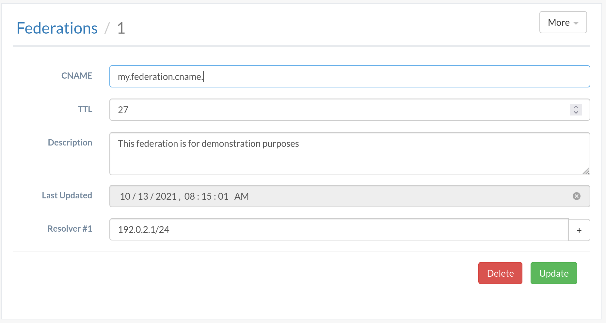
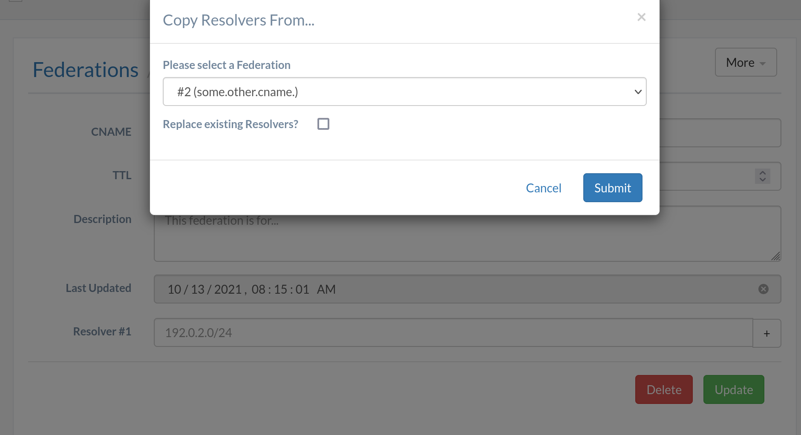
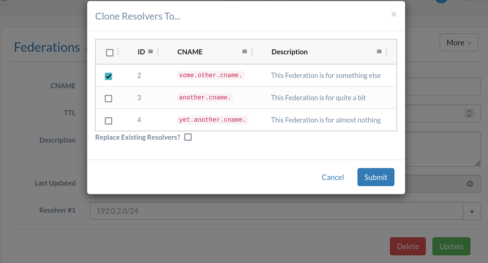

<!--
Licensed to the Apache Software Foundation (ASF) under one
or more contributor license agreements.  See the NOTICE file
distributed with this work for additional information
regarding copyright ownership.  The ASF licenses this file
to you under the Apache License, Version 2.0 (the
"License"); you may not use this file except in compliance
with the License.  You may obtain a copy of the License at

	http://www.apache.org/licenses/LICENSE-2.0

Unless required by applicable law or agreed to in writing,
software distributed under the License is distributed on an
"AS IS" BASIS, WITHOUT WARRANTIES OR CONDITIONS OF ANY
KIND, either express or implied.  See the License for the
specific language governing permissions and limitations
under the License.
-->
# Federations Redesign

## Problem Description
Currently, Federations are among the most convoluted and difficult to comprehend
concepts/objects in Traffic Control. The process to create a Federation - and
what one even does - is poorly understood by many, and that's reflected by the
fact that
[the latest documentation's quick-how-to guide on the subject](https://traffic-control-cdn.readthedocs.io/en/v6.0.0/admin/quick_howto/federations.html)
still has steps for and screenshots of the Traffic Ops UI that was removed years
ago.

Part of this is undoubtedly caused by the myriad of Traffic Ops API endpoints
used to manipulate Federations. Currently, these exist:

- `/cdns/{{name}}/federations`
- `/cdns/{{name}}/federations/{{ID}}`
- `/federations/all`
- `/federations`
- `/federations/{{ID}}/deliveryservices`
- `/federations/{{ID}}/deliveryservices/{{dsID}}`
- `/federation_resolvers`
- `/federations/{{ID}}/federation_resolvers`
- `/federations/{{ID}}/users`
- `/federations/{{ID}}/users/{{userID}}`

## Proposed Change
The notion of a "Federation" will be reworked into a first-class citizen of the
ATC data model. Access will be controlled by Tenancy (and Permissions), so the
only necessary Traffic Ops API endpoint will be `/federations`.

## Data Model Impact
The proposed model for Federations is as follows:

```typescript
interface Federation {
	cname: `${string}.`;
	description: string;
	// Only present in responses
	id?: number;
	 // RFC3339 timestamp string - only present in responses
	lastUpdated?: Date;
	resolvers: [string, ...string[]];
	ttl: number;
}
```

Also, Federations will be added as direct properties of Delivery Services in new
API versions:

```typescript
type DNSTypeName = "DNS" | "DNS_LIVE" | "DNS_LIVE_NATNL";
interface DNSDeliveryService extends DeliveryService {
	type: DNSTypeName;
	federations: null | [number] | [number, ...number[]];
}
interface NonDNSDeliveryService extends DeliveryService {
	type: Exclude<string, DNSTypeName>;
	federations: null;
}
type NewDeliveryService = NonDNSDeliveryService | DNSDeliveryService;
```

## Impacted Components
This primarily affects Traffic Ops and Traffic Portal, but some Traffic Router
changes will be necessary to support the new API surface.

### Traffic Ops Impact

#### Database Impact
There should be no necessary changes to database structure, but to ensure valid
data is stored in the database, the `ip_address` column of the
`federation_resolver` table should be switched from `text` to `inet`.

#### API Impact
The following currently existing API endpoints will be removed:

- `/cdns/{{name}}/federations`
- `/cdns/{{name}}/federations/{{ID}}`
- `/federations/all`
- `/federations/{{ID}}/deliveryservices`
- `/federations/{{ID}}/deliveryservices/{{dsID}}`
- `/federation_resolvers`
- `/federations/{{ID}}/federation_resolvers`
- `/federations/{{ID}}/users`
- `/federations/{{ID}}/users/{{userID}}`

The following API endpoints contain representations of Delivery Services, and
will need to be updated to support the new `federations` property:

- `/deliveryservices`
- `/deliveryservices/{{ID}}`
- `/deliveryservices/{{ID}}/safe`
- `/deliveryservice_requests`
- `/deliveryservice_requests/{{ID}}/assign`
- `/deliveryservice_requests/{{ID}}/status`
- `/servers/{{ID}}/deliveryservices`
- `/cdns/{{name}}/snapshot`
- `/cdns/{{name}}/snapshot/new`

`/cdns/{{name}}/config/monitoring` contains representations of Delivery
Services, but since Federations are irrelevant to the operation of Traffic
Monitor (at the time of this writing), those representations need not be
updated.

Of these, `/cdns/{{name}}/snapshot` and `/cdns/{{name}}/snapshot/new` are of
particular note because they contain representations of Delivery Services that
are not very similar to any of the other representations. In keeping with that,
they will have different changes than all the others, detailed in
[Snapshot Endpoints](#snapshots) below.

##### Snapshot Endpoints
Instead of including the regular array of Federation IDs that most
representations of Delivery Services will have, Snapshot Delivery Service
representations will contain a `federations` property that is a set of full
Federation representations. This allows Federations to be captured by the
Snapshot process and allows Traffic Router to read them from a Snapshot without
needing to issue additional HTTP requests to complete its information.

##### `/federations`
This endpoint will be repurposed from its existing behavior to support the
behavior described in this section.

###### GET
Required Permissions: `FEDERATION:READ`

This endpoint will support all standard pagination controls, as well as
`olderThan` and `newerThan`. It will also provide the following additional query
string parameters:

- `id` - Returns only the Federation with the given ID.
- `ttl` - Returns only Federations with this TTL.
- `cname` - Returns only Federations with `cname`s matching this glob
- `description` - Returns only Federations with `description`s matching this glob

(globs can use `*` and `%` interchangeably).

This method of this endpoint will not interpret request bodies, and returns a
`response` that is an array of Federations.

This should require the

###### POST
Required Permissions: `FEDERATION:READ`, `FEDERATION:CREATE`

This method of this endpoint is responsible for creating new Federations. The
request body must be a valid Federation, and shouldn't specify `lastUpdated` or
`id` (although the handler should ignore them if they are present). No query
string parameters are supported.

The response to requests made using this method to this endpoint will be a
representation of the created Federation.

###### PUT
Required Permissions: `FEDERATION:READ`, `FEDERATION:UPDATE`

This method of this endpoint may be used to replace existing Federations with
new ones specified by a valid Federation in the request body.

This method requires an `id` query string parameter specifying the ID of the
Federation being replaced.

The response to requests made using this method to this endpoint will be the new
representation of the modified Federation.

If the Federation is used by any Delivery Services that make use of SSL, a
warning-level Alert will be issued cautioning the requesting user to ensure that
the SSL certificates for whatever server to which the Resolver's CNAME directs
traffic are up-to-date.

###### DELETE
Required Permissions: `FEDERATION:READ`, `FEDERATION:DELETE`

This method of this endpoint deletes existing Federations.

This method requires an `id` query string parameter specifying the ID of the
Federation to be deleted.

A 409 Conflict response should be returned when a request is made to delete a
Federation that is in use by a Delivery Service, refusing to perform the
requested operation.

The response to request (successfully) made using this method of this endpoint
will be a representation of the deleted Federation.

#### Client Impact
Clients at or below API v3 should not need to change. The latest client version
will change what structures it returns, and will no longer contain methods for
the endpoints and methods of endpoints that will be removed.

### Traffic Portal Impact
Traffic Portal's functionality for manipulating Federations will need to be
overhauled. There will be a new entry under "Services" alongside "Delivery
Services" and (conditionally) "Delivery Service Requests" titled "Federations".
This menu item directs users to a page with a standard table for Federations
just like the tables for every other API object. Within a single Federation's
page is a form for editing that Federation, a sample of which is shown below.



Note that Federation Resolvers are manipulated here directly, rather than
created separately through a different page and then linked using a popup.

To accommodate re-use of Federation Resolvers, the "More" menu for a Federation
will have two options: "Copy Resolvers From..." and "Clone Resolvers To...".
These buttons will open dialog boxes that will prompt the user to choose a
Federation from which to copy Resolvers onto the Federation being edited, and
to choose one or more Federations to which to copy the Federation being edited's
Resolvers, respectively. Sample Dialogs for each are shown below.





(Note that these feature a "Replace Existing Resolvers?" checkbox, which has
since been reconsidered and should not actually be included in the UI - instead
the resolvers should *always* be overwritten)

If desired, the markup used for these samples may be found in
[Appendix A](#appendix-a).

### Traffic Router Impact
Traffic Router's Federations polling will need to be stripped out, and instead
Federation information should be parsed from the CDN Snapshot.

## Documentation Impact
The documentation for affected endpoints will need to be updated, and a section
for the new property of Delivery Services will need to be added to the Delivery
Service overview section. Also, there is a "Quick How-To" guide for setting up
Federations that currently still references the Traffic Ops UI that hasn't
existed for years; that needs to be updated either way, but since the changes to
Federations described in this blueprint include Traffic Portal changes, it would
be a good time to also update the guide. Assuming it's quickly approved.

## Testing Impact
The tests for Federation-related endpoints will need to be overhauled to remove
tests for removed endpoints, and to reflect changes to the updated endpoints.

## Performance Impact
The changes herein proposed would make Snapshots larger, but would eliminate an
entire polling thread from Traffic Router. The performance impact to Traffic
Router is difficult to know without measuring (and I haven't measured, not only
because that would require actually making the changes to compare), but I would
guess that Traffic Router will use less resources overall with this tradeoff.

Costs/gains to Traffic Ops and/or Traffic Portal are negligible.

## Security Impact
None.

## Upgrade Impact
None.

## Operations Impact
Hopefully this will make operators' lives easier by allowing Federation changes
to be gate-kept by "Snapshotting", by allowing Delivery Service-and-Federation
relationship changes to be captured and preserved by the Delivery Service
Request process. They will need to learn the new menus and tables for
Federations, which differ from the old.

## Developer Impact
This will most certainly make developers' lives much easier by allowing
Federations to be comprehensible and greatly simplifying the ways with which a
developer may interact with Federations. This simplicity (for both developers
and operators) is the primary motivation for this blueprint, so if that's not
true then the blueprint is a failure.

## Alternatives
The changes proposed in this blueprint have one distinct difference between them
and the way Federations currently work that stands out perhaps more so than
others: Federations are no longer polled outside the normal CDN "Snapshotting"
process. This could be seen as making things more consistent and making it
easier to draft changes to Delivery Services (either in Delivery Service
Requests or just as un-"snapshotted" changes), or it could be seen as overly
restrictive and requiring higher permissions to affect changes than it ought to
and/or historically has required.

A possible alternative, should it be decided that preserving the immediate(-ish)
change propagation of Federation changes, would be to provide a
`deliveryServices` property of Federations that lists the XMLIDs of the Delivery
Services to which they are assigned. That would allow Traffic Router to continue
polling for Federation data outside of the normal Snapshot polling loop.
However, this would add another place where Federation-and-Delivery Service
relationships can be manipulated, and could be confusing/misleading, especially
since such changes will show up in Delivery Service Requests - _but only_
_sometimes_. Or it could be a read-only property of Federations, but the further
the request and response payloads drift from one another the more inconvenient
our "one type for both strategy becomes. This would also require Tenancy checks
on all request methods of the `/federations` endpoint, which would otherwise be
unnecessary.

Another possibility would be adding another API endpoint that exposes all of
these mappings explicitly, modeled:

```typescript
interface FederationMappingsEndpointResponse {
	response: {
		[xmlID: string]: [Federation, ...Federation[]];
	};
}
```

The only real drawbacks are an extra API endpoint to create and maintain - since
this could easily be read-only - and a tenancy check must be added to PUT and
DELETE handlers for `/federations` to ensure that the requesting user has access
to the Delivery Services using the Federations they are manipulating. That extra
work is only necessary if it's decided that moving the schedule for Federation
updates to being the same as Snapshot polling is undesirable.

Aside from that, it should also be noted that Federations will now appear in
Delivery Service Requests, but _only_ as opaque IDs. The underlying data could
change, which changes the meaning of a Delivery Service Request, and even
outside of that window of time, Delivery Service Requests that have been closed
can have their changes' meanings corrupted by changes that occur after those
changes.

## Appendix A: Sample Code
<a name="appendix-a"></a>

### Sample Traffic Portal Federations Form
```html
<form class="form-control-columns">

	<label for="cname">CNAME</label>
	<input
	  id="cname"
	  type="text"
	  required
	  maxlength="255"
	  pattern="[A-Za-z0-9][A-Za-z0-9]*(\.[A-Za-z0-9][A-Za-z0-9-]*)*\."
	  placeholder="my.federation.cname."
	  class="form-control"
	/>

	<label for="cname">TTL</label>
	<input class="form-control" id="cname" type="number" required min="1"/>

	<label for="description">Description</label>
	<textarea class="form-control" required placeholder="This federation is for..."></textarea>

	<label for="lastUpdated">Last Updated</label>
	<input class="form-control" id="lastUpdated" type="datetime-local" value="2021-10-13T08:15:01" readonly disabled/>

	<label class="control-label" for="resolver1">
		Resolver #1
	</label>
	<div class="input-group add-more-inputs">
		<input id="resolver1" type="text" class="form-control" placeholder="192.0.2.0/24" required/>
		<span class="form-input-group-btn input-group-btn">
			<button type="button" title="remove support for this TLS version" class="btn btn-default">
				+
			</button>
		</span>
	</div>

	<div class="modal-footer" style="grid-column: 1 / span 2;">
		<button type="button" class="btn btn-danger">Delete</button>
		<button type="button" class="btn btn-success">Update</button>
	</div>
</form>
```

### Sample Traffic Portal Federations "Clone Resolvers To..." Dialog Form
```html
<div class="modal-content" uib-modal-transclude="">

	<div class="modal-header ng-scope">
		<button type="button" class="close">
			<span aria-hidden="true">×</span>
			<span class="sr-only">Close</span>
		</button>
		<h4 class="modal-title">Clone Resolvers To...</h4>
	</div>
	<div class="modal-body ng-scope">
		<style type="text/css">
			table {
				border: 1px solid #babfc7;
				width: 100%;
			}
			thead {
				background-color: #f8f8f8;
				border-bottom: 1px solid #babfc7;
				height: 48px;
			}
			tbody > tr {
				height: 42px;
			}
			td {
				padding: 0 17px;
				line-height: 40px;
			}
			tbody > tr {
				background-color: white;
			}
			tr:nth-child(2n) {
				background-color: #fcfcfc;
			}
			tr:not(:first-child) {
				border-top: 1px solid #dde2eb;
			}
			th:first-child{
				padding: 0 18px;
			}
			tr {
				line-height: normal;
				font-size: 13px;
			}
			th {
				padding: 0 18px;
				font-weight: 700;
				color: #181d1f;
			}
			th:not(:first-child) > div > div > span::after {
				font-family: agGridAlpine;
				content: "\f11b";
				float: right;
			}
			th >div {
				display: inline-flex;
				justify-content:space-between;
				align-content: start;
				align-items: start;
				height: 100%;
				width: 100%;
				vertical-align: middle;
				position: relative;
			}

			th > div > div {
				height: 100%;
				display: inline-flex;
				flex-direction: column;
				justify-content: center;
			}

			th > div > div:last-child {
				height: 100%;
				width: 8px;
			}

			th > div > div:last-child::after{
				content: "";
				position: absolute;
				z-index: 1;
				display: block;
				/* left: calc(50% - 1px); */
				right: 0;
				width: 2px;
				height: 30%;
				top: 35%;
				background: rgba(186,191,199,.5);
			}

			th >div > div:first-child {
				flex: 1 1 auto;
				display: grid;
				grid-template-columns: 1fr auto;
				align-items: center;
			}
		</style>
		<form>
			<table>
				<thead>
					<tr>
						<th>
							<div>
								<div><input type="checkbox"></div>
								<div></div>
							</div>
						</th>
						<th><div><div>ID<span></span></div><div></div></div></th>
						<th><div><div>CNAME<span></span></div><div></div></div></th>
						<th><div><div>Description<span></span></div><div></div></div></th>
					</tr>
				</thead>
				<tbody>
					<tr>
						<td><input type="checkbox" checked/></td>
						<td>2</td>
						<td><code>some.other.cname.</code></td>
						<td>This Federation is for something else</td>
					</tr>
					<tr>
						<td><input type="checkbox"/></td>
						<td>3</td>
						<td><code>another.cname.</code></td>
						<td>This Federation is for quite a bit</td>
					</tr>
					<tr>
						<td><input type="checkbox"/></td>
						<td>4</td>
						<td><code>yet.another.cname.</code></td>
						<td>This Federation is for almost nothing</td>
					</tr>
				</tbody>
			</table>
		</form>
	</div>
	<div class="modal-footer ng-scope">
		<button class="btn btn-link">Cancel</button>
		<button class="btn btn-primary">Submit</button>
	</div>
</div>
```

### Sample Traffic Portal Federations "Copy Resolvers From..." Dialog Form
```html
<div class="modal-content" uib-modal-transclude="">
	<div class="modal-header ng-scope">
		<button type="button" class="close">
			<span aria-hidden="true">×</span>
			<span class="sr-only">Close</span>
		</button>
		<h4 class="modal-title">Clone Resolvers To...</h4>
	</div>
	<div class="modal-body ng-scope">
		<form>
			<label for="target">Please select a Federation</label>
			<select class="form-control">
				<option selected>#2 (some.other.cname.)</option>
			</select>
		</form>
	</div>
	<div class="modal-footer ng-scope">
		<button class="btn btn-link">Cancel</button>
		<button class="btn btn-primary">Submit</button>
	</div>
</div>
```
