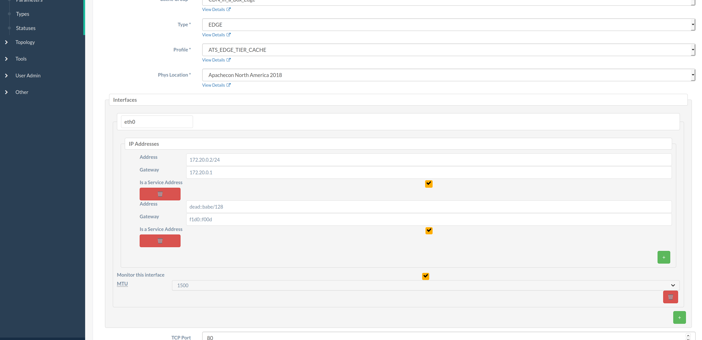

<!--
Licensed to the Apache Software Foundation (ASF) under one
or more contributor license agreements.  See the NOTICE file
distributed with this work for additional information
regarding copyright ownership.  The ASF licenses this file
to you under the Apache License, Version 2.0 (the
"License"); you may not use this file except in compliance
with the License.  You may obtain a copy of the License at

    http://www.apache.org/licenses/LICENSE-2.0

Unless required by applicable law or agreed to in writing,
software distributed under the License is distributed on an
"AS IS" BASIS, WITHOUT WARRANTIES OR CONDITIONS OF ANY
KIND, either express or implied.  See the License for the
specific language governing permissions and limitations
under the License.
-->
# Additional Server Interfaces

## Problem Description
Multiple network interfaces may be used by cache servers to service requests.
However, these cannot be expressed as parts of the current "server" object.
Specifically, assuming each interface has its own IP address, then each would
need to be treated as a separate cache server. This means that getting clients
to use one when the other is unavailable requires manual intervention.

## Proposed Change
Instead, cache servers should be configurable with numerous network interfaces
monitored by Traffic Monitor that are all associated with the server, each
having its own associated network information e.g. IP Address, but Traffic
Router should only be aware of the "main" interface on which the cache server
listens for connections.

The specific use-case outlined above, obviously, entails some management be done
on the cache servers to actually support multiple interfaces answering to the
same "main" IP address and this should be considered outside of
<abbr title="Apache Traffic Control">ATC</abbr>'s scope of operation.

## Data Model Impact
The proposed structure of each of these interfaces is given below as a pair of
TypeScript<sup>[1](#typescript)</sup> interfaces:
```typescript
interface IPAddress {
	/**
	 * The actual IP (v4 or v6) address which is used by an interface.
	 * If it is an IPv6 address
	 */
	address: string;

	/**
	 * The IP (v4 or v6) address of the gateway used by this IP address.
	 */
	gateway: string | null;

	/**
	 * Tells whether or not this address of this interface is the server's
	 * "service" address.
	 * At least one address of EXACTLY ONE interface MUST have this set to
	 * 'true' for a server.
	 */
	serviceAddress: boolean;
}

interface Interface {
	/**
	 * These will be all of the IPv4/IPv6 addresses assigned to the interface,
	 * including gateways and "masks".
	 * It is illegal for an interface to not have at least one associated IP
	 * address.
	 */
	ipAddresses: Array<IPAddress> & {0: IPAddress};
	/**
	 * The maximum allowed bandwidth for this interface to be considered "healthy"
	 * by Traffic Monitor.
	 *
	 * This has no effect if `monitor` is not true.
	 * Values are in kb/s.
	 * The value `0` means "no limit".
	 */
	maxBandwidth: bigint;
	/**
	 * Whether or not Traffic Monitor should monitor this particular interface.
	 */
	monitor: boolean;
	/**
	 * The interface's Maximum Transmission Unit.
	 * If this is 'null' it is assumed that the interface's MTU is not known/is
	 * irrelevant.
	 */
	mtu: number | null;
	/**
	 * The name of the interface device on the server e.g. eth0.
	 */
	name: string;
}
```
We don't have a real data model for ATC, so what follows is an approximately
defined representation of a "server" that is valid within certain contexts. The
modifications made to it for the purposes of the changes herein proposed should
be considered valid in those same contexts - whatever they may be.

```typescript
interface Server {

	cachegroup?:  string | null;
	cachegroupId: number;
	cdnId:        number;
	cdnName?:     string | null;
	domainName:   string;
	guid?:        string | null;
	hostName:     string;
	httpsPort?:   number | null;
	id?:          bigint;

	// ILO things aren't being moved in because they also require a
	// username/password that aren't used by any other interface type.
	iloIpAddress?: string | null;
	iloIpGateway?: string | null;
	iloIpNetmask?: string | null;
	iloPassword?:  string | null;
	iloUsername?:  string | null;

	/**
	 * New field containing additional interfaces.
	 * It is illegal for a server to not have at least one interface.
	 */
	interfaces: Array<Interface> & {0: Interface};

	// these should be moved into the interfaces property at the earliest
	// convenience, as they are deprecated and will disappear in a future
	// release.
	mgmtIpAddress: string;
	mgmtIpGateway: string;
	mgmtIpNetmask: string;
	lastUpdated?:  string;

	// notice not here: mgmtIpAddress, mgmtIpGateway, mgmtIpNetmask

	offlineReason:   string;
	physLocation?:   string | null;
	physLocationId:  number;
	profile?:        string | null;
	profileDesc?:    string | null;
	profileId:       number;
	revalPending?:   boolean;
	rack?:           string | null;
	routerHostName?: string | null;
	routerPortName?: string | null;
	status?:         string | null;
	statusId:        number;
	tcpPort:         number;
	type?:           string | null;
	typeId:          number;
	updPending?:     boolean;
	xmppId?:         string | null;
	xmppPassword?:   string | null;
}
```

`/monitoring` payloads and CDN Snapshots are purposely un-versioned and
un-modeled, so this section will make no attempts to define the model changes to
those objects.

## Impacted Components
The only components that should need to be modified to accommodate this feature
are Traffic Ops, Traffic Portal, and Traffic Monitor.

### Traffic Ops Impact

#### Database
A new table will need to be introduced to contain interface information:
`interface`, which is described below.
```text
            Table "traffic_ops.interface"
     Column    |  Type   | Collation | Nullable | Default
---------------+---------+-----------+----------+---------
 name          | text    |           | not null |
 server        | bigint  |           | not null |
 monitor       | boolean |           | not null |
 mtu           | integer |           |          | 1500
 max_bandwidth | integer |           | not null | 0
Indexes:
    "interface_pkey" PRIMARY KEY, btree (name, server)
Check constraints:
	"interface_mtu_check" CHECK (mtu > 1280)
Foreign-key constraints:
    "interface_server_fkey" FOREIGN KEY (server) REFERENCES server(id)
```
Another new table will need to be created to contain address information, which
is described below.
```text
               Table "traffic_ops.ip_address"
     Column     |  Type   | Collation | Nullable | Default
----------------+---------+-----------+----------+---------
 address        | inet    |           | not null |
 gateway        | inet    |           |          |
 serviceaddress | boolean |           | not null |
 server         | bigint  |           | not null |
 interface      | text    |           | not null |
Indexes:
    "ip_address_pkey" PRIMARY KEY, btree (address, interface, server)
Check constraints:
    "ip_address_gateway_check" CHECK (gateway IS NULL OR masklen(gateway) = 0)
Foreign-key constraints:
    "ip_address_interface_fkey" FOREIGN KEY (interface, server) REFERENCES interface(name, server)
    "ip_address_server_fkey" FOREIGN KEY (server) REFERENCES server(id)
```

This should be sufficient to capture the model changes. In addition to creating
these tables, a migration will need to be written to convert currently stored
server information to utilize these new tables.

The resulting server table after migration should look like:

```text
                        Table "traffic_ops.server"
      Column      |           Type           | Collation | Nullable | Default
------------------+--------------------------+-----------+----------+---------
 id               | bigserial                |           | not null |
 host_name        | text                     |           | not null |
 domain_name      | text                     |           | not null |
 tcp_port         | bigint                   |           |          |
 xmpp_id          | text                     |           |          |
 xmpp_passwd      | text                     |           |          |
 phys_location    | bigint                   |           | not null |
 rack             | text                     |           |          |
 cachegroup       | bigint                   |           | not null | 0
 type             | bigint                   |           | not null |
 status           | bigint                   |           | not null |
 offline_reason   | text                     |           |          |
 upd_pending      | boolean                  |           | not null | false
 profile          | bigint                   |           | not null |
 cdn_id           | bigint                   |           | not null |
 ilo_ip_address   | text                     |           |          |
 ilo_ip_netmask   | text                     |           |          |
 ilo_ip_gateway   | text                     |           |          |
 ilo_username     | text                     |           |          |
 ilo_password     | text                     |           |          |
 mgmt_ip_address  | text                     |           |          |
 mgmt_ip_gateway  | text                     |           |          |
 mgmt_ip_netmask  | text                     |           |          |
 router_host_name | text                     |           |          |
 router_port_name | text                     |           |          |
 guid             | text                     |           |          |
 last_updated     | timestamp with time zone |           | not null | now()
 https_port       | bigint                   |           |          |
 reval_pending    | boolean                  |           | not null | false
Indexes:
	"idx_89709_primary" PRIMARY KEY, btree (id, cachegroup, type, status, profile)
	"idx_89709_fk_cdn2" INDEX, btree (cdn_id)
	"idx_89709_fk_contentserver_atsprofile1" INDEX, btree (profile)
	"idx_89709_fk_contentserver_contentserverstatus1" INDEX, btree (status)
	"idx_89709_fk_contentserver_contentservertype1" INDEX, btree (type)
	"idx_89709_fk_contentserver_phys_location1" INDEX, btree (phys_location)
	"idx_89709_fk_server_cachegroup1" INDEX, btree (cachegroup)
	"idx_89709_se_id_unique" UNIQUE INDEX, btree (id)
Foreign-key constraints:
	"fk_server_cachegroup1" FOREIGN KEY (cachegroup) REFERENCES cachegroup(id)
	"fk_cdn2" FOREIGN KEY (cdn_id) REFERENCES cdn(id)
	"fk_contentserver_atsprofile1" FOREIGN KEY (profile) REFERENCES profile(id)
	"fk_contentserver_contentserverstatus1" FOREIGN KEY (status) REFERENCES status(id)
	"fk_contentserver_contentservertype1" FOREIGN KEY (type) REFERENCES type(id)
	"fk_contentserver_phys_location1" FOREIGN KEY (phys_location) REFERENCES phys_location(id)
```

#### API
<a name="sec:api"></a>
The affected endpoints will be:

##### `/cdns/{{name}}/configs/monitoring`
The current payload includes a `trafficServers` property that contains an array
of cache server representations to be monitored by a Traffic Monitor within the
path-specified CDN. An example of one such array member is given below.
```json
{
	"cacheGroup": "Ciab_Edge",
	"fqdn": "edge.infra.ciab.test",
	"hashId": "edge",
	"hostName": "edge",
	"interfacename": "eth0",
	"ip6": "dead::babe",
	"ip": "192.168.0.0",
	"port": 80,
	"profile": "ATS_EDGE",
	"status": "REPORTED",
	"type": "EDGE"
}
```
This will need to change to reflect the new set of interfaces, which for the
above example with no additional interfaces would look like:
```json
{
	"cacheGroup": "Ciab_Edge",
	"fqdn": "edge.infra.ciab.test",
	"hashId": "edge",
	"hostName": "edge",
	"interfaces": [
		{
			"name": "eth0",
			"maxBandwidth": 0,
			"mtu": 1500,
			"monitor": true,
			"ipAddresses": [
				{
					"address": "192.168.0.0/32",
					"gateway": "10.0.0.1",
					"serviceAddress": true
				},
				{
					"address": "dead::babe/128",
					"gateway": "f1d0::f00d",
					"serviceAddress": true
				}
			]
		}
	],
	"port": 80,
	"profile": "ATS_EDGE",
	"status": "REPORTED",
	"type": "EDGE"
}
```
Note that only interfaces that have "monitor" set to `true` should appear at all
in the payloads of this endpoint.

##### `/cdns/{{name}}/snapshot`
This is a semantic change only - payloads remain structurally unchanged. The
reported `ip`, `ip6` and `interfaceName` fields for elements of the
`contentServers` array property should be the IPv4 service address (if one
exists), the IPv6 service address (if one exists), and the name of the
interface to which the chosen address(es) belong.

##### `/cdns/{{name}}/snapshot/new`
This is a semantic change only - payloads remain structurally unchanged. The
changes to this endpoint are the same as those described for
`/cdns/{{name}}/snapshot` above.

##### `/servers`/`/servers/{{ID}}`
An example of one element of an output array for this endpoint at the time of
this writing is shown below.
```json
{
	"cachegroup": "CDN_in_a_Box_Mid",
	"cachegroupId": 6,
	"cdnId": 2,
	"cdnName": "CDN-in-a-Box",
	"domainName": "infra.ciab.test",
	"guid": null,
	"hostName": "mid",
	"httpsPort": 443,
	"id": 10,
	"iloIpAddress": "",
	"iloIpGateway": "",
	"iloIpNetmask": "",
	"iloPassword": "",
	"iloUsername": "",
	"interfaceMtu": 1500,
	"interfaceName": "eth0",
	"ip6Address": "fc01:9400:1000:8::120",
	"ip6Gateway": "fc01:9400:1000:8::1",
	"ipAddress": "172.16.239.120",
	"ipGateway": "172.16.239.1",
	"ipNetmask": "255.255.255.0",
	"lastUpdated": "2018-12-05 18:45:05+00",
	"mgmtIpAddress": "",
	"mgmtIpGateway": "",
	"mgmtIpNetmask": "",
	"offlineReason": "",
	"physLocation": "Apachecon North America 2018",
	"physLocationId": 1,
	"profile": "ATS_MID_TIER_CACHE",
	"profileDesc": "Mid Cache - Apache Traffic Server",
	"profileId": 10,
	"rack": "",
	"revalPending": false,
	"routerHostName": "",
	"routerPortName": "",
	"status": "REPORTED",
	"statusId": 3,
	"tcpPort": 80,
	"type": "MID",
	"typeId": 12,
	"updPending": false,
	"xmppId": "mid",
	"xmppPasswd": "",
	"ipIsService": true,
	"ip6IsService": true
}
```
After this feature's inclusion, the same element would look like this:
```json
{
	"cachegroup": "CDN_in_a_Box_Mid",
	"cachegroupId": 6,
	"cdnId": 2,
	"cdnName": "CDN-in-a-Box",
	"domainName": "infra.ciab.test",
	"guid": null,
	"hostName": "mid",
	"httpsPort": 443,
	"id": 10,
	"iloIpAddress": "",
	"iloIpGateway": "",
	"iloIpNetmask": "",
	"iloPassword": "",
	"iloUsername": "",
	"interfaces": [
		{
			"ipAddresses": [
				{
					"address": "172.16.239.120/24",
					"gateway": "172.16.239.1",
					"serviceAddress": true
				},
				{
					"address": "fc01:9400:1000:8::120/128",
					"gateway": "fc01:9400:1000:8::1",
					"serviceAddress": true
				}
			],
			"maxBandwidth": 0,
			"monitor": true,
			"mtu": 1500,
			"name": "eth0"
		}
	],
	"lastUpdated": "2018-12-05 18:45:05+00",
	"mgmtIpAddress": "",
	"mgmtIpGateway": "",
	"mgmtIpNetmask": "",
	"offlineReason": "",
	"physLocation": "Apachecon North America 2018",
	"physLocationId": 1,
	"profile": "ATS_MID_TIER_CACHE",
	"profileDesc": "Mid Cache - Apache Traffic Server",
	"profileId": 10,
	"rack": "",
	"revalPending": false,
	"routerHostName": "",
	"routerPortName": "",
	"status": "REPORTED",
	"statusId": 3,
	"tcpPort": 80,
	"type": "MID",
	"typeId": 12,
	"updPending": false,
	"xmppId": "mid",
	"xmppPasswd": "",
}
```
The `mgmtIpAddress`, `mgmtIpGateway`, and `mgmtIpNetmask` fields are deprecated
by this change, and should be removed in a future release.

Request payloads for `PUT` and `POST` methods will need to change similarly. A
server object should be accepted (based only on its `interfaces` property) if
it has at least one interface, every interface has at least one IP address,
exactly one interface has at least one IP address that is a service address, and
no two IP addresses of the same family/version are simultaneously marked as
'service addresses'. And, of course, the property's values must be syntactically
and semantically valid.

Below are some examples of invalid `interfaces` property arrays, to which
Traffic Ops MUST respond with a `400 Bad Request` and an appropriate Alert:

Empty array
```json
{"interfaces": []}
```
Null property
```json
{"interfaces": null}
```
Missing property
```json
{}
```
Invalid `maxBandwidth` - cannot be floating point number
```json
{
	"interfaces": [
		{
			"ipAddresses": [
				{
					"address": "0.0.0.1/32",
					"gateway": "10.0.0.1",
					"serviceAddress": true
				}
			],
			"maxBandwidth": 1.5,
			"monitor": true,
			"mtu": 1500,
			"name": "eth0"
		}
	]
}
```
Invalid `maxBandwidth` - cannot be negative
```json
{
	"interfaces": [
		{
			"ipAddresses": [
				{
					"address": "0.0.0.1/32",
					"gateway": "10.0.0.1",
					"serviceAddress": true
				}
			],
			"maxBandwidth": -1,
			"monitor": true,
			"mtu": 1500,
			"name": "eth0"
		}
	]
}
```
Invalid <abbr title="Maximum Transmission Unit">MTU</abbr>, must be greater than 1280 or `null`
```json
{
	"interfaces": [
		{
			"ipAddresses": [
				{
					"address": "0.0.0.1/32",
					"gateway": "10.0.0.1",
					"serviceAddress": true
				}
			],
			"maxBandwidth": 0,
			"monitor": true,
			"mtu": 420,
			"name": "eth0"
		}
	]
}
```
Empty `ipAddresses` sub-property
```json
{
	"interfaces": [
		{
			"ipAddresses": [],
			"maxBandwidth": 0,
			"monitor": true,
			"mtu": 1500,
			"name": "eth0"
		}
	]
}
```
Null `ipAddresses` sub-property
```json
{
	"interfaces": [
		{
			"ipAddresses": null,
			"maxBandwidth": 0,
			"monitor": true,
			"mtu": 1500,
			"name": "eth0"
		}
	]
}
```
Missing `ipAddresses` sub-property
```json
{
	"interfaces": [
		{
			"maxBandwidth": 0,
			"monitor": true,
			"mtu": 1500,
			"name": "eth0"
		}
	]
}
```
No service addresses
```json
{
	"interfaces": [
		{
			"ipAddresses": [
				{
					"address": "0.0.0.1/32",
					"gateway": "10.0.0.1",
					"serviceAddress": false
				}
			],
			"maxBandwidth": 0,
			"monitor": true,
			"mtu": 1500,
			"name": "eth0"
		}
	]
}
```
Too many interfaces with service addresses
```json
{
	"interfaces": [
		{
			"ipAddresses": [
				{
					"address": "0.0.0.1/32",
					"gateway": "10.0.0.1",
					"serviceAddress": true
				}
			],
			"maxBandwidth": 0,
			"monitor": true,
			"mtu": 1500,
			"name": "eth0"
		},
		{
			"ipAddresses": [
				{
					"address": "f1d0::f00d/128",
					"gateway": "dead::beef",
					"serviceAddress": true
				}
			],
			"maxBandwidth": 0,
			"monitor": true,
			"mtu": 1500,
			"name": "wnlp0"
		}
	]
}
```
Too many service addresses of the same family/version
```json
{
	"interfaces": [
		{
			"ipAddresses": [
				{
					"address": "0.0.0.1/32",
					"gateway": "10.0.0.1",
					"serviceAddress": true
				},
				{
					"address": "0.0.0.2/32",
					"gateway": "10.0.0.1",
					"serviceAddress": true
				}
			],
			"maxBandwidth": 0,
			"monitor": true,
			"mtu": 1500,
			"name": "eth0"
		}
	]
}
```
##### `/servers/details`
This endpoint is subject to the same changes described above for
`/servers`/`/servers/{{ID}}` - though obviously the full output objects will
differ.

##### `/deliveryservices/{{ID}}/servers`
This endpoint is subject to the same changes described above for
`/servers`/`/servers/{{ID}}`.

##### `/deliveryservices/{{ID}}/servers/eligible`
This endpoint is subject to the same changes described above for
`/servers`/`/servers/{{ID}}`.

#### Client Impact
The structures output by various clients will change, but no client code changes
should be necessary.

### Traffic Portal Impact
<a name="sec:TP-impact"></a>
The server edit/display/creation page will need to be updated to remove all of
the properties of servers which no longer exist because they've been moved into
the "interfaces" section, and a new set of interface-related input fields with
controls for dynamically adding to them should be added.

A sample screenshot is shown below.



If desired, the markup used for that sample may be found in
[Appendix A](#appendix-a)

Additionally, the properties of servers no longer present on a server object
will need to be removed from table columns (and `interfaces` should not be
added). However, if possible, it may make sense to include the IP addresses of
the one interface that has service addresses in the servers table.

Also, Traffic Portal's ISO-generation form will need modification when using the
"Copy Server Attributes From" drop-down to copy the properties of the one interface
that has service addresses.

### Traffic Monitor Impact
<a name="sec:TM-impact"></a>
Traffic Monitor will need to update its parsing of `/monitoring` payloads to
account for the new structure, but will still need to be able to parse the old
structure for backwards compatibility. It will need to poll all listed
interfaces (instead of just one per cache server as was done previously) for
health, connections, and bandwidth.

The cache server should be marked unavailable - or "down" - if the total
used bandwidth of all monitored interfaces exceeds the limits set by Parameters
on the cache server's Profile, _or_ if the bandwidth of any single interface
exceeds its `maxBandwidth` property.

The Traffic Monitor API and user interface will be updated to include
statistics about each individual interface as well as the aggregate status.

## Documentation Impact
Documentation for the affected endpoints will need to be updated - including
mentioning that the "Management" IP Address/Gateway/Netmask fields are
deprecated. Beyond that, the "Health Protocol" section and perhaps the
"Traffic Monitor - Using" section should be updated to describe the behavior of
multiple monitored interfaces.

## Testing Impact
A swathe of client/API integration tests should be written to verify the
constraints outlined in [API](#sec:api).

There should also be UI tests to accompany the new UI design as outlined in
[Traffic Portal Impact](#sec:TP-impact).

Finally, Traffic Monitor will need additional unit and integration tests to
test the new behavior as outlined in [Traffic Monitor Impact](#sec:TM-impact).

## Performance Impact
The proposed method of updating servers to change their interfaces is by
submitting a PUT request to `/servers/{{ID}}` like normal. Traffic Ops will then
delete **all** associated interfaces before inserting the ones supplied in the
PUT payload. This will occur even if the interfaces are not actually changing in
values. So a single server update now requires a minimum of two extra database
calls.

This probably isn't a significant performance concern, but at the time of this
writing no profiling has been done.

## Security Impact
Setting an improper interface can allow users with read-only permissions to read
arbitrary files named 'speed' or 'operstate' that the 'ats' user has permission
to read on the cache server's file system. Of course, this was already possible,
and improper values can only be entered by users with at least "operator"
permissions. Now, though, an arbitrary number of these files could be exposed
per Snapshot, whereas previously it was limited to one file per cache server per
Snapshot.

Improper configuration has the same result as improper configuration of
`interfaceName` currently, which is to say it can cause a cache server to be
marked unavailable.

Multiple new inputs will need to be sanitized, as always.

> _"Will new SQL queries properly use parameter binding?"_

The answer to this question should absolutely never be "no," can't imagine a
world wherein that would need to change for this - or any other - particular
feature.

## Upgrade Impact
There will be at least one, but possibly two, database migrations. The changes
to Traffic Monitor ought to be made in such a way that it can parse either the
old `/monitoring` payloads or the new ones.

Prior to upgrading, operators will need to ensure that previously unstructured
data fields are properly structured - or the upgrade **WILL** fail!
Specifically, all MTU values need to be positive integers with values of at
least `1280`, and all "IP Gateway"/"IP Address"/"IP Netmask" fields (including
their IPv6 counterparts) need to be valid IP addresses (or empty string/null
where permitted). The API currently only validates IP/IP6 Address fields for
correctness, and the database enforces no constraints - so it's possible that
even IP/IP6 Addresses are incorrectly stored with old enough data or direct
database manipulation.

## Operations Impact
Operators will need to learn the new method for creating, viewing, and updating
servers' network information, as well as what the meaning of additional
interfaces and how/when/why they would need to be added/changed.

The changes will be automated to a degree by the migration to convert old data.

Overall, setting up a simple cache server will become slightly more complicated.

Finally, it will be operators' responsibility to migrate their data from the
old, unstructured, "Management" server properties to the new "interfaces"
array, as those properties will go away some day. Since they were unstructured,
it's not possible - in general - to do this automatically in a database
migration without data loss.

## Alternatives
One potential alternative is to add an `additionalInterfaces` property, and
instead of moving existing network information into the interfaces array, simply
use it to hold any interfaces besides the "service" interface that should be
monitored.

### Pros
- Interface objects become simpler as any given IP Address doesn't need to
include a `serviceAddress` flag.
- Checking for valid data becomes much simpler, because service addresses are
configured as they always have been and so Traffic Ops need only check if the
provided structure is syntactically valid.
- User interfaces are much simpler to make simple; a simple cache server has an
IP address etc. and one need not worry about multiple interfaces unless that's
actually necessary.
- API changes get smaller because fewer old fields need to be removed.
- Because `/monitoring` payloads will change less, Traffic Monitor changes
become much smaller and less intrusive, as the default parsing case will remain
unchanged, only adding special handling in case a new property is found.

### Cons
- Interfaces will be configured in two places to a greater degree (given that
ILO-related interface data isn't moving) than if this alternative were not
taken.

## Appendix A: Sample Code
<a name="appendix-a"></a>
### Sample Traffic Portal Mock-Up
```html
<fieldset>
	<legend>Interfaces</legend>
	<fieldset>
		<legend><input type="text" value="eth0" required=""></legend>
		<fieldset>
			<legend>IP Addresses</legend>
			<ul>
				<li style="display: grid;grid-template-columns: auto 1fr;grid-column-gap: 10px;">
					<label>Address</label><input type="text" value="172.20.0.2/24">
					<label>Gateway</label><input type="text" value="172.20.0.1">
					<label>Is a Service Address</label><input type="checkbox" checked="">
					<button type="button" title="delete this IP address" class="btn btn-danger" style="color: black;">🗑️</button>
				</li>
				<li style="display: grid;grid-template-columns: auto 1fr;grid-column-gap: 10px;">
					<label>Address</label><input type="text" value="dead::babe/128">
					<label>Gateway</label><input type="text" value="f1d0::f00d">
					<label>Is a Service Address</label><input type="checkbox" checked="">
					<button type="button" title="delete this IP address" class="btn btn-danger">🗑️</button>
				</li>
			</ul>
			<button type="button" title="add new IP Address" class="btn btn-success" style="float: right;">+</button>
		</fieldset>

		<div style="display: grid;grid-template-columns: auto 1fr;grid-column-gap: 20px;">
			<label>Monitor this interface</label><input type="checkbox" checked="">
			<label><abbr title="Maximum Transmission Unit">MTU</abbr></label><select>
				<option selected="">1500</option>
				<option>9000</option>
			</select>
		</div>
		<button class="btn btn-danger" type="button" title="delete this interface" style="float: right;">🗑️</button>
	</fieldset>
	<button class="btn btn-success" type="button" title="add a new interface" style="float: right;">+</button>
</fieldset>
```

<a name="typescript">1:</a> The syntax should be mostly self-explanatory, but
see their [official documentation for a five-minute introduction](https://www.typescriptlang.org/docs/handbook/typescript-in-5-minutes.html)
