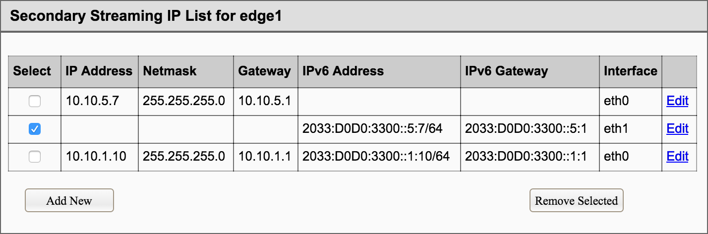
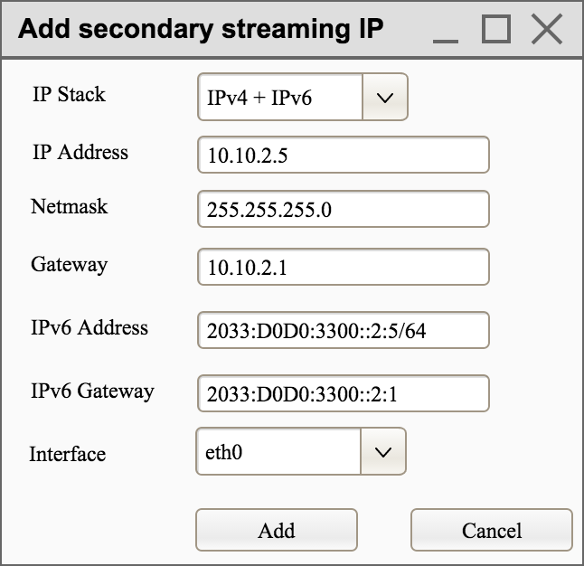
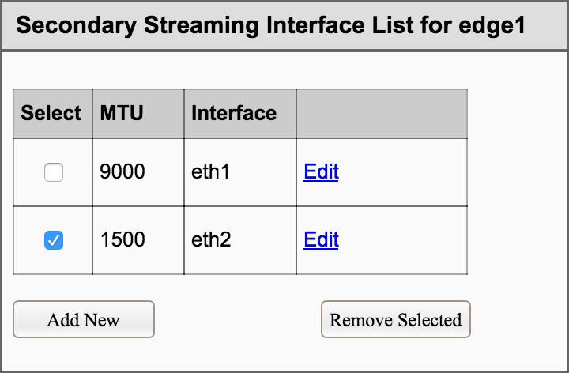
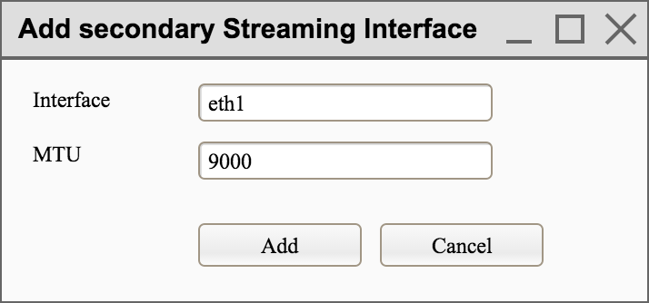
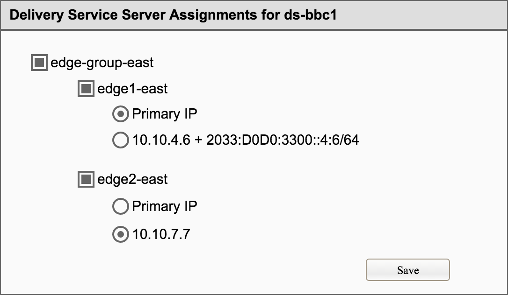
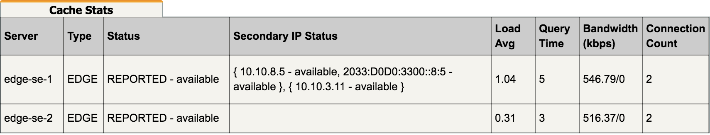

<!--
Licensed to the Apache Software Foundation (ASF) under one
or more contributor license agreements.  See the NOTICE file
distributed with this work for additional information
regarding copyright ownership.  The ASF licenses this file
to you under the Apache License, Version 2.0 (the
"License"); you may not use this file except in compliance
with the License.  You may obtain a copy of the License at

	http://www.apache.org/licenses/LICENSE-2.0

Unless required by applicable law or agreed to in writing,
software distributed under the License is distributed on an
"AS IS" BASIS, WITHOUT WARRANTIES OR CONDITIONS OF ANY
KIND, either express or implied.  See the License for the
specific language governing permissions and limitations
under the License.
-->
# Traffic Server Secondary Streaming IPs Design
## Purpose
### Scope
This document contains the requirements and top-level architectural design for
Traffic Server Secondary IPs feature.

## Architectural Framework
### Functional Overview
In current implementation, edge cache servers will stream to clients via a
single IPv4 or IPv6 address. When Traffic Router act as the DNS Resolver for a
cache plus delivery service domain name (i.e. edge1.ds.cdn.customer.com), it
will response with the IPv4 and IPv6 (if configured) configured for that server.

There is feature request from market to add secondary IPs support on edge cache
servers, and the functionality to assign a delivery service to a secondary IP of
an edge cache.

### Architectural Overview
This feature requires Traffic Ops implementation to support secondary IP
configuration for edge cache, and delivery service assignment to secondary IP.

Traffic Monitor should also monitor connectivity of secondary IPs configured.
And Traffic Router needs support to resolve streamer FQDN to secondary IP
assigned in a delivery service.

Traffic Server should record the IP serving client request. And should reject
request to an unassigned IP for a delivery service.

### Performance Requirements
This feature will add additional health check from Traffic Monitor to secondary
IPs of edge caches. Considering the message size and interval, the additional
health check traffic should have little impact the streaming traffic.

## Common Design and Implementation Standards
### Design and implementation
#### Configuration
##### Cache node system configuration
The IP configuration for cache node is not managed by Traffic Control. Adding a
new secondary IP requires operate on the cache node Linux system via IP tools or
some continuous deployment infrastructure like Salt Stack.

##### GUI Mockup
This feature development will be based on Apache Traffic Control master branch.
Therefore, GUI configuration on Traffic Portal must be supported. Traffic Ops
GUI is obsolete.

GUI mockups below are prototypes to demonstrate the concept of cache node
secondary streaming IP configuration. They will provide a guide line to support
this feature on Traffic Portal.

###### Configure Secondary Streaming IPs for an Edge Cache
A new list for all configured secondary stream IPs will be added on the server
edit web page. This list will only be available for edge caches. Operator could
remove selected secondary IPs, or add a new secondary IP via "Add New" button.



After "Add New" pressed, a new box "Add secondary streaming IP" will pop up. The
configuration could be "IPv4 Only", "IPv6 Only" or "IPv4 + IPv6". The edit page
should be similar as the add page.




The secondary streaming IP will share the same "TCP Port", "HTTPS Port",
"Status" configuration in the server edit page. The interface configuration will
also share with the primary IP.

However, if a different interface needs be selected, the secondary streaming
interfaces must be added first as shown below. And "Server Checks" for the
secondary streaming interfaces should be added in this case.






###### Assign Secondary Streaming IP to delivery service
When assigning an edge cache to a delivery service, operator could select from
the primary IP or one of secondary IPs. If selected the check box for a device,
the primary IP will be assigned by default.




##### Traffic Ops API changes
<!--
TODO: this section needs heavy rework in light of multi-interface servers.
-->
Traffic Portal is relied on Traffic Ops APIs to do the configuration on Traffic
Control. New Traffic Ops APIs need be designed to configure secondary streaming
IPs.

New CRUD `servers/{{server ID}}/interfaces` APIs will be added to support
configuration for multiple interfaces on a server. New CRUD
`/servers/{{server ID}}/ips` APIs will be added to support configuration for
multiple IPs on a server. Create or delete IP of type primary/management/ilo is
NOT allowed, and delete interface with primary IP assigned is NOT allowed.

For backward compatibility, the old CRUD `/servers` APIs are no
modified, and will not operate on secondary IPs.

###### Configure Secondary Streaming IPs
`GET /servers/{{server ID}}/interfaces`

Request Route Parameters:
| Name      | Required | Description |
------------|----------|--------------
| server ID | yes      | Server ID   |


Response Properties:
| Parameter     | Type    | Description                                                        |
----------------|---------|---------------------------------------------------------------------
| id            | integer | The interface ID                                                   |
| interfaceName | string  | The interface name                                                 |
| interfaceMTU  | integer | The Maximum Transmission Unit (MTU) to configure for interfaceName |


Response Example:
```json
{
	"response": [
		{
			"id": 1,
			"interfaceName": "bond0",
			"interfaceMTU": 9000
		},
		{
			"id": 3,
			"interfaceName": "bond1",
			"interfaceMTU": 1500
		}
	]
}
```

`GET /servers/{{server ID}}/interfaces/{{interface ID}}`

Request Route Parameters:
| Name         | Required | Description      |
---------------|----------|-------------------
| server ID    | yes      | Server ID        |
| interface ID | yes      | The interface ID |


Response Properties:
| Parameter     | Type    | Description                                                        |
----------------|---------|---------------------------------------------------------------------
| id            | integer | The interface ID                                                   |
| interfaceName | string  | The interface name                                                 |
| interfaceMTU  | integer | The Maximum Transmission Unit (MTU) to configure for interfaceName |


Response Example:
```json
{
	"response": {
		"id": 1,
		"interfaceName": "bond0",
		"interfaceMTU": 9000
	}
}
```

`POST /servers/{{server ID}}/interfaces`

Request Route Parameters:
| Name      | Required | Description |
------------|----------|--------------
| server ID | yes      | Server ID   |


Request Properties:
| Parameter     | Required | Description                                                        |
----------------|----------|---------------------------------------------------------------------
| serverID      | yes      | Server ID                                                          |
| interfaceName | yes      | The interface name                                                 |
| interfaceMTU  | yes      | The Maximum Transmission Unit (MTU) to configure for interfaceName |


Request Example:
```json
{
	"interfaceName": "bond0",
	"interfaceMTU": 9000
}
```

Response Properties:
| Parameter     | Type    | Description                                                        |
----------------|---------|---------------------------------------------------------------------
| id            | integer | The interface ID                                                   |
| interfaceName | string  | The interface name                                                 |
| interfaceMTU  | integer | The Maximum Transmission Unit (MTU) to configure for interfaceName |

Response Example:
```json
{
	"response": {
		"id": 1,
		"interfaceName": "bond0",
		"interfaceMTU": 9000
	},
	"alerts":[
		{
			"level": "success",
			"text": "Server interface creation was successful."
		}
	]
}
```

`PUT /servers/{{server ID}}/interfaces/{{interface ID}}`

Request Route Parameters:
| Name         | Required | Description      |
---------------|----------|-------------------
| server ID    | yes      | Server ID        |
| interface ID | yes      | The interface ID |


Request Properties:
| Parameter     | Required | Description                                                        |
----------------|----------|---------------------------------------------------------------------
| serverID      | yes      | Server ID                                                          |
| interfaceName | yes      | The interface name                                                 |
| interfaceMTU  | yes      | The Maximum Transmission Unit (MTU) to configure for interfaceName |


Request Example:
```json
{
	"interfaceName": "bond0",
	"interfaceMTU": 9000
}
```

Response Properties:
| Parameter     | Type    | Description                                                        |
----------------|---------|---------------------------------------------------------------------
| id            | integer | The interface ID                                                   |
| interfaceName | string  | The interface name                                                 |
| interfaceMTU  | integer | The Maximum Transmission Unit (MTU) to configure for interfaceName |


Response Example:
```json
{
	"response": {
		"id": 1,
		"interfaceName": "bond0",
		"interfaceMTU": 9000
	},
	"alerts":[
		{
			"level": "success",
			"text": "Server interface update was successful."
		}
	]
}
```

`DELETE /servers/{{server ID}}/interfaces/{{interface ID}}`

Request Route Parameters:
| Name         | Required | Description      |
---------------|----------|-------------------
| server ID    | yes      | Server ID        |
| interface ID | yes      | The interface ID |


Response Example:
```json
{
	"alerts":[
		{
			"level": "success",
			"text": "Server interface delete was successful."
		}
	]
}
```

`GET /servers/{{server ID}}/ips`

Request Route Parameters:
| Name         | Required | Description      |
---------------|----------|-------------------
| server ID    | yes      | Server ID        |

Response Properties:
| Parameter     | Type    | Description                                                                                                  |
----------------|---------|---------------------------------------------------------------------------------------------------------------
| id            | integer | Server IP ID                                                                                                 |
| type          | string  | IP type: "ilo", "management", "primary", or "secondary"                                                      |
| interfaceName | string  | The network interface name assigned with this IP<br/>For IP of type "ilo" or "management", it should be null |
| ip6Address    | string  | The IPv6 address/netmask of this IP                                                                          |
| ip6Gateway    | string  | The IPv6 gateway of this IP                                                                                  |
| ipAddress     | string  | The IPv4 address of this IP                                                                                  |
| ipGateway     | string  | The IPv4 gateway of this IP                                                                                  |
| ipNetmask     | string  | The IPv4 netmask of this IP                                                                                  |


Response Example:
```json
{
	"response": [
		{
			"id": 1,
			"type": "management",
			"ipAddress": "192.168.2.2",
			"ipGateway": "192.168.2.1",
			"ipNetmask": "255.255.255.0"
		},
		{
			"id": 3,
			"type": "primary",
			"interfaceName": "eth0",
			"ipAddress": "10.10.1.2",
			"ipGateway": "10.10.1.1",
			"ipNetmask": "255.255.255.0"
		},
		{
			"id": 11,
			"type": "secondary",
			"interfaceName": "bond0",
			"ip6Address": "2033:D0D0:3300::2:2/64",
			"ip6Gateway": "2033:D0D0:3300::2:1",
			"ipAddress": "10.10.2.2",
			"ipGateway": "10.10.2.1",
			"ipNetmask": "255.255.255.0"
		},
		{
			"id": 13,
			"type": "secondary",
			"interfaceName": "bond1",
			"ipAddress": "10.10.7.5",
			"ipGateway": "10.10.7.1",
			"ipNetmask": "255.255.255.0"
		}
	]
}
```

`GET /servers/{{server ID}}/ips/{{ID}}`

Request Route Parameters:
| Name         | Required | Description      |
---------------|----------|-------------------
| server ID    | yes      | Server ID        |
| ID           | yes      | Server IP ID     |


Response Properties:
| Parameter     | Type    | Description                                                                                                  |
----------------|---------|---------------------------------------------------------------------------------------------------------------
| id            | integer | Server IP ID                                                                                                 |
| type          | string  | IP type: "ilo", "management", "primary", or "secondary"                                                      |
| interfaceName | string  | The network interface name assigned with this IP<br/>For IP of type "ilo" or "management", it should be null |
| ip6Address    | string  | The IPv6 address/netmask of this IP                                                                          |
| ip6Gateway    | string  | The IPv6 gateway of this IP                                                                                  |
| ipAddress     | string  | The IPv4 address of this IP                                                                                  |
| ipGateway     | string  | The IPv4 gateway of this IP                                                                                  |
| ipNetmask     | string  | The IPv4 netmask of this IP                                                                                  |


Response Example:
```json
{
	"response": {
		"id": 11,
		"type": "secondary",
		"interfaceName": "bond0",
		"ip6Address": "2033:D0D0:3300::2:2/64",
		"ip6Gateway": "2033:D0D0:3300::2:1",
		"ipAddress": "10.10.2.2",
		"ipGateway": "10.10.2.1",
		"ipNetmask": "255.255.255.0"
	}
}
```

`POST /servers/{{server ID}}/ips`

Request Route Parameters:
| Name         | Required | Description      |
---------------|----------|-------------------
| server ID    | yes      | Server ID        |


Request Properties:
| Parameter     | Required | Description                                      |
----------------|----------|---------------------------------------------------
| serverID      | yes      | Server ID                                        |
| type          | yes      | Should always be "secondary"                     |
| interfaceName | yes      | The network interface name assigned with this IP |
| ip6Address    | no       | The IPv6 address/netmask of this IP              |
| ip6Gateway    | no       | The IPv6 gateway of this IP                      |
| ipAddress     | no       | The IPv4 address of this IP                      |
| ipGateway     | no       | The IPv4 gateway of this IP                      |
| ipNetmask     | no       | The IPv4 netmask of this IP                      |


Request Example:
```json
{
	"type": "secondary",
	"interfaceName": "bond0",
	"ip6Address": "2033:D0D0:3300::2:2/64",
	"ip6Gateway": "2033:D0D0:3300::2:1",
	"ipAddress": "10.10.2.2",
	"ipGateway": "10.10.2.1",
	"ipNetmask": "255.255.255.0"
}
```

Response Properties:
| Parameter     | Type    | Description                                      |
----------------|---------|---------------------------------------------------
| id            | integer | Server IP ID                                     |
| type          | string  | Should always be "secondary"                     |
| interfaceName | string  | The network interface name assigned with this IP |
| ip6Address    | string  | The IPv6 address/netmask of this IP              |
| ip6Gateway    | string  | The IPv6 gateway of this IP                      |
| ipAddress     | string  | The IPv4 address of this IP                      |
| ipGateway     | string  | The IPv4 gateway of this IP                      |
| ipNetmask     | string  | The IPv4 netmask of this IP                      |


Response Example:
```json
{
	"response": {
		"id": 11,
		"type": "secondary",
		"interfaceName": "bond0",
		"ip6Address": "2033:D0D0:3300::2:2/64",
		"ip6Gateway": "2033:D0D0:3300::2:1",
		"ipAddress": "10.10.2.2",
		"ipGateway": "10.10.2.1",
		"ipNetmask": "255.255.255.0"
	},
	"alerts":[
		{
			"level": "success",
			"text": "Server IP creation was successful."
		}
	]
}
```

`PUT /servers/{{server ID}}/ips/{{ID}}`

Request Route Parameters:
| Name         | Required | Description      |
---------------|----------|-------------------
| server ID    | yes      | Server ID        |
| ID           | yes      | Server IP ID     |


Request Properties:
| Parameter     | Required | Description                                      |
----------------|----------|---------------------------------------------------
| serverID      | yes      | Server ID                                        |
| interfaceName | no       | The network interface name assigned with this IP |
| ip6Address    | no       | The IPv6 address/netmask of this IP              |
| ip6Gateway    | no       | The IPv6 gateway of this IP                      |
| ipAddress     | no       | The IPv4 address of this IP                      |
| ipGateway     | no       | The IPv4 gateway of this IP                      |
| ipNetmask     | no       | The IPv4 netmask of this IP                      |


Request Example:
```json
{
	"interfaceName": "bond0",
	"ip6Address": "2033:D0D0:3300::2:2/64",
	"ip6Gateway": "2033:D0D0:3300::2:1",
	"ipAddress": "10.10.2.2",
	"ipGateway": "10.10.2.1",
	"ipNetmask": "255.255.255.0"
}
```

Response Properties:
| Parameter     | Type    | Description                                                                                                  |
----------------|---------|---------------------------------------------------------------------------------------------------------------
| id            | integer | Server IP ID                                                                                                 |
| type          | string  | IP type: "ilo", "management", "primary", or "secondary"                                                      |
| interfaceName | string  | The network interface name assigned with this IP<br/>For IP of type "ilo" or "management", it should be null |
| ip6Address    | string  | The IPv6 address/netmask of this IP                                                                          |
| ip6Gateway    | string  | The IPv6 gateway of this IP                                                                                  |
| ipAddress     | string  | The IPv4 address of this IP                                                                                  |
| ipGateway     | string  | The IPv4 gateway of this IP                                                                                  |
| ipNetmask     | string  | The IPv4 netmask of this IP                                                                                  |


Response Example:
```json
{
	"response": {
		"id": 11,
		"interfaceName": "bond0",
		"ip6Address": "2033:D0D0:3300::2:2/64",
		"ip6Gateway": "2033:D0D0:3300::2:1",
		"ipAddress": "10.10.2.2",
		"ipGateway": "10.10.2.1",
		"ipNetmask": "255.255.255.0"
	},
	"alerts":[
		{
			"level": "success",
			"text": "Server IP update was successful."
		}
	]
}
```

`DELETE /servers/{{server ID}}/2ndips/{{ID}}`

Request Route Parameters:
| Name         | Required | Description      |
---------------|----------|-------------------
| server ID    | yes      | Server ID        |
| ID           | yes      | Server IP ID     |


Response Example:
```json
{
	"alerts":[
		{
			"level": "success",
			"text": "Server IP delete was successful."
		}
	]
}
```

###### Assign Secondary Streaming IP to delivery service
The following existing APIs need modification:

`GET /deliveryserviceserver`

If secondary IP assigned, new parameters "ipID" and "type" will be shown in
response:
| Parameter | Type    | Description                                                |
------------|---------|-------------------------------------------------------------
| ipID      | integer | Server streaming IP ID                                     |
| type      | string  | IP type: "IP_PRIMARY primary", or "IP_SECONDARY secondary" |


Response Example:
```json
{
	"response": [
		{
			"lastUpdated": "2014-09-26T17:53:43Z",
			"server": "20",
			"ipID": "2",
			"type": "primary",
			"deliveryService": "1"
		},
		{
			"lastUpdated": "2014-09-26T17:53:44Z",
			"server": "21",
			"ipID": "11",
			"type": "secondary",
			"deliveryService": "1"
		},
	]
}
```

`GET /deliveryservices/{{id}}/servers`

If secondary IP assigned, new parameters "ipID" and "type" will be shown in
response:
| Parameter | Type    | Description                        |
------------|---------|-------------------------------------
| ipID      | integer | Server streaming IP ID             |
| type      | string  | IP type: "primary", or "secondary" |


And the following parameter will display the actual IP and interface assigned.
| Parameter     | Type    | Description                                                        |
----------------|---------|---------------------------------------------------------------------
| interfaceName | string  | The network interface name used for streaming IP                   |
| interfaceMTU  | string  | The Maximum Transmission Unit (MTU) to configure for interfaceName |
| ip6Address    | string  | The IPv6 address/netmask for streaming IP                          |
| ip6Gateway    | string  | The IPv6 gateway for streaming IP                                  |
| ipAddress     | string  | The IPv4 address for secondary streaming IP                        |
| ipGateway     | string  | The IPv4 gateway for secondary streaming IP                        |
| ipNetmask     | string  | The IPv4 netmask for secondary streaming IP                        |

Response Example:
```json
{ "response": [
	{
		"cachegroup": "us-il-chicago",
		"cachegroupId": "3",
		"cdnId": "3",
		"cdnName": "CDN-1",
		"domainName": "chi.kabletown.net",
		"guid": null,
		"hostName": "atsec-chi-00",
		"id": "19",
		"iloIpAddress": "172.16.2.6",
		"iloIpGateway": "172.16.2.1",
		"iloIpNetmask": "255.255.255.0",
		"iloPassword": "********",
		"iloUsername": "",
		"ipID": 11,
		"type": "secondary",
		"interfaceName": "bond0",
		"interfaceMTU": 9000,
		"ip6Address": "2033:D0D0:3300::2:2/64",
		"ip6Gateway": "2033:D0D0:3300::2:1",
		"ipAddress": "10.10.2.2",
		"ipGateway": "10.10.2.1",
		"ipNetmask": "255.255.255.0",
		"lastUpdated": "2015-03-08 15:57:32",
		"mgmtIpAddress": "",
		"mgmtIpGateway": "",
		"mgmtIpNetmask": "",
		"offlineReason": "N/A",
		"physLocation": "plocation-chi-1",
		"physLocationId": "9",
		"profile": "EDGE1_CDN1_421_SSL",
		"profileDesc": "EDGE1_CDN1_421_SSL profile",
		"profileId": "12",
		"rack": "RR 119.02",
		"routerHostName": "rtr-chi.kabletown.net",
		"routerPortName": "2",
		"status": "ONLINE",
		"statusId": "6",
		"tcpPort": "80",
		"httpsPort": "443",
		"type": "EDGE",
		"typeId": "3",
		"updPending": false
	}
]}
```

`POST /deliveryserviceserver`

A new "ipIDs" parameter will be added to request:
| Parameter | Required | Description                                                                             |
------------|----------|------------------------------------------------------------------------------------------
| ipIDs     | yes      | An array of server streaming IP ID<br/>The array must have the same size with "servers" |


Request Example:
```json
{
	"dsId": 246,
	"servers": [ 2, 3, 4, 5, 6 ],
	"ipIDs": [ 5, 2, 7, 9, 1 ],
	"replace": true
}
```

A new "ipIDs" parameter will be added to response:
| Parameter | Required | Description                                                                             |
------------|----------|------------------------------------------------------------------------------------------
| ipIDs     | yes      | An array of server streaming IP ID<br/>The array must have the same size with "servers" |


Response Example:
```json
{
	"alerts": [
		{
			"level": "success",
			"text": "Server assignments complete."
		}
	],
	"response": {
		"dsId" : 246,
		"servers": [ 2, 3, 4, 5, 6 ],
		"ipIDs": [ 5, 2, 7, 9, 1 ],
		"replace" : true
	}
}
```

`POST /deliveryservices/{{XML ID}}/servers`

A new "ipIDs" parameter will be added to request:
| Parameter | Required | Description                                                                             |
------------|----------|------------------------------------------------------------------------------------------
| ipIDs     | yes      | An array of server streaming IP ID<br/>The array must have the same size with "servers" |


Request Example:
```json
{
	"serverNames": [
		"tc1_ats1",
		"tc1_ats2"
	],
	"ipIDs": [
		11,
		3
	]
}
```
A new "ipIDs" parameter will be added to response:
| Parameter | Required | Description                                                                             |
------------|----------|------------------------------------------------------------------------------------------
| ipIDs     | yes      | An array of server streaming IP ID<br/>The array must have the same size with "servers" |


Response Example:
```json
{ "response":{
	"serverNames":[
		"tc1_ats1",
		"tc1_ats2"
	],
	"ipIDs":[
		11,
		3
	],
	"xmlId":"my_ds_1"
}}
```

##### DB schema changes
Add a new table to describe IPs:
```sql
CREATE TABLE ip (
	id bigint NOT NULL,
	server bigint NOT NULL,
	type bigint NOT NULL,
	intfid bigint,
	ipv4 cidr,
	ipv4_gateway inet,
	ipv6 cidr,
	ipv6_gateway inet,
	last_updated timestamp with time zone DEFAULT now(),
PRIMARY KEY (id),
FOREIGN KEY (intfid) REFERENCES interface(id) ON UPDATE CASCADE ON DELETE CASCADE
FOREIGN KEY (server) REFERENCES server(id) ON UPDATE CASCADE ON DELETE CASCADE
);
```

Add new value into type table to describe IP types:
```sql
INSERT INTO type (name, description, use_in_table) VALUES ('IP_MANAGEMENT', 'Management IP', 'ip');
INSERT INTO type (name, description, use_in_table) VALUES ('IP_ILO', 'ILO IP', 'ip');
INSERT INTO type (name, description, use_in_table) VALUES ('IP_PRIMARY', 'Primary IP', 'ip');
INSERT INTO type (name, description, use_in_table) VALUES ('IP_SECONDARY', 'Secondary streaming IP', 'ip');
```

Add a new table to describe interfaces:
```sql
CREATE TABLE intf (
	id bigint NOT NULL,
	server bigint NOT NULL,
	interface_name text NOT NULL,
	interface_mtu DEFAULT '9000'::bigint NOT NULL,
	last_updated timestamp with time zone DEFAULT now(),
PRIMARY KEY (id),
FOREIGN KEY (server) REFERENCES server(id) ON UPDATE CASCADE ON DELETE CASCADE
);
```

Modify server table to remove duplicated information, which will be moved to ip and interface table:
```sql
ALTER TABLE server DROP COLUMN IF EXISTS interface_name;
ALTER TABLE server DROP COLUMN IF EXISTS interface_mtu;
ALTER TABLE server DROP COLUMN IF EXISTS ip_address;
ALTER TABLE server DROP COLUMN IF EXISTS ip_netmask;
ALTER TABLE server DROP COLUMN IF EXISTS ip_gateway;
ALTER TABLE server DROP COLUMN IF EXISTS ip6_address;
ALTER TABLE server DROP COLUMN IF EXISTS ip6_gateway;
ALTER TABLE server DROP COLUMN IF EXISTS mgmt_ip_address;
ALTER TABLE server DROP COLUMN IF EXISTS mgmt_ip_netmask;
ALTER TABLE server DROP COLUMN IF EXISTS mgmt_ip_gateway;
ALTER TABLE server DROP COLUMN IF EXISTS ilo_ip_address;
ALTER TABLE server DROP COLUMN IF EXISTS ilo_ip_netmask;
ALTER TABLE server DROP COLUMN IF EXISTS ilo_ip_gateway;
```

Modify deliveryservice_server table to add a new column for IP assignment:
```sql
ALTER TABLE deliveryservice_server
	ADD COLUMN ip bigint default 0,
	ADD CONSTRAINT fk_ipid FOREIGN KEY (ip) REFERENCES ip(id) ON UPDATE CASCADE ON DELETE CASCADE;
```

#### Traffic Monitor
The "CrConfig" generated by Traffic Ops should add a new "secondaryIps" array to
describe all secondary streaming IPs configured on an edge cache server.
Example:
```json
{ "company-edge-se-1": {
  "port": "80",
  "cacheGroup": "edge1",
  "status": "REPORTED",
  "secondaryIps": [
	{
		"interfaceName": "eth0",
		"ip": "10.10.8.5",
		"ip6": "2033:D0D0:3300::8:5"
	},
	{
		"interfaceName": "eth1",
		"ip": "10.10.3.11"
	}
  ],
  "profile": "EDGE1_532"
}}
```

Traffic Monitor must query the connectivity to all the configured secondary IPs
with the same manner as the primary IP via "health.polling.url" configured. The
"CacheStats" should also add a new "secondaryIps" array to describe each
secondary IP availability on each edge server. Example:
```json
{
	"caches": {
		"edge-se-1": {
			"isAvailable": true,
			"secondaryIps": {
				"eth0": {
					"10.10.8.5":true,
					"2033:D0D0:3300::8:5":true
				},
				"eth1": {
					"10.10.3.11":true
				}
			}
		},
		"edge-se-2": {"isAvailable": true},
		"crdc-mid-se-1": {"isAvailable": true}
	},
	"deliveryServices": {
		"vod1": {
			"disabledLocations": [null],
			"isAvailable": true
		},
		"live1": {
			"disabledLocations": [],
			"isAvailable": true
		}
	}
}
```

While there will be a query for each primary and secondary IP, and each
interface configured, the following stats shown in "CrStates" should be
aggregated for all configured interfaces:
- `"kbps"`
- `"availableBandwidthInMbps"`
- `"availableBandwidthInKbps"`
- `"bandwidth"`

Also in "CrStates", the following stats should uniquely include all interfaces
configured for secondary streaming IPs:
- `"system.inf.name"`
- `"system.inf.speed"`

Also in "CrStates", the following stats should add value for each secondary
streaming IP:
- `"isHealthy"`
- `"isAvailable"`

In the "Cache Stats" table of Traffic Monitor GUI, "Bandwidth" should be the
aggregate of all the primary and secondary interfaces configured. And a new
"Secondary IP Status" column should report the status of all secondary IPs
configured.



#### Traffic Router
The "CrConfig" generated by Traffic Ops should add a new
"deliveryServices2ndIps" array to describe all secondary streaming IPs
assignment to delivery services on an edge cache server. Example:
```json
{
	"company-edge-se-1": {
		"port": "80",
		"cacheGroup": "edge1",
		"status": "REPORTED",
		"deliveryServices": {
			"vod1": ["edge.vod1.companycdn.com"],
			"live1": ["company-edge-se-1.live1.companycdn.com"],
			"primary1": ["company-edge-se-1.primary1.companycdn.com"]
		},
		"deliveryServices2ndIps": {
			"vod1": {
				"ip": "10.10.8.5",
				"ip6": "2033:D0D0:3300::8:5"
			},
			"live1": {
				"ip": "10.10.3.11"
			}
		},
		"profile": "EDGE1_532"
	}
}
```

When Traffic Router trying to redirect a delivery service request to an edge
cache, it should use the secondary IPs listed in "deliveryServices2ndIps" if
available. And only use the primary IPs if secondary IPs could not be found in
"deliveryServices2ndIps" for that delivery service.

#### Traffic Server
To get the client request dest IP in ATS access log, use "hii" field instead of
"phi" field.

Traffic Server should reject a request to a delivery service on an unassigned
IP. For example, when a delivery service assigned to the primary IP, any request
to the secondary IP for that delivery service should be rejected.

In ATS 8.0.0, the header_rewrite plugin adds support for condition
`"%{IP:INBOUND}"`, which could be used to support to restrict unassigned IPs.
Another option is implement a new plugin to support this restriction. However,
this restriction could be considered as optional as it will not impact the
feature usage itself.

## Analysis Support
The IP serving client request on cache server could be get from Traffic Server
access log. The information could be extracted from "phi" field or a new "phis"
field, see "Traffic Server" above.

## Upgrade and Downgrade
When upgraded from a release not supported this feature, DB migration will add
all the new secondary IP related tables and new columns. The existing delivery
service will not be impacted.

When downgrade to a release not supported this feature, DB migration will drop
the secondary IP related tables and columns. Any delivery service assigned to a
secondary IP of a cache, will be served by the primary IP of that cache.
