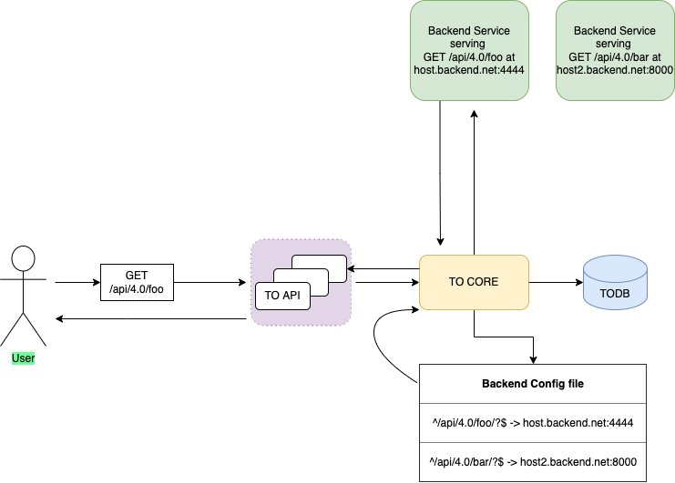

<!--
Licensed to the Apache Software Foundation (ASF) under one
or more contributor license agreements.  See the NOTICE file
distributed with this work for additional information
regarding copyright ownership.  The ASF licenses this file
to you under the Apache License, Version 2.0 (the
"License"); you may not use this file except in compliance
with the License.  You may obtain a copy of the License at

    http://www.apache.org/licenses/LICENSE-2.0

Unless required by applicable law or agreed to in writing,
software distributed under the License is distributed on an
"AS IS" BASIS, WITHOUT WARRANTIES OR CONDITIONS OF ANY
KIND, either express or implied.  See the License for the
specific language governing permissions and limitations
under the License.
-->
# Service Oriented Architecture for Traffic Ops

## Problem Description
Traffic Ops (TO), in its current form, can be best described as a monolithic application.
All the code and logic for TO resides in one single application. Hence, making even a minor 
change to one area of TO requires a redeploy of the entire TO application. This is not ideal, 
as it adds the additional burden of deploying a huge application, for a small change. In order to 
move faster and in a more seamless manner, TO needs to be refactored so that we can redeploy/ restart 
one part of the application without affecting the other parts.

Rewriting the entire TO application will be a highly time and resource intensive effort. However, we could 
refactor TO, to convert it into a Service Oriented architecture (SOA) style product. This would allow us to
decouple new features and functionality from the monolith while also providing the opportunity to re-factor out 
existing features in the future.

## Proposed Change
The goal is to transition TO from a monolithic application to a more service-oriented architecture.
What this means is that TO will be more of a "collection of services". New features and functionality will be
added as stand-alone services with stand-alone testing, deployment and scalability. TO, the way it is today, will serve
as `TO-core`, and any new service will be added as a "backend service", fulfilling the requirements of that service, and nothing else.
The user would still send a request to the TO API. TO, upon receiving this request, would check in its configured "backend routes". If 
a match is encountered, TO would act as a reverse proxy for this service. This means that TO would simply forward the request to the backend
service, get the response from the backend service and send it back to the user. From the user's perspective, this should be totally transparent
and seamless. Once TO starts supporting the SOA pattern, we would be able to scale the individual services independently of TO core.


### Traffic Portal Impact
Any new Traffic Portal (TP) changes that the backend service requires, will be required to be added as modules to the current TP architecture.
As for the TO refactor, no TP changes are required.

### Traffic Ops Impact
TO will need to read a new optional configuration file (supplied with the `backendcfg` option) on startup. This file will list the routes that will be served by the backend services, some route 
specific metadata (permissions, route ID, etc.) and where the incoming requests on those paths should be reverse proxied to. Any change to
this configuration file will require a reload of the new configuration values on TO's side. This can be achieved by sending a `SIGHUP` signal 
to the TO process.

The contents of an example backend configuration file are listed below:

```jsonc
{
  // List of routes for which TO needs to act as a reverse proxy
  "routes": [
    {
      // The path to match on
      "path": "^/api/4.0/foo/?$",
      // The HTTP method for this path that TO should support
      "method": "GET",
      // List of hosts where the backend service is running, and where TO needs to forward the incoming request to
      "hosts": [
        {
          // Protocol to follow while forwarding the requests
          "protocol": "https",
          // Host name where the backend service is running
          "hostname": "to.backend.net",
          // Port where the backend service is running on the above mentioned host
          "port": 8444
        },
        {
          "protocol": "https",
          "hostname": "to.backend.net",
          "port": 8445
        }
      ],
      // A boolean specifying whether or not TO should verify the backend server's certificate chain and host name. This is not recommended for production use.
      "insecure": false,
      // Permissions required to access the route
      "permissions": [
        "FOO:READ"
      ],
      // ID for the route
      "routeId": 123456,
      // Extra options to configure how TO forwards these requests
      "opts": {
        // Currently, TO just supports a round robin algorithm to forward the requests.
        "alg": "roundrobin"
      }
    }
  ]
}
```

#### REST API Impact
n/a

#### Client Impact
Clients will still send requests and receive responses (for the newly configured endpoints) from TO, so nothing will change from the clients' perspective.

#### Data Model / Database Impact
There is no impact on the existing TO database structure/ schema. The backend services are free to have their own databases and 
serve data from there. As before, only TO will be allowed to access the Traffic Ops Database (TODB).

### t3c Impact
n/a

### Traffic Monitor Impact
n/a

### Traffic Router Impact
n/a

### Traffic Stats Impact
n/a

### Traffic Vault Impact
n/a

### Documentation Impact
Documentation will have to be added for the new configuration option for TO.

### Testing Impact
The backend services will be responsible for writing their own test suites.

### Performance Impact
We don't foresee any performance impact on TO as a result of this architecture change.

### Security Impact
SSL certificates will be required for HTTPS protocol to be used between TO and the services. These can be implemented however is preferred by the 
backend service. The overhead will include certificate generation and signing, certificate deployment to services' servers, certificate management 
and renewal. Client certificates are an option for the future but will require further development.

### Upgrade Impact
If a change has to go in to one of the backend services, a redeploy/ restart of TO will no longer be necessary. The backend service will, however, 
need to be re deployed. After that, if there is no change to the backend configuration file, no action will be required on the TO side. Else, as explained 
earlier, a SIGHUP signal will need to be sent to TO to reload the new configuration values.

### Operations Impact
The added backend services will add some overhead to operations. However, this architecture will also reduce the load on operations from the TO side, since 
every code change now won't force redeploying TO as a whole. 

### Developer Impact
If a new endpoint (or refactor of an existing one) is deemed as a fit candidate for a backend service, the developer will have to undertake the tasks of writing
this new service (which can be a simple server serving these endpoints), and the tests associated with it. 

## Alternatives
We could consider refactoring the entire TO code base, but that might be extremely time and resource intensive.

## Dependencies
n/a

## References
n/a