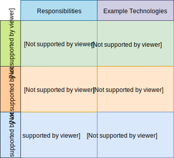
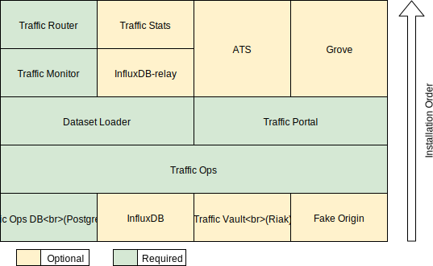

..
..
.. Licensed under the Apache License, Version 2.0 (the "License");
.. you may not use this file except in compliance with the License.
.. You may obtain a copy of the License at
..
..     http://www.apache.org/licenses/LICENSE-2.0
..
.. Unless required by applicable law or agreed to in writing, software
.. distributed under the License is distributed on an "AS IS" BASIS,
.. WITHOUT WARRANTIES OR CONDITIONS OF ANY KIND, either express or implied.
.. See the License for the specific language governing permissions and
.. limitations under the License.
..

.. _ansiblelab:

**************************
Ansible-based Lab Creation
**************************

The scope of the Ansible work presented is a set of generic roles an implementor could use to expose the common installation and configuration tasks of each component.
Additionally,  it provides some suggestions and sample scaffolding on how to divide the full end-to-end lab construction.

.. topic:: Why Ansible?

	There are many excellent tools to facilitate application installation and configuration.
	Ansible is a leading open-source tool in this marketspace backed by major corporate sponsorship and adoption.
	Most importantly it facilitates the abstractions desired without creating technological conflicts with existing infrastructure management solutions.

.. topic:: What about Security?

	Each organization should review the instructions being performed in each Ansible playbook to determine if they satisfy their security requirements.
	Additionally, each implementor should select and implement their secret store of choice such as the built-in ``ansible-vault`` or a more advanced secret-as-a-service solution for any sensitive variables.

Lab Implementation Concepts
===========================

The basic idea is to separate responsibilities to allow each implementation to use the tools/technologies that are already in use within their organizations.

Provisioning Layer
------------------

The provisioning layer deals with the lowest levels of compute/network/storage/load balancer resources.
Its objective is to bring systems from nothingness to a functional operating system (at least minimally).
Additionally, it is responsible for setting up proper DNS for each system, CDN components, and DNS NS record delegations.

Since DNS is a part of this layer, this unfortunately necessitates a small number of CDN concepts being present in the provisioning configuration.
It is expected that upon completion of this layer, a compatible Ansible inventory file is generated and placed in the lab's Ansible inventory directory.

The Provisioning Layer Output
"""""""""""""""""""""""""""""

Ansible supports inventory files in several formats such as JSON, YAML, INI, or TOML.
An example output is located at :atc-file:`infrastructure/ansible/sample.lab/inventory/provisioning.inventory`.

When creating systems, each will probably be designated for some particular component in the CDN.
Ansible groups and hostvars specifying the component name must be provided and will be mapped to server types later on in the dataset loader.

Like the systems being allocated to a particular component name, they must also be assigned to a particular DNS NS Delegation name where relevant or the ``ALL`` cdn as needed by the component.
The NS Delegation name is what you would find in DNS for Traffic Router to be authoritative for.  In this example it's ``MKGA`` rather than the CDN Name which is ``Kabletown2.0``.

It is not recommended that an :term:`origin server` be used by more than one :term:`Delivery Service` or it could lead to inconsistent behavior and conflated log data at the :term:`Mid-tier`.
As a workaround to this it is better for a lab to create DNS CNAME for each :term:`Delivery Service` pointing at a particular :term:`origin server` and return that set of names as a CSV hostvar ds_names on each :term:`origin server`.
These names will later be translated to additional inventory hosts used only for the creation of server objects in Traffic Ops and assignment to :term:`Delivery Services`.

Steady-state OS Layer
---------------------

The steady-state layer deals with the adaptation of a generic OS image to something that meets the organization's requirements.
For a CDN lab, it is also important to consider the deployment of necessary SSL data to known locations.

Application Layer
-----------------

This is the primary area for contribution within Apache Traffic Control.  Ansible has built-in variable precedence and role inclusion.
Conceptually these playbooks are split into implementation specific driver playbooks versus a generic core.

Implementation Specific Driver Playbook
"""""""""""""""""""""""""""""""""""""""

Generally, this should handle some basic lab variable plumbing as well as any implementation specific tasks not generally useful to other ATC implementations.
For example, an implementation might use an internal application as their application alerting engine which wouldn't make sense to others.
Sticking with the example of an application alerting engine, even if it were an open implementation such as Nagios it still probably wouldn't be appropriate
as not all implementations make use of that tool and maintaining it after contribution would incur ongoing costs.

Generic Core Playbook
"""""""""""""""""""""

This is the important piece for collaboration as it's based on the question, "Is this task/feature/function something all ATC implementations would benefit from?".
Typically, the yes answers involve exposing or simplifying application functionality on the part of the lab environment maintainer or developer.
Generally, the default values of a generic core role match or improve upon those present inside the RPM of the software.

Lab Implementation Layout
=========================

Ansible variable hierarchy
--------------------------

This is a topic better covered by `Ansible documentation <https://docs.ansible.com/ansible/latest/user_guide/playbooks_variables.html#variable-precedence-where-should-i-put-a-variable>`_, but the short version to keep in mind if you follow the sample lab design and markdown readme is:

(Highest precedence) CLI → Lab Vault → Lab Vars → Playbook Vars → Task Vars → Role Defaults (Lowest precedence)

Each of the generic core roles uses a prefix on its variables to avoid collision, and to make life easier it's recommended that you map them on the associated import role task variables.
This makes keeping track of what variables were intentionally overwritten from the role defaults clearer.

Sample Driver Playbooks
-----------------------

There are a few sample playbooks located at :atc-file:`infrastructure/ansible/`.  As an implementor develops their implementation specific driver playbooks they should go here.

* :atc-file:`infrastructure/ansible/steady-state.yml` is an example of a playbook that can deal with generating SSL certificates and distributing them across a lab as well as dynamically generating a secondary inventory file with additional data.
* :atc-file:`infrastructure/ansible/sample.driver.playbook.yml` shows a general skeleton to leverage when building out your implementation's driver playbooks around the generic core roles.
* :atc-file:`infrastructure/ansible/influxdb_relay.yml` shows a more advanced example of a driver playbook that involves querying Traffic Ops for supplementary information in a secondary play.
* :atc-file:`infrastructure/ansible/test.urls.yml` is just a simple playbook to query a known asset list on all delivery service urls to ensure a basic 200 http response for every asset and url.

The Lab directory
-----------------

A simple scaffold for a lab directory is included at :atc-file:`infrastructure/ansible/sample.lab`.  This directory should encapsulate all pieces that make one environment unique from another.  Ideally making new environments is as simple as copy-paste this directory and tweak the variables desired inside.

* The :atc-file:`infrastructure/ansible/sample.lab/ansible` subdirectory should be used to hold variables specific to a particular lab in either ``vars.yml`` or an encrypted Ansible ``vault``
* The :atc-file:`infrastructure/ansible/sample.lab/inventory` directory is where it's recommended for your provisioning layer to drop a valid Ansible inventory file describing what was allocated.  When using Ansible, it's important to point the inventory source to this directory so that it will merge all available inventory files together for you.
* The :atc-file:`infrastructure/ansible/sample.lab/out/ssl` directory is generated with the first run of the lab and holds your local copy of the lab SSL data.  The out directory is also handy for holding temporary data from the provisioning or steady-state layers to help triage failures.
* The docker and docker compose related files are present as an optional wrapper for Linux hosts (doesn't work on OSX) around all the lab plumbing dependencies for Ansible.  This is particularly handy for automated systems who perform regular redeployments such as in a CI/CD tool.
* :atc-file:`infrastructure/ansible/sample.lab/manual.run.sh` is a scaffold for the entrypoint for performing a lab rebuild from your local system.

Gilt
""""

Traditionally when distributing application playbooks for Ansible, many people use the built-in Ansible Galaxy repository.
There is a design limitation to the Ansible Galaxy though in that one git repository may only contain one role.
In the case of Apache Traffic Control, there are many components each with their own roles.
At the end of the day, the generic core roles must exist in a valid Ansible role directory location.
There are many solutions to this problem, but one of the better and easier once that's been run across is using the 3\ :sup:`rd`-party tool `Gilt <https://github.com/metacloud/gilt>`_.
As another alternative you can simply extract the roles from an Apache Traffic Control (ATC) source tarball from a build.

The Roles directory
-------------------

The generic core roles for each component live at :atc-file:`infrastructure/ansible/roles`.
Each role contains a README.md with more information, but this is not a replacement for existing documentation on the components themselves.
It's very useful to still review the Administrator's Guide in the documentation as you develop your implementation around the component's generic core.

If you're attempting to optimize the wallclock time needed to deploy all the components in parallel, they should be installed like the following:

Ansible Bonuses
===============

These roles don't require a lab environment to be useful to operations (ops) teams.

The to_api role
---------------

When reviewing the generic core roles, you'll notice that :atc-file:`infrastructure/ansible/roles/to_api` is a little different and doesn't map to an ATC component.
This role was developed for Ops teams to integrate around daily workflows if desired.

Using Traffic Ops as an Ansible Dynamic Inventory source
--------------------------------------------------------

:atc-file:`infrastructure/ansible/dynamic.inventory` contains a python script that is compatible with Ansible as a dynamic inventory.
It leverages the python native client in ATC to expose lots of Traffic Ops server related data to the operator to make powerful and precise Ansible host patterns without the need of maintaining static files.
