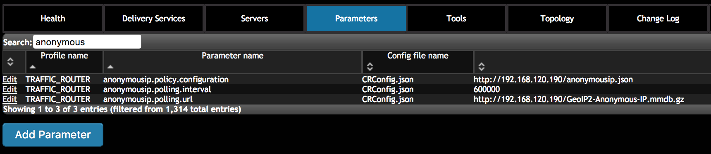
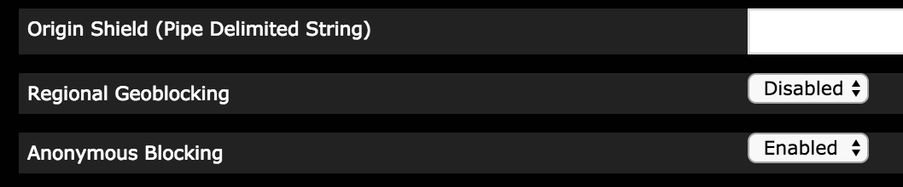
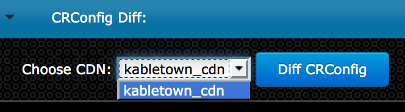

..
..
.. Licensed under the Apache License, Version 2.0 (the "License");
.. you may not use this file except in compliance with the License.
.. You may obtain a copy of the License at
..
..     http://www.apache.org/licenses/LICENSE-2.0
..
.. Unless required by applicable law or agreed to in writing, software
.. distributed under the License is distributed on an "AS IS" BASIS,
.. WITHOUT WARRANTIES OR CONDITIONS OF ANY KIND, either express or implied.
.. See the License for the specific language governing permissions and
.. limitations under the License.
..

.. _rl-anonymous_blocking-qht:

**************************************
Configure Anonymous Blocking
**************************************

.. Note:: Anonymous Blocking is only supported for HTTP delivery services.

1)  Prepare the Anonymous Blocking configuration file

Anonymous Blocking uses a configuration file in JSON format to define blocking rules for delivery services. The file needs to be put on an HTTP server accessible to Traffic Router. An example of the JSON is as follows::

    {

       "customer": "YourCompany",
       "version": "1",
       "date" : "2017-05-23 03:28:25",
       "name": "Anonymous IP Blocking Policy",

       "anonymousIp": { "blockAnonymousVPN": true,
                        "blockHostingProvider": true, 
                        "blockPublicProxy": true,
                        "blockTorExitNode": true},
                        
       "ip4Whitelist": ["192.168.30.0/24", "10.0.2.0/24", "10.1.1.1/32"],
       
       "ip6Whitelist": ["2001:550:90a::/48", "::1/128"],
       
       "redirectUrl": "http://youvebeenblocked.com"
    }

* “anonymousIp” contains the types of IPs which can be checked against the Anonymous IP Database. There are 4 types of IPs which can be checked: VPNs, Hosting Providers, Public Proxies, and Tor Exit Nodes. Each type of IP can be enabled or disabled. If the value is true, IPs which match this type will be blocked when the feature is enabled in the delivery service. If the value is false, IPs which match this type will not be blocked. If an IP matches more than 1 type and any type is enabled, the IP will be blocked.

* “redirectUrl” is the URL that will be returned to the blocked clients. Without a redirectUrl, the clients will receive an HTTP response code 403. With a redirectUrl, the clients will be redirected with an HTTP response code 302.

* “ipWhiteList” is an optional element. It includes a list of CIDR (Classless Inter-Domain Routing) blocks indicating the IPv4 and IPv6 subnets that are allowed by the rule. If this list exists and the value is not empty, client IP will be matched against the CIDR list, and if there is any match, the request will be allowed. If there is no match in the white list, further anonymous blocking logic will continue.

2)  Add Anonymous Blocking parameters on Traffic Ops

The following three new parameters are required to be added into CRConfig.json:

* "anonymousip.policy.configuration": the HTTP URL of the Anonymous Blocking configuration file. Traffic Router will fetch the file from this URL.
* "anonymousip.polling.url": the HTTP URL of the Anonymous IP Database. Traffic Router will fetch the file from this URL.
* "anonymousip.polling.interval": the interval that Traffic Router polls the Anonymous Blocking configuration file and Anonymous IP Database.

3)  Enable Anonmyous Blocking for a delivery service

4)  Make configuration effective

Go to Tools->Snapshot CRConfig, perform “Diff CRConfig” and click "Write CRConfig".

5)  Traffic Router access log with Anonymous Blocking

Anonymous Blocking extends the field of "rtype" and adds a new field "ANON_BLOCK" in Traffic Router access.log to help to monitor the working of this feature.

If rtype=ANON_BLOCK then the client's IP was found in the Anonymous IP Database and was blocked.

   

