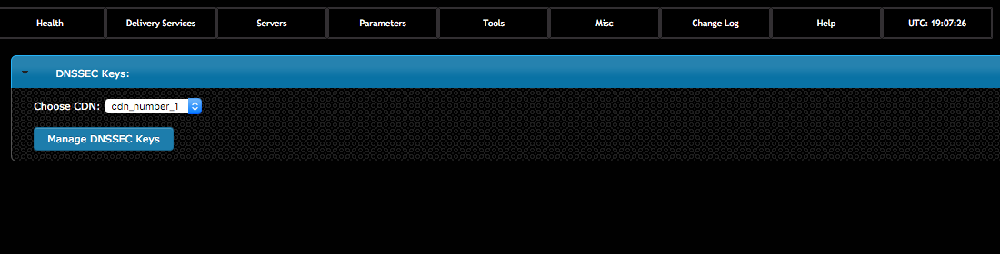
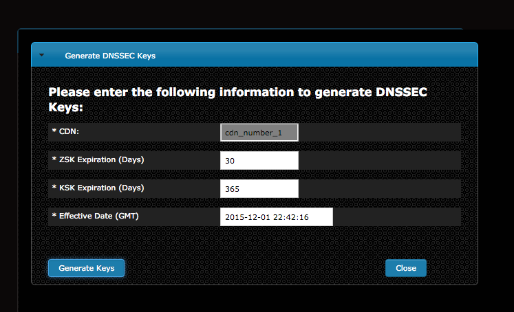
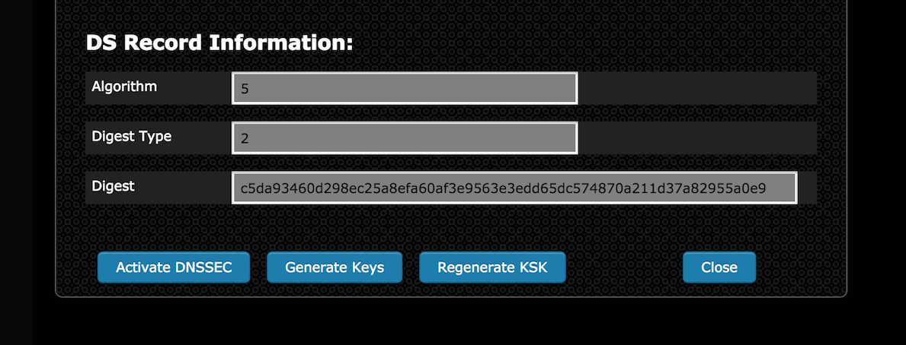
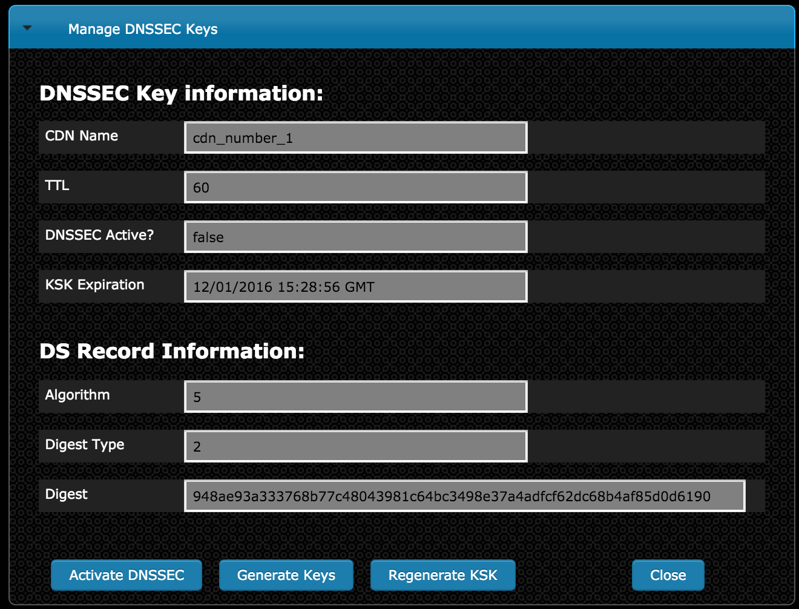

.. 
.. 
.. Licensed under the Apache License, Version 2.0 (the "License");
.. you may not use this file except in compliance with the License.
.. You may obtain a copy of the License at
.. 
..     http://www.apache.org/licenses/LICENSE-2.0
.. 
.. Unless required by applicable law or agreed to in writing, software
.. distributed under the License is distributed on an "AS IS" BASIS,
.. WITHOUT WARRANTIES OR CONDITIONS OF ANY KIND, either express or implied.
.. See the License for the specific language governing permissions and
.. limitations under the License.
.. 

.. _rl-dnssec-qht:

****************
Configure DNSSEC
****************

.. Note:: In order for Traffic Ops to successfully store keys in Traffic Vault, at least one Riak Server needs to be configured in Traffic Ops. See the `Traffic Vault admin page <../traffic_vault.html>`_ for more information.

.. Note:: Currently DNSSEC is only supported for DNS delivery services.

1)  Go to Tools->Manage DNSSEC Keys choose a CDN and click Manage DNSSEC Keys

2)	Generate keys for a CDN by clicking Generate Keys then entering the following information: 
	
		-  Expiration in days for the Zone Signing Key (ZSK)
		-  Expiration in days for the Key Signing Key (KSK)
		-  Effective Date

	Once the required information has been entered click on the 'Generate Keys' button.  

	Depending upon the number of Delivery Services in the CDN, generating DNSSEC keys may take serveral seconds.

3)	In order for DNSSEC to work properly, the DS Record information needs to be added to the parent zone of the CDN's domain (e.g. If 	the CDN's domain is 'cdn.kabletown.net' the parent zone is 'kabletown.net'). 

	If you control your parent zone you can enter this information yourself, otherwise you will need to work with your DNS team to get the DS Record added to the parent zone.

4)	Once DS Record information has been added to the parent zone, DNSSEC needs to be activated for the CDN so that Traffic Router will sign responses.  
	
	Click on Tools -> Manage DNSSEC Keys -> Choose your CDN -> On the Manage DNSSEC Keys page click the activate DNSSEC Keys button.  

	This will add a 'dnssec.enabled = "true"' entry to CRConfig for the chosen CDN. 

5) DNSSEC should now be active on your CDN and Traffic Router should be signing responses.  
	
	A dig command with +dnssec added should show you the signed responses.  

	``dig edge.cdn.kabletown.net. +dnssec``

6)	When KSK expiration is approaching (default 365 days), it is necessary to manually generate a new KSK for the TLD (Top Level Domain) and add the DS Record to the parent zone.  In order to avoid signing errors, it is suggested that an effective date is chosen which allows time for the DS Record to be added to the parent zone before the new KSK becomes active.  

	A new KSK can be generated by clicking the 'Regenerate KSK' button on the Manage DNSSEC Keys screen (see screenshot above). 
