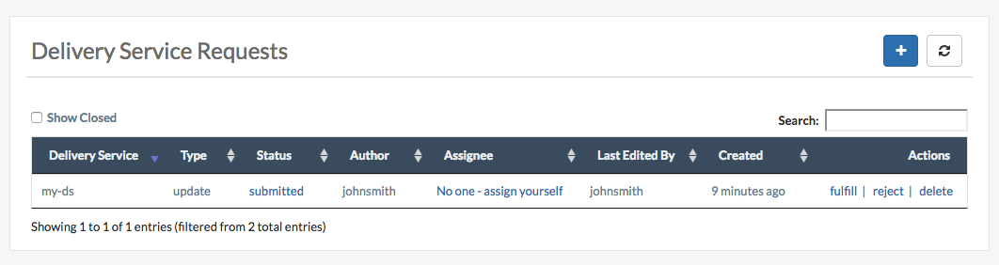

..
..
.. Licensed under the Apache License, Version 2.0 (the "License");
.. you may not use this file except in compliance with the License.
.. You may obtain a copy of the License at
..
..     http://www.apache.org/licenses/LICENSE-2.0
..
.. Unless required by applicable law or agreed to in writing, software
.. distributed under the License is distributed on an "AS IS" BASIS,
.. WITHOUT WARRANTIES OR CONDITIONS OF ANY KIND, either express or implied.
.. See the License for the specific language governing permissions and
.. limitations under the License.
..

.. _ds_requests:

Delivery Service Requests
=========================

When enabled in traffic_portal_properties.json, delivery service requests are created when ALL users attempt to create, update or delete a delivery service.
This allows users with higher level permissions (ops or admin) to review the changes for completeness and accuracy before deploying the changes.
In addition, most delivery service changes require cache config updates (aka queue updates) and/or a cdn snapshot. Both of these actions are reserved for users with elevated permissions.

A list of the delivery service requests associated with your tenant can be found here:

``https://traffic-portal.domain.com/#!/delivery-service-requests``

Who Can Create a Delivery Service Request and How?
##################################################

Users with the Portal role (or above) can create delivery service requests by doing one of three things:

1. Creating a new delivery service
2. Updating an existing delivery service
3. Deleting an exiting delivery service

By performing one of these actions, a delivery service request will be created for you with a status of draft or submitted. You determine the status of your request. Only change the status of your request to submitted once the request is ready for review and deployment.

Who Can Fulfill a Delivery Service Request and How?
###################################################

Users with elevated permissions (Operations or above) can fulfill (apply the changes) or reject the delivery service request. In fact, they can do all of the following:

Update the contents of the delivery service request
***************************************************

Optional. This will update the "Last Edited By" field to indicate who last updated the request.

Assign or unassign the delivery service request
***********************************************

Optional. Assignment is currently limited to current user. This is optional as fulfillment will auto-assign the request to the user doing the fulfillment.

Reject the delivery service request
***********************************

Rejecting a delivery service request will set status to ``rejected`` and the request can no longer be modified. This will auto-assign the request to the user doing the rejection.

Fulfill the delivery service request
************************************

Fulfilling a delivery service request will show the requested changes and, once committed, will apply the desired changes and set status to ``pending``. The request is pending because many types of changes will require cache config updates (aka queue updates) and/or a cdn snapshot. Once queue updates and/or cdn snapshot is complete, the request should be marked ``complete``.

Complete the delivery service request
*************************************

Only after the delivery service request has been fulfilled and the changes have been applied can a delivery service request be marked as complete. Marking a delivery service as complete is currently a manual step because some changes require cache config updates (aka queue updates) and/or a cdn snapshot.
Once that is done and the changes have been deployed, the request status should be changed from ``pending`` to ``complete``.

Delete the delivery service request
***********************************

Delivery service requests with a status of draft or submitted can always be deleted entirely if appropriate.

