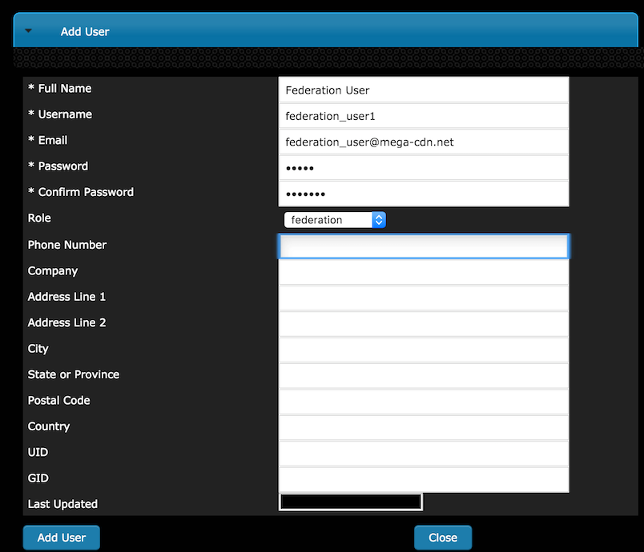

.. 
.. Copyright 2015 Comcast Cable Communications Management, LLC
.. 
.. Licensed under the Apache License, Version 2.0 (the "License");
.. you may not use this file except in compliance with the License.
.. You may obtain a copy of the License at
.. 
..     http://www.apache.org/licenses/LICENSE-2.0
.. 
.. Unless required by applicable law or agreed to in writing, software
.. distributed under the License is distributed on an "AS IS" BASIS,
.. WITHOUT WARRANTIES OR CONDITIONS OF ANY KIND, either express or implied.
.. See the License for the specific language governing permissions and
.. limitations under the License.
.. 

.. _rl-federations-qht:

*********************
Configure Federations
*********************

1)  Create a user with a federations role (Misc -> Users -> Add User).  This user will have the ability to perform the following actions: 
		
		- Edit the federation
		- Delete the federation
		- Add IPV4 resolvers
		- Add IPV6 resolvers

2) 	As a user with admin priveleges, create a Federation Mapping by going to Delivery Services -> Federations and then clicking 'Add Federation Mapping'

3)	Choose the Delivery Service for the federation to be mapped to and assign it to the Federation User; click Add.

.. image:: federation02.png
	:scale: 100%
	:align: center

4) 	After the Federation is added, Traffic Ops will display the Federation.  

	Changes can be made at this time or the Federation can be deleted.  Notice that no resolvers have been added to the fedeation yet.  This can only be done by the federation user created in step 1. 

	If no further action is necessary, the Close button will close the window and display the list of all Federations. 

.. image:: federation03.png
	:scale: 100%
	:align: center

	
**The Federation user can now add resolvers to the Federation Mapping in Traffic Ops.**

5)	The federation user logs to traffic ops and stores the mojolicious cookie.  The mojolicious cookie can be obtained manually using chrome or via curl.

	Example::

		$ curl -i -XPOST "http://localhost:3000/api/1.1/user/login" -H "Content-Type: application/json" -d '{ "u": "federation_user1", "p": "password" }'

		HTTP/1.1 200 OK
		Date: Wed, 02 Dec 2015 21:12:06 GMT
		Content-Length: 65
		Access-Control-Allow-Credentials: true
		Content-Type: application/json
		Access-Control-Allow-Methods: POST,GET,OPTIONS,PUT,DELETE
		Set-Cookie: mojolicious=eyJleHBpcmVzIjoxNDQ5MTA1MTI2LCJhdXRoX2RhdGEiOiJmZWRlcmF0aW9uX3VzZXIxIn0---06b4f870d809d82a91433e92eae8320875c3e8b0; expires=Thu, 03 Dec 2015 01:12:06 GMT; path=/; HttpOnly
		Server: Mojolicious (Perl)
		Access-Control-Allow-Headers: Origin, X-Requested-With, Content-Type, Accept
		Cache-Control: no-cache, no-store, max-age=0, must-revalidate
		Connection: keep-alive
		Access-Control-Allow-Origin: http://localhost:8080

		{"alerts":[{"level":"success","text":"Successfully logged in."}]}

6) The federation user sends a request to Traffic Ops to add IPV4 and/or IPV6 resolvers
	

	Example::

		$ curl -ki -H "Cookie: mojolicious=eyJleHBpcmVzIjoxNDQ5MTA1MTI2LCJhdXRoX2RhdGEiOiJmZWRlcmF0aW9uX3VzZXIxIn0---06b4f870d809d82a91433e92eae8320875c3e8b0;" -XPUT 'http://localhost:3000/api/1.2/federations' -d '
			{"federations": [ 
				{   "deliveryService": "images-c1", 
					"mappings": 
						{ "resolve4": [ "8.8.8.8/32", "8.8.4.4/32" ],
						  "resolve6": ["2001:4860:4860::8888/128", "2001:4860:4860::8844"]
						} 
				} 
			  ] 
			}'

		HTTP/1.1 200 OK
		Set-Cookie: mojolicious=eyJleHBpcmVzIjoxNDQ5MTA1OTQyLCJhdXRoX2RhdGEiOiJmZWRlcmF0aW9uX3VzZXIxIn0---b42be0749415cefd1d14e1a91bb214845b4de556; expires=Thu, 03 Dec 2015 01:25:42 GMT; path=/; HttpOnly
		Server: Mojolicious (Perl)
		Date: Wed, 02 Dec 2015 21:25:42 GMT
		Content-Length: 74
		Access-Control-Allow-Credentials: true
		Content-Type: application/json
		Access-Control-Allow-Methods: POST,GET,OPTIONS,PUT,DELETE
		Cache-Control: no-cache, no-store, max-age=0, must-revalidate
		Access-Control-Allow-Origin: http://localhost:8080
		Connection: keep-alive
		Access-Control-Allow-Headers: Origin, X-Requested-With, Content-Type, Accept

		{"response":"federation_user1 successfully created federation resolvers."}

7) The resolvers added by the federation user will now visible in Traffic Ops.

.. image:: federation04.png
	:scale: 100%
	:align: center

8) Any requests made from a client that resolves to one of the federation resolvers will now be given a CNAME from Traffic Router.

