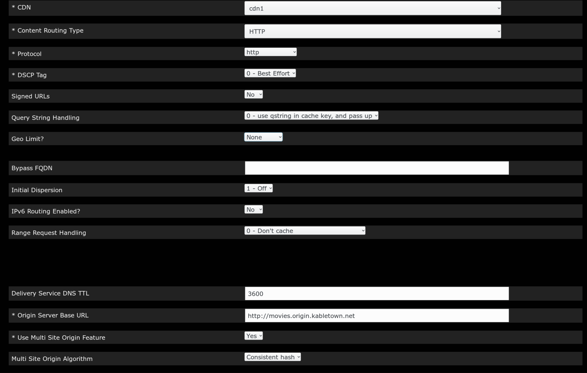

.. 
.. 
.. Licensed under the Apache License, Version 2.0 (the "License");
.. you may not use this file except in compliance with the License.
.. You may obtain a copy of the License at
.. 
..     http://www.apache.org/licenses/LICENSE-2.0
.. 
.. Unless required by applicable law or agreed to in writing, software
.. distributed under the License is distributed on an "AS IS" BASIS,
.. WITHOUT WARRANTIES OR CONDITIONS OF ANY KIND, either express or implied.
.. See the License for the specific language governing permissions and
.. limitations under the License.
.. 

.. _rl-multi-site-origin-qht:

***************************
Configure Multi Site Origin
***************************

1) Create cachegroups for the origin locations, and assign the appropriate parent-child relationship between the mid and org cachegroups (click the image to see full size).  Each mid cachegroup can be assigned a primary and secondary origin parent cachegroup.  When the mid cache parent configuration is generated, origins in the primary cachegroups will be listed first, followed by origins in the secondary cachegroup. Origin servers assigned to the delivery service that are assigned to neither the primary nor secondary cachegroups will be listed last.

.. image:: C5C4CD22-949A-48FD-8976-C673083E2177.png
	:scale: 100%
	:align: center

2) Create a profile to assign to each of the origins:

.. image:: 19BB6EC1-B6E8-4D22-BFA0-B7D6A9708B42.png
	:scale: 100%
	:align: center

3) Create server entries for the origination vips:

.. image:: D28614AA-9758-45ED-9EFD-3A284FC4218E.png
	:scale: 100%
	:align: center

4) Check the multi-site check box in the delivery service screen:

5) Assign the org servers to the delivery service that will have the multi site feature.  Org servers assigned to a delivery service with multi-site checked will be assigned to be the origin servers for this DS.

.. image:: 066CEF4F-C1A3-4A89-8B52-4F72B0531367.png
	:scale: 100%
	:align: center

.. Note:: “Origin Server Base URL” uniqueness: In order to enable MID caches to distinguish delivery services by different MSO algorithms while performing parent failover, it requires that “Origin Server Base URL” (OFQDN) for each MSO enabled delivery service is unique unless the exceptions listed afterwards. This means that the OFQDN of a MSO enabled delivery service should be different with the OFQDNs of any other delivery service, regardless of whether they are MSO enabled or not. The exceptions are: 

   1. If there are multiple CDNs created on the same Traffic Ops, delivery services across different CDNs may have the same OFQDN configured.
   2. If several delivery services in the same CDN have the same MSO algorithm configured, they may share the same OFQDN.
   3. If delivery services are assigned with different MID cache groups respectively, they can share the same OFQDN.
   4. This OFQDN must be valid - ATS will perform a DNS lookup on this FQDN even if IPs, not DNS, are used in the parent.config.
   5. The OFQDN entered as the "Origin Server Base URL" will be sent to the origins as a host header.  All origins must be configured to respond to this host.

6) For ATS 5.x, configure the mid hdr_rewrite on the delivery service, example: ::

	cond %{REMAP_PSEUDO_HOOK} __RETURN__ set-config proxy.config.http.parent_origin.dead_server_retry_enabled 1 __RETURN__ set-config proxy.config.http.parent_origin.simple_retry_enabled 1 __RETURN__ set-config proxy.config.http.parent_origin.simple_retry_response_codes "400,404,412" __RETURN__ set-config proxy.config.http.parent_origin.dead_server_retry_response_codes "502,503" __RETURN__ set-config proxy.config.http.connect_attempts_timeout 2 __RETURN__ set-config proxy.config.http.connect_attempts_max_retries 2 __RETURN__ set-config proxy.config.http.connect_attempts_max_retries_dead_server 1 __RETURN__ set-config proxy.config.http.transaction_active_timeout_in 5 [L] __RETURN__

7) Create a delivery service profile. This must be done to set the MSO algorithm.  Also, as of ATS 6.x, multi-site options must be set as parameters within the parent.config.  Header rewrite parameters will be ignored.  See `ATS parent.config <https://docs.trafficserver.apache.org/en/6.2.x/admin-guide/files/parent.config.en.html>`_ for more details.  These parameters are now handled by the creation of a delivery service profile.

   a) Create a profile of the type DS_PROFILE for the delivery service in question.

      .. image:: ds-profile.png
         :scale: 50%
         :align: center

   b) Click "Show profile parameters" to bring up the parameters screen for the profile.  Create parameters for the following:

      +----------------------------------------+------------------+--------------------------+-------------------------+
      | Parameter Name                         | Config File Name | Value                    | ATS parent.config value |
      +========================================+==================+==========================+=========================+
      | mso.algorithm                          | parent.config    | true, false, strict,     | round_robin             |
      |                                        |                  | consistent_hash          |                         |
      +----------------------------------------+------------------+--------------------------+-------------------------+
      | mso.parent_retry                       | parent.config    | simple_retry, both,      | parent_retry            |
      |                                        |                  | unavailable_server_retry |                         |
      +----------------------------------------+------------------+--------------------------+-------------------------+
      | mso.unavailable_server_retry_responses | parent.config    | list of server response  | defaults to the value   |
      |                                        |                  | codes, eg "500,502,503"  | in records.config       |
      |                                        |                  |                          | when unused.            |
      +----------------------------------------+------------------+--------------------------+-------------------------+
      | mso.max_simple_retries                 | parent.config    | Nubmer of retries made   | defaults to the value   |
      |                                        |                  | after a 4xx error        | in records.config       |
      |                                        |                  |                          | when unused.            |
      +----------------------------------------+------------------+--------------------------+-------------------------+
      | mso.max_unavailable_server_retries     | parent.config    | Nubmer of retries made   | defaults to the value   |
      |                                        |                  | after a 5xx error        | in records.config       |
      |                                        |                  |                          | when unused.            |
      +----------------------------------------+------------------+--------------------------+-------------------------+

      .. image:: ds_profile_parameters.png
         :scale: 100%
         :align: center

   c) In the delivery service page, select the newly created DS_PROFILE and save the delivery service.

8) Turn on parent_proxy_routing in the MID profile.
