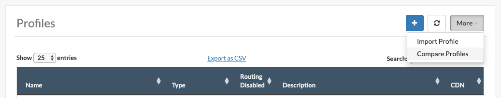

..
..
.. Licensed under the Apache License, Version 2.0 (the "License");
.. you may not use this file except in compliance with the License.
.. You may obtain a copy of the License at
..
..     http://www.apache.org/licenses/LICENSE-2.0
..
.. Unless required by applicable law or agreed to in writing, software
.. distributed under the License is distributed on an "AS IS" BASIS,
.. WITHOUT WARRANTIES OR CONDITIONS OF ANY KIND, either express or implied.
.. See the License for the specific language governing permissions and
.. limitations under the License.
..

.. _profile_compare_mgmt:

****************
Compare Profiles
****************
In Traffic Portal *all* users can compare the :term:`Parameters` of any 2 :term:`Profiles` side-by-side, and users with a higher level :term:`Role` ("operations" or "admin") can easily add or remove parameters from each profile as necessary.

The ability to compare 2 profiles can be found under :menuselection:`Configure --> Profiles --> More --> Compare Profiles`

	The "Compare Profiles" menu item

Once you have selected the :guilabel:`Compare Profiles` menu item, you will be asked to choose 2 profiles to compare.

.. figure:: profile_compare_mgmt/select_profiles_dialog.png
	:width: 60%
	:align: center
	:alt: A screenshot of the "Compare Profiles" dialog

	The "Compare Profiles" dialog

All parameters exclusively assigned to one profile but not the other will be displayed by default with their profile membership displayed side-by-side. In addition, by selecting the :guilabel:`Show Shared Params` link, the user can see a superset of all parameters (shared and not shared) across the 2 profiles. Both views provide users with higher level permissions ("operations" or "admin") the ability to easily remove or add parameters for each profile and persist the final state of both profiles (or restore the original state and discard changes). As the user makes changes, a blue shadow is added to all modified checkboxes.

.. figure:: profile_compare_mgmt/compare_profiles_table.png
	:align: center
	:alt: A screenshot of the "Compare Profiles" table

	The "Compare Profiles" table
