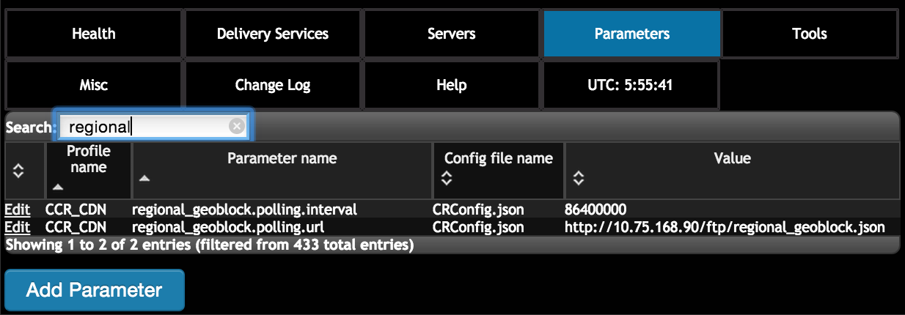

..
..
.. Licensed under the Apache License, Version 2.0 (the "License");
.. you may not use this file except in compliance with the License.
.. You may obtain a copy of the License at
..
..     http://www.apache.org/licenses/LICENSE-2.0
..
.. Unless required by applicable law or agreed to in writing, software
.. distributed under the License is distributed on an "AS IS" BASIS,
.. WITHOUT WARRANTIES OR CONDITIONS OF ANY KIND, either express or implied.
.. See the License for the specific language governing permissions and
.. limitations under the License.
..

.. _rl-regionalgeo-qht:

**************************************
Configure Regional Geo-blocking (RGB)
**************************************

.. Note:: RGB is only supported for HTTP delivery services.

1)	Prepare RGB configuration file

RGB uses a configuration file in JSON format to define regional geo-blocking rules for delivery services. The file needs to be put on an HTTP server accessible to Traffic Router. An example of the JSON is as follows::

    {
    "deliveryServices":
        [
            {
                "deliveryServiceId": "hls-live",
                "urlRegex": ".*live4\\.m3u8",
                "geoLocation": {"includePostalCode":["N0H", "L9V", "L9W"]},
                "redirectUrl": "http://third-party.com/blacked_out.html"
            },
            {
                "deliveryServiceId": "hls-live",
                "urlRegex": ".*live5\\.m3u8",
                "ipWhiteList": [185.68.71.9/22","142.232.0.79/24"],
                "geoLocation": {"excludePostalCode":["N0H", "L9V"]},
                "redirectUrl": "/live5_low_bitrate.m3u8"
            }
        ]
    }

* The value of "deliveryServiceId" shall be equal to the “XML ID” field of the intended delivery service defined on Traffic Ops.

* “urlRegex” is to match request URLs. The URLs matching the regex are applicable to the rule.

* “geoLocation” currently supports “includePostalCode” and “excludePostalCode” attribute. When “includePostalCode” attribute is used, only the clients whose FSAs are in the “includePostalCode” list are able to view the content represented by “urlRegex”. When “excludePostalCode” is used, any client whose FSA are not in the “excludePostalCode” list are allowed to view the content. “includePostalCode” and “excludePostalCode” are mutually exclusive in one rule. (FSA: Forward Sortation Area, first three postal characters of Canadian postal codes)

* “redirectUrl” is the URL that will be responded to the blocked clients. Without a domain name in the URL, the URL will still be served in the same delivery service. Thus Traffic Router will redirect the client to a chosen cache server assigned to the delivery service. If the URL includes a domain name, Traffic Router simply redirects the client to the defined URL. In the later case, the redirect URL must not match the “urlRegex” part to avoid HTTP 302 loop on Traffic Router.

* “ipWhiteList” is an optional element. It includes a list of CIDR (Classless Inter-Domain Routing) blocks indicating the IPv4 subnets that are allowed by the rule. If this list exists and the value is not empty, client IP will be matched against the CIDR list, and if there is any match, the request will be allowed and no postal code matching logic is needed. If there is no match in the white list, postal code matching logic will be processed further.

2)	Add RGB parameters on Traffic Ops

The two new parameters in following table are required to be added into CRConfig.json:

* "regional_geoblocking.polling.url": the HTTP URL of RGB configuration file. Traffic Router will fetch the file from this URL.
* "regional_geoblocking.polling.interval": the interval that Traffic Router polls the RGB configuration file.

3)	Enable RGB for a delivery service

.. image:: regionalgeo02.png
	:scale: 100%
	:align: center

4)	Make configuration effective

Go to Tools->Snapshot CRConfig, perform “Diff CRConfig” and click "Write CRConfig".

.. image:: regionalgeo03.png
	:scale: 70%
	:align: center

5)	Traffic Router access log with RGB

RGB extends the field of "rtype" and adds a new field "rgb" in Traffic Router access.log to help to monitor the working of this feature.

For "rtype", RGALT indicates that a request is redirected to an alternate URL by RGB; RGDENY indicates that a request is denied by RGB because there is no matching rule in JSON for this request.

For "rgb", when RGB is enabled, it will be non-empty with following format::

    {FSA}:{allowed/disallowed}:{include/exclude postal}:{fallback config/current config}:{allowed by whitelist/otherwise}

* {FSA}: It is the client’s FSA part of its postal code, which is retrieved from geo-location database. If FSA is empty, dash (“-“) is filled in.
* {allowed/disallowed}: This flag shows if a request is allowed or disallowed by RGB (1 for yes, and 0 for no).
* {include/exclude postal}: It shows that when a rule in JSON is matched for a request, it is an include or exclude list of postal codes (i.e. FSAs). “I” for include, and “X” for exclude. If no rule matches, dash (“-“) is filled in.
* {fallback config/current config}: when TR fails to parse an RGB JSON, TR will handle requests with latest valid JSON configuration, but will set {fallback config} flag to 1. If the new JSON is valid, then the flag is set to 0.
* {allowed by whitelist/otherwise}: If a request is allowed by whitelist, this flag is set to 1; for all other cases, it is 0.

Example::

    1446442214.685 qtype=HTTP chi=129.100.254.79 url="http://foo.geo2.cdn.com/live5.m3u8" cqhm=GET cqhv=HTTP/1.1 rtype=GEO rloc="-" rdtl=- rerr="-" rgb="N6G:1:X:0:0" pssc=302 ttms=3 rurl=http://cent6-44.geo2.cdn.com/live5.m3u8 rh="-"

    1446442219.181 qtype=HTTP chi=184.68.71.9 url="http://foo.geo2.cdn.com/live5.m3u8" cqhm=GET cqhv=HTTP/1.1 rtype=RGALT rloc="-" rdtl=- rerr="-" rgb="-:0:X:0:0" pssc=302 ttms=3 rurl=http://cent6-44.geo2.cdn.com/low_bitrate.m3u8 rh="-"

    1446445521.677 qtype=HTTP chi=24.114.29.79 url="http://foo.geo2.cdn.com/live51.m3u8" cqhm=GET cqhv=HTTP/1.1 rtype=RGDENY rloc="-" rdtl=- rerr="-" rgb="L4S:0:-:0:0" pssc=520 ttms=3 rurl="-" rh="-"

