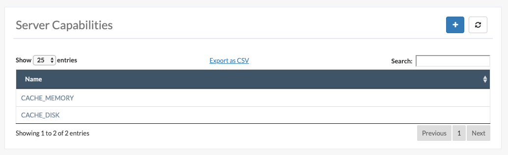
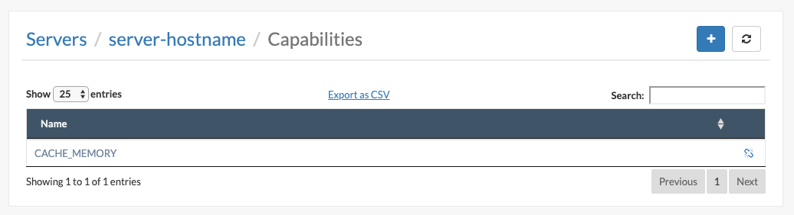
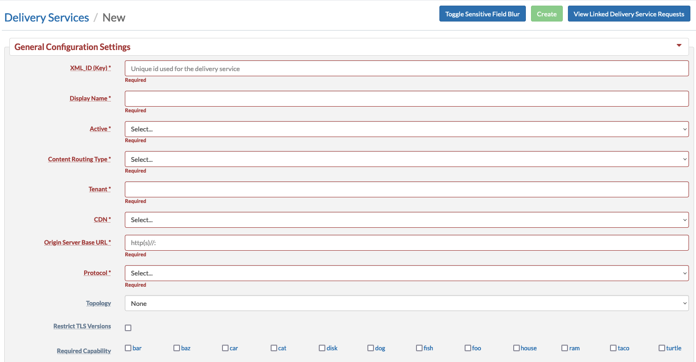

..
..
.. Licensed under the Apache License, Version 2.0 (the "License");
.. you may not use this file except in compliance with the License.
.. You may obtain a copy of the License at
..
..     http://www.apache.org/licenses/LICENSE-2.0
..
.. Unless required by applicable law or agreed to in writing, software
.. distributed under the License is distributed on an "AS IS" BASIS,
.. WITHOUT WARRANTIES OR CONDITIONS OF ANY KIND, either express or implied.
.. See the License for the specific language governing permissions and
.. limitations under the License.
..

.. _server_capability:

**************************
Manage Server Capabilities
**************************
Server capabilities are designed to enable users with the Operations or Admin :term:`Role` to control the flow of :term:`Delivery Service` traffic through only the :term:`cache servers` (:term:`Edge` or :term:`Mid`) that have the required capabilities. For example, :term:`Delivery Services` designed to serve large binary files should only have requests routed to :term:`cache servers` with sufficient disk cache. Currently, this can be controlled at the :term:`Edge-tier` where system operators can explicitly assign only :term:`Edge-tier caches` with sufficient disk cache to the :term:`Delivery Service`. However, operators do not have control of :term:`Mid-tier cache` assignments and cannot dictate which :term:`Mid-tier caches` are qualified to serve these large binary files. This will cause a problem if a :term:`Mid-tier cache` with insufficient disk cache is asked to serve the :term:`Delivery Services`' large binary files.

A list of the server capabilities can be found under :menuselection:`Configure --> Server Capabilities`. Users with a higher-level :term:`Role` ("operations" or "admin") can create or delete server capabilities. Server capabilities can only be deleted if they are not currently being used by a :term:`cache server` or required by a :term:`Delivery Service`.

	Example Server Capabilities Listing

.. _server_server_capabilities:

Manage server capabilities assigned to a server
===============================================
Users with the Operations or Admin :term:`Role` can associate one or more server capabilities with a :term:`cache servers` (:term:`Edge` or :term:`Mid`) by navigating to a server via :menuselection:`Configure --> Servers` and using the context menu for the server table and selecting :menuselection:`Manage Capabilities` or by navigating to :menuselection:`Configure --> Servers --> Server --> More --> Manage Capabilities`.

	Example Server Capabilities for a Server Listing

.. _delivery_service_required_server_capabilities:

Configure delivery service required server capabilities
=======================================================
Users with the DELIVERY-SERVICE:CREATE or DELIVERY-SERVICE:UPDATE permission can associate one or more required server capabilities with a :term:`Delivery Service` by navigating to a :term:`Delivery Service` via :menuselection:`Services --> Delivery Services` and clicking on Required Capabilities checkbox present on Delivery Services form (HTTPS and DNS)`.

Adding a required server capability to a :term:`Delivery Service` will ensure two things:

1. Only :term:`Edge-tier caches` with the required capability can be assigned to the :term:`Delivery Service`
2. Only :term:`Mid-tier caches` with the required capability will handle requests of the :term:`Delivery Service` (if applicable)

	Example Required Server Capabilities for a Delivery Service Listing

