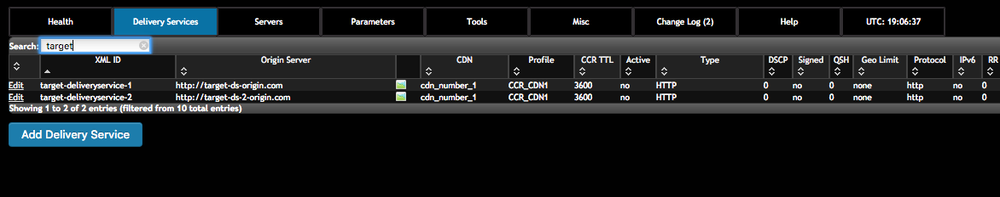
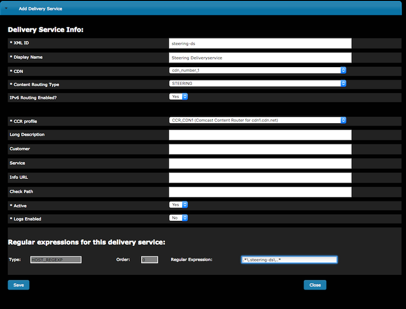
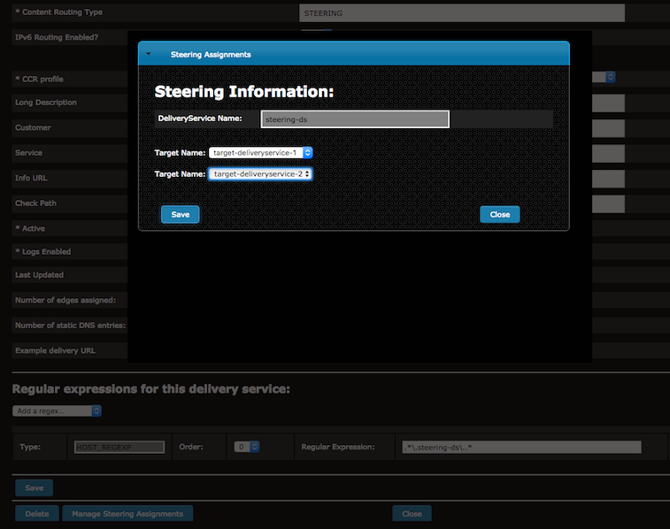
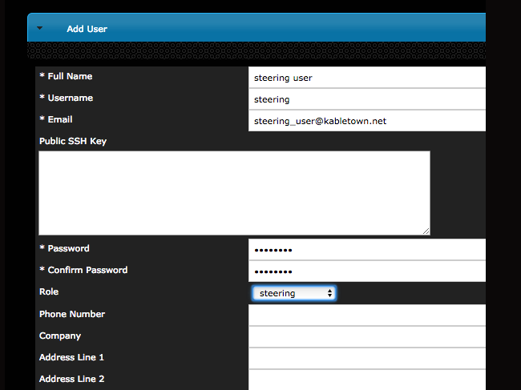

..
..
.. Licensed under the Apache License, Version 2.0 (the "License");
.. you may not use this file except in compliance with the License.
.. You may obtain a copy of the License at
..
..     http://www.apache.org/licenses/LICENSE-2.0
..
.. Unless required by applicable law or agreed to in writing, software
.. distributed under the License is distributed on an "AS IS" BASIS,
.. WITHOUT WARRANTIES OR CONDITIONS OF ANY KIND, either express or implied.
.. See the License for the specific language governing permissions and
.. limitations under the License.
..

.. _rl-steering-qht:

***********************************
Configure Delivery Service Steering
***********************************

1)  Create two target delivery services in Traffic Ops.  They must both be HTTP delivery services that are part of the same CDN.

2) Create a delivery service with type STEERING in Traffic Ops.

3) Click the 'Manage Steering Assignments' button on the delivery service screen to assign targets.

4) Create a user with the role of Steering.

5) As the steering user, assign weights or orders to target delivery services.  Assignments must either have a value for weight or order, but not both.  The value of weight must be a positive integer, while the value of order can be any integer.  This will require logging in to Traffic Ops first via ``http://to.kabletown.net/api/1.2/user/login`` and storing the mojolicious cookie.

	Sample cURL: ``curl -H "Cookie: mojolicious=xxxyyy" -XPUT "https://to.kabletown.net/internal/api/1.2/steering/steering-ds" -d @/tmp/steering.json``

	Sample JSON body:

::

   {
    "targets": [
     {
       "weight": "1000",
       "deliveryService": "target-deliveryservice-1"
     },
     {
       "weight": "9000",
       "deliveryService": "target-deliveryservice-2"
     }
     {
       "order": -1,
       "deliveryService": "target-deliveryservice-3"
     }
     {
       "order": 3,
       "deliveryService": "target-deliveryservice-4"
     }
    ]
   }

6) If desired, the steering user can create filters for the target delivery services.

	Sample cURL: ``curl -H "Cookie: mojolicious=xxxyyy" -XPUT "https://to.kabletown.net/internal/api/1.2/steering/steering-ds" -d @/tmp/steering.json``

	Sample JSON body:

::

   {
    "filters": [
     {
       "pattern": ".*\\gototarget1\\..*",
       "deliveryService": "target-deliveryservice-1"
     }
    ],
    "targets": [
     {
       "weight": "1000",
       "deliveryService": "target-deliveryservice-1"
     },
     {
       "weight": "9000",
       "deliveryService": "target-deliveryservice-2"
     }
     {
       "order": -1,
       "deliveryService": "target-deliveryservice-3"
     }
     {
       "order": 3,
       "deliveryService": "target-deliveryservice-4"
     }
    ]
   }

7) Any requests to Traffic Router for the steering delivery service should now be routed to target delivery services based on configured weight or order.  Example: ``curl -Lvs http://foo.steering-ds.cdn.kabletown.net/bar``

