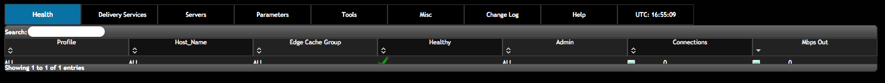

..
..
.. Licensed under the Apache License, Version 2.0 (the "License");
.. you may not use this file except in compliance with the License.
.. You may obtain a copy of the License at
..
..     http://www.apache.org/licenses/LICENSE-2.0
..
.. Unless required by applicable law or agreed to in writing, software
.. distributed under the License is distributed on an "AS IS" BASIS,
.. WITHOUT WARRANTIES OR CONDITIONS OF ANY KIND, either express or implied.
.. See the License for the specific language governing permissions and
.. limitations under the License.
..

.. |graph| image:: images/graph.png

.. |checkmark| image:: images/good.png
.. |X| image:: images/bad.png
.. |clock| image:: images/clock-black.png

.. _to-using:

*******************
Traffic Ops - Using
*******************

.. deprecated:: 3.0
	The Traffic Ops UI is deprecated, and will be removed entirely in the next major release (4.0). A much better way to interact with the CDN is to :ref:`use Traffic Portal <usingtrafficportal>`, which is the the only UI that will be receiving updates for the foreseeable future.

The Traffic Ops Menu
====================

	The Traffic Ops Landing Page

The following tabs are available in the menu at the top of the Traffic Ops user interface.

Parameters
----------
Parameters and Profiles can be edited here. Hover over the tab to get the following options:

+-----------------------------+-------------------------------------------------------------------------------------------------------------------------------------------------------------------------------------+
|        Option               |                                                                             Description                                                                                             |
+=============================+=====================================================================================================================================================================================+
| Global Profile              | The table of global parameters. See :ref:`param-prof`. This is where you Create/Read/Update/Delete parameters in the Global profile                                                 |
+-----------------------------+-------------------------------------------------------------------------------------------------------------------------------------------------------------------------------------+
| All :term:`Cache Group`\ s  | The table of all parameters *that are assigned to a cachegroup* - this may be slow to pull up, as there can be thousands of parameters.                                             |
+-----------------------------+-------------------------------------------------------------------------------------------------------------------------------------------------------------------------------------+
| All Profiles                | The table of all parameters *that are assigned to a profile* - this may be slow to pull up, as there can be thousands of parameters.                                                |
+-----------------------------+-------------------------------------------------------------------------------------------------------------------------------------------------------------------------------------+
| Select Profile              | Select the parameter list by profile first, then get a table of just the parameters for that profile.                                                                               |
+-----------------------------+-------------------------------------------------------------------------------------------------------------------------------------------------------------------------------------+
| Export Profile              | Profiles can be exported from one Traffic Ops instance to another using 'Select Profile' and under the "Profile Details" dialog for the desired profile                             |
+-----------------------------+-------------------------------------------------------------------------------------------------------------------------------------------------------------------------------------+
| Import Profile              | Profiles can be imported from one Traffic Ops instance to another using the button "Import Profile" after using the "Export Profile" feature                                        |
+-----------------------------+-------------------------------------------------------------------------------------------------------------------------------------------------------------------------------------+
| Orphaned Parameters         | A table of parameters that are not associated to any profile of :term:`Cache Group`. These parameters either should be deleted or associated with a profile of :term:`Cache Group`. |
+-----------------------------+-------------------------------------------------------------------------------------------------------------------------------------------------------------------------------------+

.. index::
	Change Log

ChangeLog
---------
The Changelog table displays the changes that are being made to the Traffic Ops database through the Traffic Ops user interface. This tab will show the number of changes since you last visited this tab in (brackets) since the last time you visited this tab. There are currently no sub menus for this tab.

Help
----
Help for Traffic Ops and Traffic Control. Hover over this tab to get the following options:

+---------------+---------------------------------------------------------------------+
|     Option    |                             Description                             |
+===============+=====================================================================+
| About         | Traffic Ops information, such as version, database information, etc |
+---------------+---------------------------------------------------------------------+
| Release Notes | Release notes for the most recent releases of Traffic Ops           |
+---------------+---------------------------------------------------------------------+
| Logout        | Logout from Traffic Ops                                             |
+---------------+---------------------------------------------------------------------+

.. _working-with-profiles:

Parameters and Profiles
=======================
Parameters are shared between profiles if the set of ``{ name, config_file, value }`` is the same. To change a value in one profile but not in others, the parameter has to be removed from the profile you want to change it in, and a new parameter entry has to be created (**Add Parameter** button at the bottom of the Parameters view), and assigned to that profile. It is easy to create new profiles from the **Misc > Profiles** view - just use the **Add/Copy Profile** button at the bottom of the profile view to copy an existing profile to a new one. Profiles can be exported from one system and imported to another using the profile view as well. It makes no sense for a parameter to not be assigned to a single profile - in that case it really has no function. To find parameters like that use the **Parameters > Orphaned Parameters** view. It is easy to create orphaned parameters by removing all profiles, or not assigning a profile directly after creating the parameter.

.. seealso:: :ref:`param-prof` in the *Configuring Traffic Ops* section.

.. _ccr-profile:

Traffic Router Profile
----------------------

+-----------------------------------------+------------------------+--------------------------------------------------------------------------------------------------------------------------------------------------+
|                   Name                  |      Config_file       |                                                                  Description                                                                     |
+=========================================+========================+==================================================================================================================================================+
| location                                | dns.zone               | Location to store the DNS zone files in the local file system of Traffic Router.                                                                 |
+-----------------------------------------+------------------------+--------------------------------------------------------------------------------------------------------------------------------------------------+
| location                                | http-log4j.properties  | Location to find the log4j.properties file for Traffic Router.                                                                                   |
+-----------------------------------------+------------------------+--------------------------------------------------------------------------------------------------------------------------------------------------+
| location                                | dns-log4j.properties   | Location to find the dns-log4j.properties file for Traffic Router.                                                                               |
+-----------------------------------------+------------------------+--------------------------------------------------------------------------------------------------------------------------------------------------+
| location                                | geolocation.properties | Location to find the log4j.properties file for Traffic Router.                                                                                   |
+-----------------------------------------+------------------------+--------------------------------------------------------------------------------------------------------------------------------------------------+
| CDN_name                                | rascal-config.txt      | The human readable name of the CDN for this profile.                                                                                             |
+-----------------------------------------+------------------------+--------------------------------------------------------------------------------------------------------------------------------------------------+
| CoverageZoneJsonURL                     | CRConfig.xml           | The location (URL) to retrieve the coverage zone map file in JSON format from.                                                                   |
+-----------------------------------------+------------------------+--------------------------------------------------------------------------------------------------------------------------------------------------+
| ecsEnable                               | CRConfig.json          | Boolean value to enable or disable ENDS0 client subnet extensions.                                                                               |
+-----------------------------------------+------------------------+--------------------------------------------------------------------------------------------------------------------------------------------------+
| geolocation.polling.url                 | CRConfig.json          | The location (URL) to retrieve the geo database file from.                                                                                       |
+-----------------------------------------+------------------------+--------------------------------------------------------------------------------------------------------------------------------------------------+
| geolocation.polling.interval            | CRConfig.json          | How often to refresh the coverage geo location database  in ms                                                                                   |
+-----------------------------------------+------------------------+--------------------------------------------------------------------------------------------------------------------------------------------------+
| coveragezone.polling.interval           | CRConfig.json          | How often to refresh the coverage zone map in ms                                                                                                 |
+-----------------------------------------+------------------------+--------------------------------------------------------------------------------------------------------------------------------------------------+
| coveragezone.polling.url                | CRConfig.json          | The location (URL) to retrieve the coverage zone map file in JSON format from.                                                                   |
+-----------------------------------------+------------------------+--------------------------------------------------------------------------------------------------------------------------------------------------+
| deepcoveragezone.polling.interval       | CRConfig.json          | How often to refresh the deep coverage zone map in ms                                                                                            |
+-----------------------------------------+------------------------+--------------------------------------------------------------------------------------------------------------------------------------------------+
| deepcoveragezone.polling.url            | CRConfig.json          | The location (URL) to retrieve the deep coverage zone map file in JSON format from.                                                              |
+-----------------------------------------+------------------------+--------------------------------------------------------------------------------------------------------------------------------------------------+
| client.steering.forced.diversity        | CRConfig.json          | Enable the Client Steering Forced Diversity feature (value = "true") to diversify CLIENT_STEERING results by including more unique edge caches   |
+-----------------------------------------+------------------------+--------------------------------------------------------------------------------------------------------------------------------------------------+
| tld.soa.expire                          | CRConfig.json          | The value for the expire field the Traffic Router DNS Server will respond with on Start of Authority (SOA) records.                              |
+-----------------------------------------+------------------------+--------------------------------------------------------------------------------------------------------------------------------------------------+
| tld.soa.minimum                         | CRConfig.json          | The value for the minimum field the Traffic Router DNS Server will respond with on SOA records.                                                  |
+-----------------------------------------+------------------------+--------------------------------------------------------------------------------------------------------------------------------------------------+
| tld.soa.admin                           | CRConfig.json          | The DNS Start of Authority admin.  Should be a valid support email address for support if DNS is not working correctly.                          |
+-----------------------------------------+------------------------+--------------------------------------------------------------------------------------------------------------------------------------------------+
| tld.soa.retry                           | CRConfig.json          | The value for the retry field the Traffic Router DNS Server will respond with on SOA records.                                                    |
+-----------------------------------------+------------------------+--------------------------------------------------------------------------------------------------------------------------------------------------+
| tld.soa.refresh                         | CRConfig.json          | The TTL the Traffic Router DNS Server will respond with on A records.                                                                            |
+-----------------------------------------+------------------------+--------------------------------------------------------------------------------------------------------------------------------------------------+
| tld.ttls.NS                             | CRConfig.json          | The TTL the Traffic Router DNS Server will respond with on NS records.                                                                           |
+-----------------------------------------+------------------------+--------------------------------------------------------------------------------------------------------------------------------------------------+
| tld.ttls.SOA                            | CRConfig.json          | The TTL the Traffic Router DNS Server will respond with on SOA records.                                                                          |
+-----------------------------------------+------------------------+--------------------------------------------------------------------------------------------------------------------------------------------------+
| tld.ttls.AAAA                           | CRConfig.json          | The Time To Live (TTL) the Traffic Router DNS Server will respond with on AAAA records.                                                          |
+-----------------------------------------+------------------------+--------------------------------------------------------------------------------------------------------------------------------------------------+
| tld.ttls.A                              | CRConfig.json          | The TTL the Traffic Router DNS Server will respond with on A records.                                                                            |
+-----------------------------------------+------------------------+--------------------------------------------------------------------------------------------------------------------------------------------------+
| tld.ttls.DNSKEY                         | CRConfig.json          | The TTL the Traffic Router DNS Server will respond with on DNSKEY records.                                                                       |
+-----------------------------------------+------------------------+--------------------------------------------------------------------------------------------------------------------------------------------------+
| tld.ttls.DS                             | CRConfig.json          | The TTL the Traffic Router DNS Server will respond with on DS records.                                                                           |
+-----------------------------------------+------------------------+--------------------------------------------------------------------------------------------------------------------------------------------------+
| api.port                                | server.xml             | The TCP port Traffic Router listens on for API (REST) access.                                                                                    |
+-----------------------------------------+------------------------+--------------------------------------------------------------------------------------------------------------------------------------------------+
| api.cache-control.max-age               | CRConfig.json          | The value of the ``Cache-Control: max-age=`` header in the API responses of Traffic Router.                                                      |
+-----------------------------------------+------------------------+--------------------------------------------------------------------------------------------------------------------------------------------------+
| api.auth.url                            | CRConfig.json          | The API authentication URL (https://${tmHostname}/api/1.1/user/login); ${tmHostname} is a search and replace token used by Traffic Router to     |
|                                         |                        | construct the correct URL)                                                                                                                       |
+-----------------------------------------+------------------------+--------------------------------------------------------------------------------------------------------------------------------------------------+
| consistent.dns.routing                  | CRConfig.json          | Control whether DNS :term:`Delivery Service`\ s use consistent hashing on the edge FQDN to select caches for answers. May improve performance if |
|                                         |                        | set to true; defaults to false                                                                                                                   |
+-----------------------------------------+------------------------+--------------------------------------------------------------------------------------------------------------------------------------------------+
| dnssec.enabled                          | CRConfig.json          | Whether DNSSEC is enabled; this parameter is updated via the DNSSEC administration user interface.                                               |
+-----------------------------------------+------------------------+--------------------------------------------------------------------------------------------------------------------------------------------------+
| dnssec.allow.expired.keys               | CRConfig.json          | Allow Traffic Router to use expired DNSSEC keys to sign zones; default is true. This helps prevent DNSSEC related outages due to failed Traffic  |
|                                         |                        | Control components or connectivity issues.                                                                                                       |
+-----------------------------------------+------------------------+--------------------------------------------------------------------------------------------------------------------------------------------------+
| dynamic.cache.primer.enabled            | CRConfig.json          | Allow Traffic Router to attempt to prime the dynamic zone cache; defaults to true                                                                |
+-----------------------------------------+------------------------+--------------------------------------------------------------------------------------------------------------------------------------------------+
| dynamic.cache.primer.limit              | CRConfig.json          | Limit the number of permutations to prime when dynamic zone cache priming is enabled; defaults to 500                                            |
+-----------------------------------------+------------------------+--------------------------------------------------------------------------------------------------------------------------------------------------+
| keystore.maintenance.interval           | CRConfig.json          | The interval in seconds which Traffic Router will check the keystore API for new DNSSEC keys                                                     |
+-----------------------------------------+------------------------+--------------------------------------------------------------------------------------------------------------------------------------------------+
| keystore.api.url                        | CRConfig.json          | The keystore API URL (https://${tmHostname}/api/1.1/cdns/name/${cdnName}/dnsseckeys.json; ${tmHostname} and ${cdnName} are search and replace    |
|                                         |                        | tokens used by Traffic Router to construct the correct URL)                                                                                      |
+-----------------------------------------+------------------------+--------------------------------------------------------------------------------------------------------------------------------------------------+
| keystore.fetch.timeout                  | CRConfig.json          | The timeout in milliseconds for requests to the keystore API                                                                                     |
+-----------------------------------------+------------------------+--------------------------------------------------------------------------------------------------------------------------------------------------+
| keystore.fetch.retries                  | CRConfig.json          | The number of times Traffic Router will attempt to load keys before giving up; defaults to 5                                                     |
+-----------------------------------------+------------------------+--------------------------------------------------------------------------------------------------------------------------------------------------+
| keystore.fetch.wait                     | CRConfig.json          | The number of milliseconds Traffic Router will wait before a retry                                                                               |
+-----------------------------------------+------------------------+--------------------------------------------------------------------------------------------------------------------------------------------------+
| signaturemanager.expiration.multiplier  | CRConfig.json          | Multiplier used in conjunction with a zone's maximum TTL to calculate DNSSEC signature durations; defaults to 5                                  |
+-----------------------------------------+------------------------+--------------------------------------------------------------------------------------------------------------------------------------------------+
| zonemanager.threadpool.scale            | CRConfig.json          | Multiplier used to determine the number of cores to use for zone signing operations; defaults to 0.75                                            |
+-----------------------------------------+------------------------+--------------------------------------------------------------------------------------------------------------------------------------------------+
| zonemanager.cache.maintenance.interval  | CRConfig.json          | The interval in seconds which Traffic Router will check for zones that need to be resigned or if dynamic zones need to be expired from cache     |
+-----------------------------------------+------------------------+--------------------------------------------------------------------------------------------------------------------------------------------------+
| zonemanager.dynamic.response.expiration | CRConfig.json          | A string (e.g.: 300s) that defines how long a dynamic zone                                                                                       |
+-----------------------------------------+------------------------+--------------------------------------------------------------------------------------------------------------------------------------------------+
| DNSKEY.generation.multiplier            | CRConfig.json          | Used to deteremine when new keys need to be regenerated. Keys are regenerated if expiration is less than the generation multiplier * the TTL. If |
|                                         |                        | the parameter does not exist, the default is 10.                                                                                                 |
+-----------------------------------------+------------------------+--------------------------------------------------------------------------------------------------------------------------------------------------+
| DNSKEY.effective.multiplier             | CRConfig.json          | Used when creating an effective date for a new key set.  New keys are generated with an effective date of old key expiration - (effective        |
|                                         |                        | multiplier * TTL).  Default is 2.                                                                                                                |
+-----------------------------------------+------------------------+--------------------------------------------------------------------------------------------------------------------------------------------------+

.. index::
	Invalidate Content
	Purge

.. _purge:

Invalidate Content
==================
Invalidating content on the CDN is sometimes necessary when the origin was mis-configured and something is cached in the CDN  that needs to be removed. Given the size of a typical Traffic Control CDN and the amount of content that can be cached in it, removing the content from all the caches may take a long time. To speed up content invalidation, Traffic Ops will not try to remove the content from the caches, but it makes the content inaccessible using the *regex_revalidate* ATS plugin. This forces a *revalidation* of the content, rather than a new get.

.. Note:: This method forces a HTTP *revalidation* of the content, and not a new *GET* - the origin needs to support revalidation according to the HTTP/1.1 specification, and send a ``200 OK`` or ``304 Not Modified`` as applicable.

To invalidate content:

#. Click **Tools > Invalidate Content**
#. Fill out the form fields:

	- Select the *:term:`Delivery Service`**
	- Enter the **Path Regex** - this should be a `PCRE <http://www.pcre.org/>`_ compatible regular expression for the path to match for forcing the revalidation. Be careful to only match on the content you need to remove - revalidation is an expensive operation for many origins, and a simple ``/.*`` can cause an overload condition of the origin.
	- Enter the **Time To Live** - this is how long the revalidation rule will be active for. It usually makes sense to make this the same as the ``Cache-Control`` header from the origin which sets the object time to live in cache (by ``max-age`` or ``Expires``). Entering a longer TTL here will make the caches do unnecessary work.
	- Enter the **Start Time** - this is the start time when the revalidation rule will be made active. It is pre-populated with the current time, leave as is to schedule ASAP.

#. Click the **Submit** button.

Manage DNSSEC Keys
==================
In order to support `DNSSEC <https://en.wikipedia.org/wiki/Domain_Name_System_Security_Extensions>`_ in Traffic Router, Traffic Ops provides some actions for managing DNSSEC keys for a CDN and associated :term:`Delivery Service`\ s.  DNSSEC Keys consist of a Key Signing Keys (KSK) which are used to sign other DNSKEY records as well as Zone Signing Keys (ZSK) which are used to sign other records.  DNSSEC Keys are stored in `Traffic Vault <../../overview/traffic_vault.html>`_ and should only be accessible to Traffic Ops.  Other applications needing access to this data, such as Traffic Router, must use the Traffic Ops `DNSSEC APIs <../../development/traffic_ops_api/v12/cdn.html#dnssec-keys>`_ to retrieve this information.

To Manage DNSSEC Keys:
1. Click **Tools -> Manage DNSSEC Keys**
2. Choose a CDN and click **Manage DNSSEC Keys**

	- If keys have not yet been generated for a CDN, this screen will be mostly blank with just the **CDN** and **DNSSEC Active?** fields being populated.
	- If keys have been generated for the CDN, the Manage DNSSEC Keys screen will show the TTL and Top Level Domain (TLD) :abbr:`KSK (Key Signing Key)` Expiration for the CDN as well as DS Record information which will need to be added to the parent zone of the TLD in order for DNSSEC to work.

The Manage DNSSEC Keys screen also allows a user to perform the following actions:

Activate/Deactivate DNSSEC for a CDN
------------------------------------
Fairly straight forward, this button set the **dnssec.enabled** param to either **true** or **false** on the Traffic Router profile for the CDN.  The Activate/Deactivate option is only available if DNSSEC keys exist for CDN.  In order to active DNSSEC for a CDN a user must first generate keys and then click the **Active DNSSEC** button.

Generate Keys
-------------
Generate Keys will generate DNSSEC keys for the CDN TLD as well as for each :term:`Delivery Service` in the CDN.  It is important to note that this button will create a new :abbr:`KSK (Key Signing Key)` for the TLD and, therefore, a new DS Record.  Any time a new DS Record is created, it will need to be added to the parent zone of the TLD in order for DNSSEC to work properly.  When a user clicks the **Generate Keys** button, they will be presented with a screen with the following fields:

- **CDN:** This is not editable and displays the CDN for which keys will be generated
- **ZSK Expiration (Days):**  Sets how long (in days) the Zone Signing Key will be valid for the CDN and associated :term:`Delivery Service`\ s. The default is 30 days.
- **KSK Expiration (Days):**  Sets how long (in days) the Key Signing Key will be valid for the CDN and associated :term:`Delivery Service`\ s. The default is 365 days.
- **Effective Date (GMT):** The time from which the new keys will be active.  Traffic Router will use this value to determine when to start signing with the new keys and stop signing with the old keys.

Once these fields have been correctly entered, a user can click Generate Keys.  The user will be presented with a confirmation screen to help them understand the impact of generating the keys.  If a user confirms, the keys will be generated and stored in Traffic Vault.

Regenerate KSK
--------------
Regenerate :abbr:`KSK (Key Signing Key)` will create a new Key Signing Key for the CDN TLD. A new DS Record will also be generated and need to be put into the parent zone in order for DNSSEC to work correctly. The **Regenerate KSK** button is only available if keys have already been generated for a CDN.  The intent of the button is to provide a mechanism for generating a new :abbr:`KSK (Key Signing Key)` when a previous one expires or if necessary for other reasons such as a security breach.  When a user goes to generate a new :abbr:`KSK (Key Signing Key)` they are presented with a screen with the following options:

:CDN: This is not editable and displays the CDN for which keys will be generated
:KSK Expiration (Days): Sets how long (in days) the Key Signing Key will be valid for the CDN and associated :term:`Delivery Service`\ s. The default is 365 days.
:Effective Date (GMT): The time from which the new :abbr:`KSK (Key Signing Key)` and DS Record will be active. Since generating a new :abbr:`KSK (Key Signing Key)` will generate a new DS Record that needs to be added to the parent zone, it is very important to make sure that an effective date is chosen that allows for time to get the DS Record into the parent zone. Failure to get the new DS Record into the parent zone in time could result in DNSSEC errors when Traffic Router tries to sign responses.

Once these fields have been correctly entered, a user can click Generate KSK. The user will be presented with a confirmation screen to help them understand the impact of generating the KSK.  If a user confirms, the :abbr:`KSK (Key Signing Key)` will be generated and stored in Traffic Vault.

Additionally, Traffic Ops also performs some systematic management of :abbr:`DNSSEC (DNS Security Extensions)` keys. This management is necessary to help keep keys in sync for :term:`Delivery Service`\ s in a CDN as well as to make sure keys do not expire without human intervention.

Generation of keys for new Delivery Services
--------------------------------------------
If a new :term:`Delivery Service` is created and added to a CDN that has :abbr:`DNSSEC (DNS Security Extensions)` enabled, Traffic Ops will create :abbr:`DNSSEC (DNS Security Extensions)` keys for the :term:`Delivery Service` and store them in Traffic Vault.

Regeneration of expiring keys for a Delivery Service
----------------------------------------------------
Traffic Ops has a process, controlled by :manpage:`cron(8)`, to check for expired or expiring keys and re-generate them. The process runs at 5 minute intervals to check and see if keys are expired or close to expiring (withing 10 minutes by default). If keys are expired for a :term:`Delivery Service`, Traffic Ops will regenerate new keys and store them in Traffic Vault. This process is the same for the CDN :abbr:`TLD (Top-Level Domain)` :abbr:`ZSK (Zone Signing Key)`, however Traffic Ops will not re-generate the CDN :abbr:`TLD (Top-Level Domain)` :abbr:`KSK (Key Signing Key)` systematically. The reason is that when a :abbr:`KSK (Key Signing Key)` is regenerated for the CDN :abbr:`TLD (Top-Level Domain)` then a new DS Record will also be created. The new DS Record needs to be added to the parent zone before Traffic Router attempts to sign with the new :abbr:`KSK (Key Signing Key)` in order for :abbr:`DNSSEC (DNS Security Extensions)` to work correctly. Therefore, management of the :abbr:`KSK (Key Signing Key)` needs to be a manual process.
