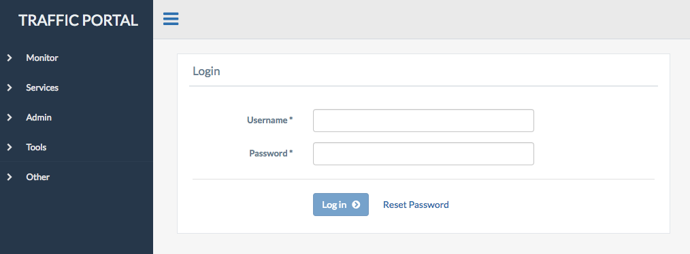
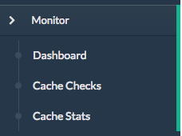
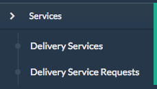
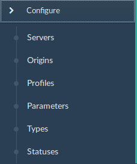
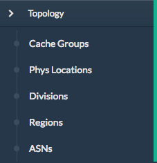
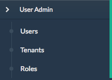
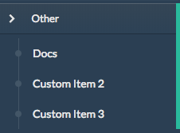

..
..
.. Licensed under the Apache License, Version 2.0 (the "License");
.. you may not use this file except in compliance with the License.
.. You may obtain a copy of the License at
..
..     http://www.apache.org/licenses/LICENSE-2.0
..
.. Unless required by applicable law or agreed to in writing, software
.. distributed under the License is distributed on an "AS IS" BASIS,
.. WITHOUT WARRANTIES OR CONDITIONS OF ANY KIND, either express or implied.
.. See the License for the specific language governing permissions and
.. limitations under the License.
..

.. _usingtrafficportal:

Traffic Portal - Using
%%%%%%%%%%%%%%%%%%%%%%

Traffic Portal is the official replacement for the legacy Traffic Ops UI. Traffic Portal consumes the Traffic Ops API. The following high-level items are available in the Traffic Portal menu.

Dashboard
=========

The Dashboard is the default landing page for Traffic Portal. It provides a real-time view into the main performance indicators of the CDNs managed by Traffic Control. It also displays various statistics about the overall health of your CDN.

* **Current Bandwidth**: The current bandwidth of all of your CDNs.
* **Current Connections**: The current number of connections to all of your CDNs.
* **Healthy Caches**: Number of healthy caches across all CDNs.  Click the link to view the healthy caches on the cache stats page.
* **Unhealthy Caches**: Number of unhealthy caches across all CDNs.  Click the link to view the unhealthy caches on the cache stats page.
* **Online Caches**: Number of online caches.  Traffic Monitor will not monitor the state of ONLINE servers. True health is unknown.
* **Reported Caches**: Number of caches with REPORTED status.
* **Offline Caches**: Number of caches with OFFLINE status.
* **Admin Down Caches**: Number of caches with ADMIN_DOWN status.

Each component of this view is updated at the intervals defined in tp.domain.com/traffic_portal_properties.json.

CDNs
====

A table of CDNs with the following columns:

+-------------------------------+----------------------------------------------------------------------------------------------------------------------+
|            Name               |                                                       Description                                                    |
+===============================+======================================================================================================================+
| Name                          |                                                                                                                      |
+-------------------------------+----------------------------------------------------------------------------------------------------------------------+
| Domain                        |                                                                                                                      |
+-------------------------------+----------------------------------------------------------------------------------------------------------------------+
| DNSSEC Enabled                |                                                                                                                      |
+-------------------------------+----------------------------------------------------------------------------------------------------------------------+

CDN management includes the ability to (where applicable):

- create a new CDN
- update an existing CDN
- delete an existing CDN
- queue/clear updates on all servers in a CDN
- diff CDN snapshot
- create CDN snapshot
- manage CDN DNSSEC keys
- manage CDN federations
- view CDN delivery services
- view CDN profiles
- view CDN servers

Monitor
=======

  +---------------+------------------------------------------------------------------------------------------------------------------------------------+
  |     Option    |                                                            Description                                                             |
  +===============+====================================================================================================================================+
  | Cache Checks  | A real time view into the status of each cache.                                                                                    |
  |               | This view is sourced by the Traffic Monitor data thru the Traffic Ops API and is updated on demand.                                |
  |               | See :ref:`tp-cache-checks` for details.                                                                                            |
  +---------------+------------------------------------------------------------------------------------------------------------------------------------+
  | Cache Stats   | A table showing the results of the periodic check extension scripts that are run. See :ref:`tp-cache-stats` for details.           |
  +---------------+------------------------------------------------------------------------------------------------------------------------------------+

Services
========

  +----------------------------------+-----------------------------------------------------------------------------------------------------------------+
  |     Option                       |                                              Description                                                        |
  +==================================+=================================================================================================================+
  | Delivery Services                | Settings for your delivery services. Only the delivery services defined by a user's tenancy are visible.        |
  |                                  | See :ref:`tp-delivery-services` for details.                                                                    |
  +----------------------------------+-----------------------------------------------------------------------------------------------------------------+
  | Delivery Service Requests        | If enabled in tp.domain.com/traffic_portal_properties.json, all delivery service changes (create, update and    |
  |                                  | delete) are captured as a delivery service request and must be reviewed before fulfillment/deployment.          |
  |                                  | See :ref:`tp-delivery-service-requests` for details.                                                            |
  +----------------------------------+-----------------------------------------------------------------------------------------------------------------+

Configure
=========

  +---------------+------------------------------------------------------------------------------------------------------------------------------------+
  |     Option    |                                                            Description                                                             |
  +===============+====================================================================================================================================+
  | Servers       | Manage servers. See :ref:`tp-servers`                                                                                              |
  +---------------+------------------------------------------------------------------------------------------------------------------------------------+
  | Profiles      | Manage profiles. See :ref:`tp-profiles`                                                                                            |
  +---------------+------------------------------------------------------------------------------------------------------------------------------------+
  | Parameters    | Manage parameters. See :ref:`tp-parameters`                                                                                        |
  +---------------+------------------------------------------------------------------------------------------------------------------------------------+
  | Types         | Manage types. See :ref:`tp-types`                                                                                                  |
  +---------------+------------------------------------------------------------------------------------------------------------------------------------+
  | Statuses      | Manage server statuses. See :ref:`tp-statuses`                                                                                     |
  +---------------+------------------------------------------------------------------------------------------------------------------------------------+

Topology
========

  +----------------+-----------------------------------------------------------------------------------------------------------------------------------+
  |     Option     |                                                            Description                                                            |
  +================+===================================================================================================================================+
  | Cache Groups   | Manage cache groups. See :ref:`tp-cache-groups`                                                                                   |
  +----------------+-----------------------------------------------------------------------------------------------------------------------------------+
  | Phys Locations | Manage profiles. See :ref:`tp-phys-locations`                                                                                     |
  +----------------+-----------------------------------------------------------------------------------------------------------------------------------+
  | Divisions      | Manage divisions. See :ref:`tp-divisions`                                                                                         |
  +----------------+-----------------------------------------------------------------------------------------------------------------------------------+
  | Regions        | Manage regions. See :ref:`tp-regions`                                                                                             |
  +----------------+-----------------------------------------------------------------------------------------------------------------------------------+
  | ASNs           | Manage autonomous system numbers (ASN). See :ref:`tp-asns`                                                                        |
  +----------------+-----------------------------------------------------------------------------------------------------------------------------------+

Tools
=====

  +--------------------+-------------------------------------------------------------------------------------------------------------------------------+
  |       Option       |                                       Description                                                                             |
  +====================+===============================================================================================================================+
  | Invalidate Content | Manage invalidate content jobs. See :ref:`tp-jobs`                                                                            |
  +--------------------+-------------------------------------------------------------------------------------------------------------------------------+
  | Generate ISO       | Generate a bootable image for any of the servers in the Servers table (or any server for that matter). See :ref:`tp-gen-iso`  |
  +--------------------+-------------------------------------------------------------------------------------------------------------------------------+

User Admin
==========

  +--------------------+-------------------------------------------------------------------------------------------------------------------------------+
  |       Option       |                                       Description                                                                             |
  +====================+===============================================================================================================================+
  | Users              | Manage users. See :ref:`tp-users`                                                                                             |
  +--------------------+-------------------------------------------------------------------------------------------------------------------------------+
  | Tenants            | Manage tenants. See :ref:`tp-tenants`                                                                                         |
  +--------------------+-------------------------------------------------------------------------------------------------------------------------------+
  | Roles              | Manage roles. See :ref:`tp-roles`                                                                                             |
  +--------------------+-------------------------------------------------------------------------------------------------------------------------------+

Other
=====

  Custom menu items. By default, you get a link to Traffic Control docs. See :ref:`tp-menu-other`

  +--------------------+--------------------------------------------------------------------------------------------------------------------------------+
  |       Option       |                                        Description                                                                             |
  +====================+================================================================================================================================+
  | Docs               | Link to trafficcontrol.apache.org                                                                                              |
  +--------------------+--------------------------------------------------------------------------------------------------------------------------------+

------------

Monitor
=======

.. _tp-cache-checks:

Cache Checks
++++++++++++
The cache checks page is intended to give an overview of the caches managed by Traffic Control as well as their status.

+----------+--------------------------------------------------------------------------------------------------------------------------------------------+
| Name     |                           Description                                                                                                      |
+==========+============================================================================================================================================+
| Hostname | Cache host name                                                                                                                            |
+----------+--------------------------------------------------------------------------------------------------------------------------------------------+
| Profile  | The name of the profile applied to the cache                                                                                               |
+----------+--------------------------------------------------------------------------------------------------------------------------------------------+
| Status   | The status of the cache  (ONLINE, REPORTED, ADMIN_DOWN, OFFLINE)                                                                           |
+----------+--------------------------------------------------------------------------------------------------------------------------------------------+
| UPD      | Config updates pending for an edge or mid                                                                                                  |
+----------+--------------------------------------------------------------------------------------------------------------------------------------------+
| RVL      | Content invalidation requests are pending for and edge or mid                                                                              |
+----------+--------------------------------------------------------------------------------------------------------------------------------------------+
| ILO      | Ping the iLO interface for EDGE or MID servers                                                                                             |
+----------+--------------------------------------------------------------------------------------------------------------------------------------------+
| 10G      | Ping the IPv4 address of the EDGE or MID servers                                                                                           |
+----------+--------------------------------------------------------------------------------------------------------------------------------------------+
| FQDN     | DNS check that matches what the DNS servers responds with compared to                                                                      |
|          | what Traffic Ops has.                                                                                                                      |
+----------+--------------------------------------------------------------------------------------------------------------------------------------------+
| DSCP     | Checks the DSCP value of packets from the edge server to the Traffic                                                                       |
|          | Ops server.                                                                                                                                |
+----------+--------------------------------------------------------------------------------------------------------------------------------------------+
| 10G6     | Ping the IPv6 address of the EDGE or MID servers                                                                                           |
+----------+--------------------------------------------------------------------------------------------------------------------------------------------+
| MTU      | Ping the EDGE or MID using the configured MTU from Traffic Ops                                                                             |
+----------+--------------------------------------------------------------------------------------------------------------------------------------------+
| RTR      | Content Router checks. Checks the health of the Content Routers. Checks the health of the caches using the Content Routers.                |
+----------+--------------------------------------------------------------------------------------------------------------------------------------------+
| CHR      | Cache Hit Ratio in percent.                                                                                                                |
+----------+--------------------------------------------------------------------------------------------------------------------------------------------+
| CDU      | Total Cache Disk Usage in percent.                                                                                                         |
+----------+--------------------------------------------------------------------------------------------------------------------------------------------+
| ORT      | Operational Readiness Test. Uses the ORT script on the edge and mid servers to determine if the configuration in Traffic Ops matches the   |
|          | configuration on the edge or mid. The user that this script runs as must have an ssh key on the edge servers.                              |
+----------+--------------------------------------------------------------------------------------------------------------------------------------------+

.. _tp-cache-stats:

Cache Stats
+++++++++++
Displays health by cache group/profile.

+--------------+----------------------------------------------------------------------------------------------------------------------------------------+
| Name         |                 Description                                                                                                            |
+==============+========================================================================================================================================+
| Profile      | Name of the profile applied to the edge or mid cache                                                                                   |
+--------------+----------------------------------------------------------------------------------------------------------------------------------------+
| Host         | ALL or grouped by profile                                                                                                              |
+--------------+----------------------------------------------------------------------------------------------------------------------------------------+
| Cache Group  | Cache Group Name                                                                                                                       |
+--------------+----------------------------------------------------------------------------------------------------------------------------------------+
| Healthy      | True/False as determined by Traffic Monitor                                                                                            |
+--------------+----------------------------------------------------------------------------------------------------------------------------------------+
| Status       | Status of the cache or cache group                                                                                                     |
+--------------+----------------------------------------------------------------------------------------------------------------------------------------+
| Connections  | Number of connections                                                                                                                  |
+--------------+----------------------------------------------------------------------------------------------------------------------------------------+
| MbpsOut      | MbpsOut                                                                                                                                |
+--------------+----------------------------------------------------------------------------------------------------------------------------------------+

Services
========

.. _tp-delivery-services:

Delivery Services
+++++++++++++++++

A table of your delivery services with the following columns:

+-------------------------------+-----------------------------------------------------------------------------------------------------------------------+
|            Name               |                                                   Description                                                         |
+===============================+=======================================================================================================================+
| Key (XML ID)                  | A unique string that identifies this delivery service.                                                                |
+-------------------------------+-----------------------------------------------------------------------------------------------------------------------+
| Tenant                        | The tenant that the delivery service is assigned to.                                                                  |
+-------------------------------+-----------------------------------------------------------------------------------------------------------------------+
| Origin                        | The Origin Server's base URL. This includes the protocol (http or https). Example: ``http://movies.origin.com``       |
+-------------------------------+-----------------------------------------------------------------------------------------------------------------------+
| Active                        | When this is set to false, Traffic Router will not serve DNS or HTTP responses for this delivery service.             |
+-------------------------------+-----------------------------------------------------------------------------------------------------------------------+
| Type                          | The type of content routing this delivery service will use. See :ref:`rl-ds-types`.                                   |
+-------------------------------+-----------------------------------------------------------------------------------------------------------------------+
| Protocol                      | The protocol to serve this delivery service to the clients with:                                                      |
|                               |                                                                                                                       |
|                               | -  HTTP                                                                                                               |
|                               | -  HTTPS                                                                                                              |
|                               | -  HTTP and HTTPS                                                                                                     |
|                               | -  HTTP to HTTPS                                                                                                      |
+-------------------------------+-----------------------------------------------------------------------------------------------------------------------+
| CDN                           | The CDN that the delivery service belongs to.                                                                         |
+-------------------------------+-----------------------------------------------------------------------------------------------------------------------+
| IPv6 Enabled                  | When set to true, the Traffic Router will respond to AAAA DNS requests for the routed name of this delivery service.  |
|                               | Otherwise, only A records will be served.                                                                             |
+-------------------------------+-----------------------------------------------------------------------------------------------------------------------+
| DSCP                          | The DSCP value to mark IP packets to the client with.                                                                 |
+-------------------------------+-----------------------------------------------------------------------------------------------------------------------+
| Signing Algorithm             | See :ref:`rl-signed-urls`.                                                                                            |
|                               | - None                                                                                                                |
|                               | - URL Signature Keys                                                                                                  |
|                               | - URI Signing Keys                                                                                                    |
+-------------------------------+-----------------------------------------------------------------------------------------------------------------------+
| Query String Handling         | How to treat query strings:                                                                                           |
|                               |                                                                                                                       |
|                               | - use in cache key and hand up to origin (each unique query string is treated as a unique URL.)                       |
|                               | - do not use in cache key, but pass up to origin (2 URLs that are the same except for the query string will match,    |
|                               |   and cache HIT, while the origin still sees original query string in the request.)                                   |
|                               | - drop at edge (2 URLs that are the same except for  the query string will match, and cache HIT, while the origin     |
|                               |   will not see original query string in the request.)                                                                 |
|                               |                                                                                                                       |
|                               | Dropping query strings at the edge will preclude the use of a Regex Remap Expression. See :ref:`rl-regex-remap`.      |
|                               |                                                                                                                       |
|                               | To set the qstring without the use of regex remap, or for further options, see :ref:`rl-qstring-handling`.            |
+-------------------------------+-----------------------------------------------------------------------------------------------------------------------+
| Last Updated                  | Timestamp when the delivery service was last updated.                                                                 |
+-------------------------------+-----------------------------------------------------------------------------------------------------------------------+

Delivery service management includes the ability to (where applicable):

- create a new delivery service
- clone an existing delivery service
- update an existing delivery service
- delete an existing delivery service
- compare delivery services
- manage delivery service SSL keys
- manage delivery service URL signature keys
- manage delivery service URI signing keys
- view and assign delivery service servers
- create, update and delete delivery service regexes
- view and create delivery service invalidate content jobs
- manage steering targets

.. _tp-delivery-service-requests:

Delivery Service Requests
+++++++++++++++++++++++++

A table of your delivery service requests with the following columns:

.. image:: ./images/tp_table_ds_requests.png

+-------------------------------+----------------------------------------------------------------------------------------------------------------------+
|            Name               |                                                    Description                                                       |
+===============================+======================================================================================================================+
| Delivery Service              | A unique string that identifies the delivery service that the request is associated with.                            |
|                               | This unique string is also known as delivery service key or XML ID.                                                  |
+-------------------------------+----------------------------------------------------------------------------------------------------------------------+
| Type                          | The type of delivery service request:                                                                                |
|                               |                                                                                                                      |
|                               | -  create (a request to create a new delivery service)                                                               |
|                               | -  update (a request to update an existing delivery service)                                                         |
|                               | -  delete (a request to delete an existing delivery service)                                                         |
+-------------------------------+----------------------------------------------------------------------------------------------------------------------+
| Status                        | The status of the delivery service request:                                                                          |
|                               |                                                                                                                      |
|                               | -  draft (the delivery service request is NOT ready for review and fulfillment)                                      |
|                               | -  submitted (the delivery service request is ready for review and fulfillment)                                      |
|                               | -  rejected (the delivery service request has been rejected and cannot be modified)                                  |
|                               | -  pending (the delivery service request has been fulfilled but the changes have yet to be deployed)                 |
|                               | -  complete (the delivery service request has been fulfilled and the changes have been deployed)                     |
+-------------------------------+----------------------------------------------------------------------------------------------------------------------+
| Author                        | The user responsible for creating the delivery service request.                                                      |
+-------------------------------+----------------------------------------------------------------------------------------------------------------------+
| Assignee                      | The user responsible for fulfilling the delivery service request. Currently, the operations role or above is         |
|                               | required to assign delivery service requests.                                                                        |
+-------------------------------+----------------------------------------------------------------------------------------------------------------------+
| Last Edited By                | The last user to edit the delivery service request.                                                                  |
+-------------------------------+----------------------------------------------------------------------------------------------------------------------+
| Created                       | Relative time indicating when the delivery service was created.                                                      |
+-------------------------------+----------------------------------------------------------------------------------------------------------------------+
| Actions                       | Actions that can be performed on a delivery service request:                                                         |
|                               |                                                                                                                      |
|                               | -  fulfill (Implement the changes captured in the delivery service request.)                                         |
|                               | -  reject (Reject the changes captured in the delivery service request.)                                             |
|                               | -  delete (Delete the delivery service request.)                                                                     |
+-------------------------------+----------------------------------------------------------------------------------------------------------------------+

Delivery service request management includes the ability to (where applicable):

- create a new delivery service request
- update an existing delivery service request
- delete an existing delivery service request
- update the status of a delivery service request
- assign a delivery service request
- reject a delivery service request
- fulfill a delivery service request
- complete a delivery service request

See :ref:`ds_requests` for details.

Configure
=========

.. _tp-servers:

Servers
+++++++

A table of servers with the following columns:

+-------------------------------+----------------------------------------------------------------------------------------------------------------------+
|            Name               |                                                       Description                                                    |
+===============================+======================================================================================================================+
| UPD                           |                                                                                                                      |
+-------------------------------+----------------------------------------------------------------------------------------------------------------------+
| Host                          |                                                                                                                      |
+-------------------------------+----------------------------------------------------------------------------------------------------------------------+
| Domain                        |                                                                                                                      |
+-------------------------------+----------------------------------------------------------------------------------------------------------------------+
| IP                            |                                                                                                                      |
+-------------------------------+----------------------------------------------------------------------------------------------------------------------+
| IPv6                          |                                                                                                                      |
+-------------------------------+----------------------------------------------------------------------------------------------------------------------+
| Status                        |                                                                                                                      |
+-------------------------------+----------------------------------------------------------------------------------------------------------------------+
| Type                          |                                                                                                                      |
+-------------------------------+----------------------------------------------------------------------------------------------------------------------+
| Profile                       |                                                                                                                      |
+-------------------------------+----------------------------------------------------------------------------------------------------------------------+
| CDN                           |                                                                                                                      |
+-------------------------------+----------------------------------------------------------------------------------------------------------------------+
| Cache Group                   |                                                                                                                      |
+-------------------------------+----------------------------------------------------------------------------------------------------------------------+
| ISO                           |                                                                                                                      |
+-------------------------------+----------------------------------------------------------------------------------------------------------------------+

Server management includes the ability to (where applicable):

- create a new server
- update an existing server
- delete an existing server
- queue/clear updates on a server
- update server status
- view server delivery services
- view server config files
- clone delivery service assignments
- assign delivery services to server

.. _tp-profiles:

Profiles
++++++++

A table of profiles with the following columns:

+-------------------------------+----------------------------------------------------------------------------------------------------------------------+
|            Name               |                                                     Description                                                      |
+===============================+======================================================================================================================+
| Name                          |                                                                                                                      |
+-------------------------------+----------------------------------------------------------------------------------------------------------------------+
| Type                          |                                                                                                                      |
+-------------------------------+----------------------------------------------------------------------------------------------------------------------+
| Routing Disabled              |                                                                                                                      |
+-------------------------------+----------------------------------------------------------------------------------------------------------------------+
| Description                   |                                                                                                                      |
+-------------------------------+----------------------------------------------------------------------------------------------------------------------+
| CDN                           |                                                                                                                      |
+-------------------------------+----------------------------------------------------------------------------------------------------------------------+

Profile management includes the ability to (where applicable):

- create a new profile
- update an existing profile
- delete an existing profile
- clone a profile
- export a profile
- view profile parameters
- view profile delivery services
- view profile servers

See :ref:`rl-working-with-profiles` for details.

.. _tp-parameters:

Parameters
++++++++++

A table of parameters with the following columns:

+-------------------------------+----------------------------------------------------------------------------------------------------------------------+
|            Name               |                                                     Description                                                      |
+===============================+======================================================================================================================+
| Name                          |                                                                                                                      |
+-------------------------------+----------------------------------------------------------------------------------------------------------------------+
| Config File                   |                                                                                                                      |
+-------------------------------+----------------------------------------------------------------------------------------------------------------------+
| Value                         |                                                                                                                      |
+-------------------------------+----------------------------------------------------------------------------------------------------------------------+

Parameter management includes the ability to (where applicable):

- create a new parameter
- update an existing parameter
- delete an existing parameter
- view parameter profiles

.. _tp-types:

Types
+++++

A table of types with the following columns:

+-------------------------------+----------------------------------------------------------------------------------------------------------------------+
|            Name               |                                                  Description                                                         |
+===============================+======================================================================================================================+
| Name                          |                                                                                                                      |
+-------------------------------+----------------------------------------------------------------------------------------------------------------------+
| Use In Table                  |                                                                                                                      |
+-------------------------------+----------------------------------------------------------------------------------------------------------------------+
| Description                   |                                                                                                                      |
+-------------------------------+----------------------------------------------------------------------------------------------------------------------+

Type management includes the ability to (where applicable):

- create a new type
- update an existing type
- delete an existing type
- view delivery services assigned to a type
- view servers assigned to a type
- view cache groups assigned to a type

.. _tp-statuses:

Statuses
++++++++

A table of statuses with the following columns:

+-------------------------------+---------------------------------------------------------------------------------------------------------------------+
|            Name               |                                              Description                                                            |
+===============================+=====================================================================================================================+
| Name                          |                                                                                                                     |
+-------------------------------+---------------------------------------------------------------------------------------------------------------------+
| Description                   |                                                                                                                     |
+-------------------------------+---------------------------------------------------------------------------------------------------------------------+

Status management includes the ability to (where applicable):

- create a new status
- update an existing status
- delete an existing status
- view status servers

Topology
========

.. _tp-cache-groups:

Cache Groups
++++++++++++

A table of cache groups with the following columns:

+-------------------------------+---------------------------------------------------------------------------------------------------------------------+
|            Name               |                                                Description                                                          |
+===============================+=====================================================================================================================+
| Name                          |                                                                                                                     |
+-------------------------------+---------------------------------------------------------------------------------------------------------------------+
| Short Name                    |                                                                                                                     |
+-------------------------------+---------------------------------------------------------------------------------------------------------------------+
| Type                          |                                                                                                                     |
+-------------------------------+---------------------------------------------------------------------------------------------------------------------+
| Latitude                      |                                                                                                                     |
+-------------------------------+---------------------------------------------------------------------------------------------------------------------+
| Longitude                     |                                                                                                                     |
+-------------------------------+---------------------------------------------------------------------------------------------------------------------+

Cache group management includes the ability to (where applicable):

- create a new cache group
- update an existing cache group
- delete an existing cache group
- queue/clear updates for all servers in a cache group
- view cache group ASNs
- view and assign cache group parameters
- view cache group servers

.. _tp-phys-locations:

Phys Locations
++++++++++++++

A table of physical locations with the following columns:

+-------------------------------+-------------------------------------------------------------------------------------------------------------------+
|            Name               |                                              Description                                                          |
+===============================+===================================================================================================================+
| Name                          |                                                                                                                   |
+-------------------------------+-------------------------------------------------------------------------------------------------------------------+
| Short Name                    |                                                                                                                   |
+-------------------------------+-------------------------------------------------------------------------------------------------------------------+
| Address                       |                                                                                                                   |
+-------------------------------+-------------------------------------------------------------------------------------------------------------------+
| City                          |                                                                                                                   |
+-------------------------------+-------------------------------------------------------------------------------------------------------------------+
| State                         |                                                                                                                   |
+-------------------------------+-------------------------------------------------------------------------------------------------------------------+
| Region                        |                                                                                                                   |
+-------------------------------+-------------------------------------------------------------------------------------------------------------------+

Physical location management includes the ability to (where applicable):

- create a new physical location
- update an existing physical location
- delete an existing physical location
- view physical location servers

.. _tp-divisions:

Divisions
+++++++++

A table of divisions with the following columns:

+-------------------------------+-------------------------------------------------------------------------------------------------------------------+
|            Name               |                                         Description                                                               |
+===============================+===================================================================================================================+
| Name                          |                                                                                                                   |
+-------------------------------+-------------------------------------------------------------------------------------------------------------------+

Division management includes the ability to (where applicable):

- create a new division
- update an existing division
- delete an existing division
- view division regions

.. _tp-regions:

Regions
+++++++

A table of regions with the following columns:

+-------------------------------+------------------------------------------------------------------------------------------------------------------+
|            Name               |                                            Description                                                           |
+===============================+==================================================================================================================+
| Name                          |                                                                                                                  |
+-------------------------------+------------------------------------------------------------------------------------------------------------------+
| Division                      |                                                                                                                  |
+-------------------------------+------------------------------------------------------------------------------------------------------------------+

Region management includes the ability to (where applicable):

- create a new region
- update an existing region
- delete an existing region
- view region physical locations

.. _tp-asns:

ASNs
++++

A table of ASNs with the following columns:

+-------------------------------+-----------------------------------------------------------------------------------------------------------------+
|            Name               |                                           Description                                                           |
+===============================+=================================================================================================================+
| ASN                           |                                                                                                                 |
+-------------------------------+-----------------------------------------------------------------------------------------------------------------+
| Cache Group                   |                                                                                                                 |
+-------------------------------+-----------------------------------------------------------------------------------------------------------------+

ASN management includes the ability to (where applicable):

- create a new ASN
- update an existing ASN
- delete an existing ASN

Tools
=====

.. _tp-jobs:

Invalidate Content
++++++++++++++++++

A table of invalidate content jobs with the following columns:

+-------------------------------+----------------------------------------------------------------------------------------------------------------+
|            Name               |                                              Description                                                       |
+===============================+================================================================================================================+
| Delivery Service              |                                                                                                                |
+-------------------------------+----------------------------------------------------------------------------------------------------------------+
| Asset URL                     |                                                                                                                |
+-------------------------------+----------------------------------------------------------------------------------------------------------------+
| Parameters                    |                                                                                                                |
+-------------------------------+----------------------------------------------------------------------------------------------------------------+
| Start                         |                                                                                                                |
+-------------------------------+----------------------------------------------------------------------------------------------------------------+
| Created By                    |                                                                                                                |
+-------------------------------+----------------------------------------------------------------------------------------------------------------+

Invalidate content includes the ability to (where applicable):

- create a new invalidate content job

.. _tp-gen-iso:

Generate ISO
++++++++++++

See :ref:`rl-generate-iso`

User Admin
==========

.. _tp-users:

Users
+++++

A table of users with the following columns:

+-------------------------------+--------------------------------------------------------------------------------------------------------------+
|            Name               |                                             Description                                                      |
+===============================+==============================================================================================================+
| Full Name                     |                                                                                                              |
+-------------------------------+--------------------------------------------------------------------------------------------------------------+
| Username                      |                                                                                                              |
+-------------------------------+--------------------------------------------------------------------------------------------------------------+
| Email                         |                                                                                                              |
+-------------------------------+--------------------------------------------------------------------------------------------------------------+
| Tenant                        |                                                                                                              |
+-------------------------------+--------------------------------------------------------------------------------------------------------------+
| Role                          |                                                                                                              |
+-------------------------------+--------------------------------------------------------------------------------------------------------------+

User management includes the ability to (where applicable):

- register a new user
- create a new user
- update an existing user
- view delivery services visible to a user

.. _tp-tenants:

Tenants
+++++++

A table of tenants with the following columns:

+-------------------------------+-------------------------------------------------------------------------------------------------------------+
|            Name               |                                            Description                                                      |
+===============================+=============================================================================================================+
| Name                          |                                                                                                             |
+-------------------------------+-------------------------------------------------------------------------------------------------------------+
| Active                        |                                                                                                             |
+-------------------------------+-------------------------------------------------------------------------------------------------------------+
| Parent                        |                                                                                                             |
+-------------------------------+-------------------------------------------------------------------------------------------------------------+

Tenant management includes the ability to (where applicable):

- create a new tenant
- update an existing tenant
- delete an existing tenant
- view users assigned to a tenant
- view delivery services assigned to a tenant

.. _tp-roles:

Roles
+++++

A table of roles with the following columns:

+-------------------------------+-------------------------------------------------------------------------------------------------------------+
|            Name               |                                           Description                                                       |
+===============================+=============================================================================================================+
| Name                          |                                                                                                             |
+-------------------------------+-------------------------------------------------------------------------------------------------------------+
| Privilege Level               |                                                                                                             |
+-------------------------------+-------------------------------------------------------------------------------------------------------------+
| Description                   |                                                                                                             |
+-------------------------------+-------------------------------------------------------------------------------------------------------------+

Role management includes the ability to (where applicable):

- view all roles

Other
=====

.. _tp-menu-other:

Custom Menu Items
+++++++++++++++++

This section is configurable in tp.domain.com/traffic_portal_properties.json in the customMenu section.

