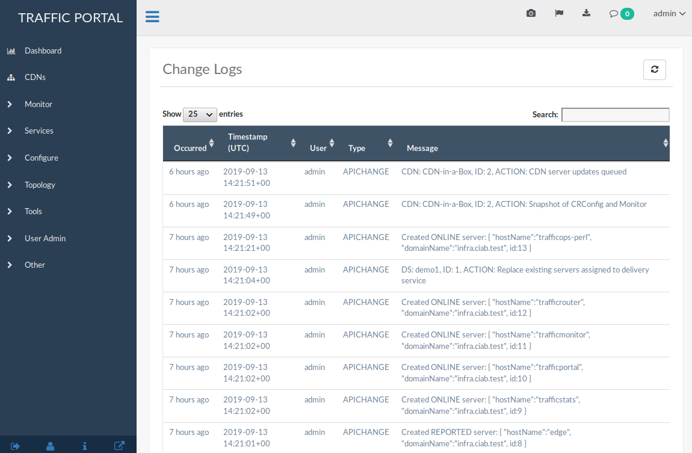
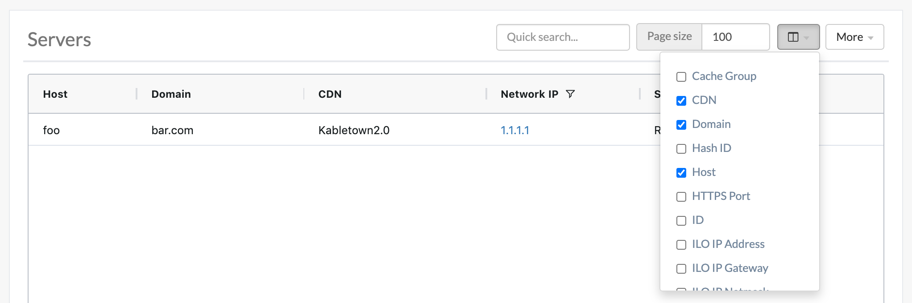

..
..
.. Licensed under the Apache License, Version 2.0 (the "License");
.. you may not use this file except in compliance with the License.
.. You may obtain a copy of the License at
..
..     http://www.apache.org/licenses/LICENSE-2.0
..
.. Unless required by applicable law or agreed to in writing, software
.. distributed under the License is distributed on an "AS IS" BASIS,
.. WITHOUT WARRANTIES OR CONDITIONS OF ANY KIND, either express or implied.
.. See the License for the specific language governing permissions and
.. limitations under the License.
..

.. _usingtrafficportal:

**********************
Traffic Portal - Using
**********************
Traffic Portal is the official Traffic Control UI. Traffic Portal typically runs on a different machine than Traffic Ops, and works by using the Traffic Ops API. The following high-level items are available in the Traffic Portal menu.

.. figure:: ./images/tp_menu.png
	:width: 55%
	:align: center
	:alt: The Traffic Portal Landing Page

	Traffic Portal Start Page

Change Logs
===========
At the top-right of every page is a bubble icon and badge count indicating the number of changes made to the CDN since the last viewing. Clicking on this expands a short list, with an option to :guilabel:`See All Change Logs`. Clicking on this will navigate to the "Changelog" page.

	The Changelog Dialog

	The Full Change Logs Page

Sidebar Bottom Buttons
======================
At the bottom of the sidebar, a few action buttons may be found. At the far left, is the :guilabel:`Logout` button.

.. figure:: images/logout_button.png
	:align: center
	:alt: The logout button

	The Logout Button

Clicking on this button will cause the current user session to end; further use of the Traffic Portal UI will require re-authentication. Next to this is the :guilabel:`User Profile` button.

	The User Profile Button

Clicking on this button will take the user to his or her user profile page, where much of their information (contact, username etc.) is editable. The next button to the right is the :guilabel:`Release Info` button.

.. figure:: images/release_info_button.png
	:align: center
	:alt: The release info button

	The Release Info Button

When this button is clicked, a modal window will appear, displaying the Traffic Portal version, the date on which it was built, and the network location of the Traffic Ops server that serves the :ref:`to-api` used by the Traffic Portal instance. The final button is the :guilabel:`Popout` button.

.. figure:: images/popout_button.png
	:align: center
	:alt: The popout button

	The Popout Button

This button will open the current view in a new browsing context. Most browsers will implement this as a new tab, but can be configured instead to open them in a new window - check your browser's configuration and set it as desired.

Dashboard
=========
The Dashboard is the default landing page for Traffic Portal. It provides a real-time view into the main performance indicators of the CDNs managed by Traffic Control. It also displays various statistics about the overall health of your CDN.

Current Bandwidth
	The current bandwidth of all of your CDNs.

Current Connections
	The current number of connections to all of your CDNs.

Healthy Caches
	Displays the number of healthy :term:`cache servers` across all CDNs. Click the link to view the healthy caches on the cache stats page.

Unhealthy Caches
	Displays the number of unhealthy :term:`cache servers` across all CDNs. Click the link to view the unhealthy caches on the cache stats page.

Online Caches
	Displays the number of :term:`cache servers` with ONLINE :term:`Status`. Traffic Monitor will not monitor the state of ONLINE servers.

Reported Caches
	Displays the number of :term:`cache servers` with REPORTED :term:`Status`.

Offline Caches
	Displays the number of :term:`cache servers` with OFFLINE :term:`Status`.

Admin Down Caches
	Displays the number of caches with ADMIN_DOWN :term:`Status`.

Each component of this view is updated on the intervals defined in the :atc-file:`traffic_portal/app/src/traffic_portal_properties.json` configuration file.

.. _tp-cdns:

CDNs
====
A table of CDNs with the following columns:

:Name:           The name of the CDN
:Domain:         The CDN's :abbr:`TLD (Top-Level Domain)`
:DNSSEC Enabled: 'true' if :ref:`tr-dnssec` is enabled on this CDN, 'false' otherwise.

CDN management includes the ability to (where applicable):

- create a new CDN
- update an existing CDN
- delete an existing CDN
- :term:`Queue Updates` on all servers in a CDN, or clear such updates
- Compare CDN :term:`Snapshots`
- create a CDN :term:`Snapshot`
- manage a CDN's DNSSEC keys
- manage a CDN's :term:`Federations`
- view :term:`Delivery Services` of a CDN
- view CDN :term:`Profiles`
- view servers within a CDN

Monitor
=======
The :guilabel:`Monitor` section of Traffic Portal is used to display statistics regarding the various :term:`cache servers` within all CDNs visible to the user. It retrieves this information through the :ref:`to-api` from Traffic Monitor instances.

.. figure:: ./images/tp_menu_monitor.png
	:align: center
	:alt: The Traffic Portal 'Monitor' Menu

	The 'Monitor' Menu

Cache Checks
------------
A real-time view into the status of each :term:`cache server`. The :menuselection:`Monitor --> Cache Checks` page is intended to give an overview of the caches managed by Traffic Control as well as their status.

.. warning:: Several of these columns may be empty by default - particularly in the :ref:`ciab` environment - and require :ref:`Traffic Ops Extensions <admin-to-ext-script>` to be installed/enabled/configured in order to work.

:Hostname: The (short) hostname of the :term:`cache server`
:Profile:  The :ref:`profile-name` of the :term:`Profile` used by the :term:`cache server`
:Status:   The :term:`Status` of the :term:`cache server`

	.. seealso:: :ref:`health-proto`

:UPD:  Displays whether or not this :term:`cache server` has configuration updates pending
:RVL:  Displays whether or not this :term:`cache server` (or one or more of its :term:`parents`) has content invalidation requests pending
:ILO:  Indicates the status of an :abbr:`iLO (Integrated Lights-Out)` interface for this :term:`cache server`
:10G:  Indicates whether or not the IPv4 address of this :term:`cache server` is reachable via ICMP "pings"
:FQDN: DNS check that matches what the DNS servers respond with compared to what Traffic Ops has configured
:DSCP: Checks the :abbr:`DSCP (Differentiated Services Code Point)` value of packets received from this :term:`cache server`
:10G6: Indicates whether or not the IPv6 address of this :term:`cache server` is reachable via ICMP "pings"
:MTU:  Checks the :abbr:`MTU (Maximum Transmission Unit)` by sending ICMP "pings" from the Traffic Ops server
:RTR:  Checks the reachability of the :term:`cache server` from the CDN's configured Traffic Routers
:CHR:  Cache-Hit Ratio (percent)
:CDU:  Total Cache-Disk Usage (percent)
:ORT:  Uses the :term:`ORT` script on the :term:`cache server` to determine if the configuration in Traffic Ops matches the configuration on :term:`cache server` itself. The user as whom this script runs must have an SSH key on each server.

Cache Stats
-----------
A table showing the results of the periodic :ref:`to-check-ext` that are run. These can be grouped by :term:`Cache Group` and/or :term:`Profile`.

:Profile:     :ref:`profile-name` of the :term:`Profile` applied to the Edge-tier or Mid-tier :term:`cache server`, or the special name "ALL" indicating that this row is a group of all :term:`cache servers` within a single :term:`Cache Group`
:Host:        'ALL' for entries grouped by :term:`Cache Group`, or the hostname of a particular :term:`cache server`
:Cache Group: :ref:`Name of the Cache Group <cache-group-name>` to which this server belongs, or the name of the :term:`Cache Group` that is grouped for entries grouped by :term:`Cache Group`, or the special name "ALL" indicating that this row is an aggregate across all :term:`Cache Groups`
:Healthy:     True/False as determined by Traffic Monitor

	.. seealso:: :ref:`health-proto`

:Status:      Status of the :term:`cache server` or :term:`Cache Group`
:Connections: Number of currently open connections to this :term:`cache server` or :term:`Cache Group`
:MbpsOut:     Data flow rate outward from the CDN (toward client) in Megabits per second

.. _tp-services:

Services
========
:guilabel:`Services` groups the functionality to modify :term:`Delivery Services` - for those users with the necessary permissions - or make :term:`Delivery Service Requests` for such changes - for users without necessary permissions. Delivery Services can also be grouped by :term:`Service Category`.

.. figure:: ./images/tp_menu_services.png
	:align: center
	:alt: The Traffic Portal 'Services' Menu

	The 'Services' Menu

.. _tp-services-delivery-service:

Delivery Services
-----------------
This page contains a table displaying all :term:`Delivery Services` visible to the user as determined by their :term:`Tenant`.

.. figure:: images/tp_table_ds.png
	:align: center
	:alt: An example table of Delivery Services

	Table of Delivery Services

Use the `Select Columns` menu to select the delivery service columns to view and search. Columns can also be rearranged using drag-and-drop. Available delivery service columns include:

- :ref:`ds-active` (visible by default)
- :ref:`ds-anonymous-blocking`
- :ref:`ds-cdn` (visible by default)
- :ref:`ds-check-path`
- :ref:`ds-consistent-hashing-qparams`
- :ref:`ds-consistent-hashing-regex`
- :ref:`ds-deep-caching`
- :ref:`ds-display-name`
- :ref:`ds-dns-bypass-cname`
- :ref:`ds-dns-bypass-ip`
- :ref:`ds-dns-bypass-ipv6`
- :ref:`ds-dns-bypass-ttl`
- :ref:`ds-dns-ttl`
- :ref:`ds-dscp` (visible by default)
- :ref:`ds-edge-header-rw-rules`
- :ref:`ds-fqpr`
- :ref:`ds-first-header-rw-rules`
- :ref:`ds-geo-limit`
- :ref:`ds-geo-limit-countries`
- :ref:`ds-geo-limit-redirect-url`
- :ref:`ds-geo-provider`
- :ref:`ds-geo-miss-default-latitude`
- :ref:`ds-geo-miss-default-longitude`
- :ref:`ds-global-max-mbps`
- :ref:`ds-global-max-tps`
- :ref:`ds-http-bypass-fqdn`
- :ref:`ds-info-url`
- :ref:`ds-initial-dispersion`
- :ref:`ds-inner-header-rw-rules`
- :ref:`ds-ipv6-routing` (visible by default)
- :ref:`ds-last-header-rw-rules`
- :ref:`ds-longdesc`
- :ref:`ds-max-dns-answers`
- :ref:`ds-max-origin-connections`
- :ref:`ds-mid-header-rw-rules`
- :ref:`ds-origin-shield`
- :ref:`ds-origin-url` (visible by default)
- :ref:`ds-profile`
- :ref:`ds-protocol` (visible by default)
- :ref:`ds-qstring-handling` (visible by default)
- :ref:`ds-range-request-handling`
- :ref:`ds-slice-block-size`
- :ref:`ds-raw-remap`
- :ref:`ds-regex-remap`
- :ref:`ds-regionalgeo`
- :ref:`ds-routing-name`
- :ref:`ds-signing-algorithm` (visible by default)
- :ref:`ds-tenant` (visible by default)
- :ref:`ds-topology`
- :ref:`ds-tr-resp-headers`
- :ref:`ds-tr-req-headers`
- :ref:`ds-types` (visible by default)
- :ref:`ds-multi-site-origin`
- :ref:`ds-xmlid` (visible by default)

:term:`Delivery Service` management includes the ability to (where applicable):

- Create a new :term:`Delivery Service`
- Clone an existing :term:`Delivery Service`
- Update an existing :term:`Delivery Service`
- Delete an existing :term:`Delivery Service`
- Compare :term:`Delivery Services`
- Manage :term:`Delivery Service` SSL keys
- Manage :term:`Delivery Service` URL signature keys
- Manage :term:`Delivery Service` URI signing keys
- Manage :term:`Delivery Service` invalidation requests
- Manage :term:`Delivery Service` origins
- Manage :term:`Delivery Service` regular expressions
- :ref:`delivery_service_required_server_capabilities`
- Manage :term:`Delivery Service` server assignments
- Manage :term:`Delivery Service` steering targets
- Manage :term:`Delivery Service` static DNS records within a :term:`Delivery Service` subdomain
- Test :ref:`pattern-based-consistenthash`

	.. seealso:: :ref:`static-dns-qht`

Delivery Service Requests
-------------------------
If enabled in the :file:`traffic_portal_properties.json` configuration file, all :term:`Delivery Service` changes (create, update and delete) are captured as a :term:`Delivery Service Request` and must be reviewed before fulfillment/deployment.

.. figure:: images/tp_table_ds_requests.png
	:align: center
	:alt: An example table of Delivery Service Requests

	Table of Delivery Service Requests

:term:`Delivery Service`: A unique string that identifies the :term:`Delivery Service` with which the request is associated. This unique string is also known (and ofter referred to within documentation and source code) as a :term:`Delivery Service` key' or 'XML ID'/'xml_id'/'xmlid'
:Type:             The type of :term:`Delivery Service Request`: 'create', 'update', or 'delete' according to what was requested
:Status:           The status of the :term:`Delivery Service Request`. Has the following possible values:

	draft
		The :term:`Delivery Service Request` is *not* ready for review and fulfillment
	submitted
		The :term:`Delivery Service Request` is ready for review and fulfillment
	rejected
		The :term:`Delivery Service Request` has been rejected and cannot be modified
	pending
		The :term:`Delivery Service Request` has been fulfilled but the changes have yet to be deployed
	complete
		The :term:`Delivery Service Request` has been fulfilled and the changes have been deployed

:Author:         The user responsible for creating the :term:`Delivery Service Request`
:Assignee:       The user responsible for fulfilling the :term:`Delivery Service Request`. Currently, the operations role or above is required to assign :term:`Delivery Service Requests`
:Last Edited By: The last user to edit the :term:`Delivery Service Request`
:Created:        Relative time indicating when the :term:`Delivery Service Request` was created
:Actions:        Actions that can be performed on a :term:`Delivery Service Request`. The following actions are provided:

	fulfill
		Implement the changes captured in the :term:`Delivery Service Request`
	reject
		Reject the changes captured in the :term:`Delivery Service Request`
	delete
		Delete the :term:`Delivery Service Request`

:term:`Delivery Service Request` management includes the ability to (where applicable):

- create a new :term:`Delivery Service Request`
- update an existing :term:`Delivery Service Request`
- delete an existing :term:`Delivery Service Request`
- update the status of a :term:`Delivery Service Request`
- assign a :term:`Delivery Service Request`
- reject a :term:`Delivery Service Request`
- fulfill a :term:`Delivery Service Request`
- complete a :term:`Delivery Service Request`

.. seealso:: :ref:`ds_requests`

Configure
=========
Interfaces for managing the various components of Traffic Control and how they interact are grouped under :guilabel:`Configure`.

.. figure:: ./images/tp_menu_configure.png
	:align: center
	:alt: The 'Configure' Menu

	The 'Configure' Menu

.. _tp-configure-servers:

Servers
-------
A configurable table of all servers (of all kinds) across all :term:`Delivery Services` and CDNs visible to the user.

	Table of Servers

Use the `Quick Search` to search across all table columns or the column filter to apply a more powerful filter to individual columns. Use the `Select Columns` menu to select the server columns to view. Columns can also be rearranged using drag-and-drop. Available server columns include:

:Cache Group:       [Visible by default] The :ref:`Name of the Cache Group <cache-group-name>` to which this server belongs
:CDN:               [Visible by default] The name of the CDN to which the server belongs
:Domain:            [Visible by default] The domain part of the server's :abbr:`FQDN (Fully Qualified Domain Name)`
:Hash ID:           The identifier of the server used in Traffic Router's consistent hashing algorithm.
:Host:              [Visible by default] The (short) hostname of the server
:HTTPS Port:        The port on which the server listens for incoming HTTPS connections/requests
:ID:                An integral, unique identifier for this server
:ILO IP Address:    The IPv4 address of the server's :abbr:`ILO (Integrated Lights-Out)` service

	.. seealso:: `Hewlett Packard ILO Wikipedia Page <https://en.wikipedia.org/wiki/HP_Integrated_Lights-Out>`_

:ILO IP Gateway:    The IPv4 gateway address of the server's :abbr:`ILO (Integrated Lights-Out)` service
:ILO IP Netmask:    The IPv4 subnet mask of the server's :abbr:`ILO (Integrated Lights-Out)` service
:ILO Username:      The user name for the server's :abbr:`ILO (Integrated Lights-Out)` service
:Interface Name:    The name of the primary network interface used by the server
:IPv6 Address:      [Visible by default] The IPv6 address and subnet mask of ``interfaceName``
:IPv6 Gateway:      The IPv6 address of the gateway used by ``interfaceName``
:Last Updated:      The date and time at which this server description was last modified
:Mgmt IP Address:   The IPv4 address of some network interface on the server used for 'management'
:Mgmt IP Gateway:   The IPv4 address of a gateway used by some network interface on the server used for 'management'
:Mgmt IP Netmask:   The IPv4 subnet mask used by some network interface on the server used for 'management'
:IPv4 Gateway:      The IPv4 address of the gateway used by ``interfaceName``
:IPv4 Address:      [Visible by default] The IPv4 address of ``interfaceName``
:Network MTU:       The Maximum Transmission Unit (MTU) to configured on ``interfaceName``
:IPv4 Subnet:       The IPv4 subnet mask used by ``interfaceName``
:Offline Reason:    A user-entered reason why the server is in ADMIN_DOWN or OFFLINE status
:Phys Location:     The name of the physical location where the server resides
:Profile:           [Visible by default] The :ref:`profile-name` of the :term:`Profile` used by this server
:Rack:              A string indicating "server rack" location
:Reval Pending:     [Visible by default] A boolean value represented as a clock (content invalidation/revalidation is pending) or green check mark (content invalidation/revalidation is not pending)
:Router Hostname:   The human-readable name of the router responsible for reaching this server's interface
:Router Port:       The human-readable name of the port used by the router responsible for reaching this server's interface
:Status:            [Visible by default] The :term:`Status` of the server

	.. seealso:: :ref:`health-proto`

:TCP Port:          The port on which this server listens for incoming TCP connections
:Type:              [Visible by default] The name of the :term:`Type` of this server
:Update Pending:    [Visible by default] A boolean value represented as a clock (updates are pending) or green check mark (updates are not pending), typically to be acted upon by Traffic Ops ORT

Server management includes the ability to (where applicable):

- Create a new server
- Update an existing server
- Delete an existing server
- :term:`Queue Updates` on a server, or clear such updates
- Update server status
- View server :term:`Delivery Services`
- Clone :term:`Delivery Service` assignments
- Assign :term:`Delivery Services` to server(s)
- :ref:`server_server_capabilities`

.. _tp-configure-origins:

Origins
-------
A table of all :term:`Origins`. These are automatically created for the :term:`Origins` served by :term:`Delivery Services` throughout all CDNs, but additional ones can be created at will. The table has the following columns:

:Name:             The name of the :term:`Origin`. If this :term:`Origin` was created automatically for a :term:`Delivery Service`, this will be the :ref:`ds-xmlid` of that :term:`Delivery Service`.
:Tenant:           The name of the :term:`Tenant` that owns this :term:`Origin` - this is not necessarily the same as the :term:`Tenant` that owns the :term:`Delivery Service` to which this :term:`Origin` belongs.
:Primary:          Either ``true`` to indicate that this is the "primary" :term:`Origin` for the :term:`Delivery Service` to which it is assigned, or ``false`` otherwise.
:Delivery Service: The :ref:`ds-xmlid` of the :term:`Delivery Service` to which this :term:`Origin` is assigned.
:FQDN:             The :abbr:`FQDN (Fully Qualified Domain Name)` of the :term:`Origin`.
:IPv4 Address:     The :term:`Origin`'s IPv4 address, if configured.
:IPv6 Address:     The :term:`Origin`'s IPv6 address, if configured.
:Protocol:         The protocol this :term:`Origin` uses to serve content. One of

	- http
	- https

:Port: The port on which the :term:`Origin` listens for incoming HTTP(S) requests.

	.. note:: If this field appears blank in the table, it means that a default was chosen for the :term:`Origin` based on its Protocol - ``80`` for "http", ``443`` for "https".

:Coordinate: The name of the geographic coordinate pair that defines the physical location of this :term:`Origin`. :term:`Origins` created for :term:`Delivery Services` automatically will **not** have associated Coordinates. This can be rectified on the details pages for said :term:`Origins`
:Cachegroup: The :ref:`Name of the Cache Group <cache-group-name>` to which this :term:`Origin` belongs, if any.
:Profile:    The :ref:`profile-name` of a :term:`Profile` used by this :term:`Origin`.

:term:`Origin` management includes the ability to (where applicable):

- create a new :term:`Origin`
- update an existing :term:`Origin`
- delete an existing :term:`Origin`

.. _tp-configure-profiles:

Profiles
--------
A table of all :term:`Profiles`. From here you can see :term:`Parameters`, servers and :term:`Delivery Services` assigned to each :term:`Profile`. Each entry in the table has these fields:

:Name:             The :ref:`profile-name` of the :term:`Profile`
:Type:             The :ref:`profile-type` of this :term:`Profile`, which indicates the kinds of objects to which the :term:`Profile` may be assigned
:Routing Disabled: The :ref:`profile-routing-disabled` setting of this :term:`Profile`
:Description:      This :term:`Profile`'s :ref:`profile-description`
:CDN:              The :ref:`profile-cdn` to which this :term:`Profile` is restricted. To use the same :term:`Profile` across multiple CDNs, clone the :term:`Profile` and change the clone's :ref:`profile-cdn` field.

:term:`Profile` management includes the ability to (where applicable):

- create a new :term:`Profile`
- update an existing :term:`Profile`
- delete an existing :term:`Profile`
- clone a :term:`Profile`
- export a :term:`Profile`
- view :term:`Profile` :term:`Parameters`
- view :term:`Profile` :term:`Delivery Services`
- view :term:`Profile` servers

.. _tp-configure-parameters:

Parameters
----------
This page displays a table of :term:`Parameters` from all :term:`Profiles` with the following columns:

:Name:        The :ref:`parameter-name` of the :term:`Parameter`
:Config File: The :ref:`parameter-config-file` to which the :term:`Parameter` belongs.
:Value:       The :ref:`parameter-value` of the :term:`Parameter`.
:Secure:      Whether or not the :term:`Parameter` is :ref:`parameter-secure`
:Profiles:    The number of :term:`Profiles` currently using this :term:`Parameter`

:term:`Parameter` management includes the ability to (where applicable):

- create a new :term:`Parameter`
- update an existing :term:`Parameter`
- delete an existing :term:`Parameter`
- view :term:`Parameter` :term:`Profiles`
- manage assignments of a :term:`Parameter` to one or more :term:`Profiles` and/or :term:`Delivery Services`

.. _tp-configure-types:

Types
-----
:term:`Types` group :term:`Delivery Services`, servers and :term:`Cache Groups` for various purposes. Each entry in the table shown on this page has the following fields:

:Name:         The name of the :term:`Type`
:Use In Table: States the use of this :term:`Type`, e.g. ``server`` indicates this is a :term:`Type` assigned to servers
:Description:  A short, usually user-defined, description of the :term:`Type`

:term:`Type` management includes the ability to (where applicable):

- create a new :term:`Type`
- update an existing :term:`Type`
- delete an existing :term:`Type`
- view :term:`Delivery Services` assigned to a :term:`Type`
- view servers assigned to a :term:`Type`
- view :term:`Cache Groups` assigned to a :term:`Type`

Statuses
--------
This page shows a table of :term:`Status`\ es with the following columns:

:Name:        The name of this :term:`Status`
:Description: A short, usually user-defined, description of this :term:`Status`

:term:`Status` management includes the ability to (where applicable):

- create a new :term:`Status`
- update an existing :term:`Status`
- delete an existing :term:`Status`
- view :term:`Status`\ es

Topology
========
:guilabel:`Topology` groups views and functionality that deal with how CDNs and their Traffic Control components are grouped and distributed, both on a logical level as well as a physical level.

.. figure:: ./images/tp_menu_topology.png
	:align: center

	'Topology' Menu

.. _tp-configure-cache-groups:

Cache Groups
------------
This page is a table of :term:`Cache Groups`, each entry of which has the following fields:

:Name:       The full :ref:`Name of this Cache Group <cache-group-name>`
:Short Name: This :ref:`Cache Group's Short Name <cache-group-short-name>`
:Type:       This :ref:`Cache Group's Type <cache-group-type>`
:Latitude:   This :ref:`Cache Group's Latitude <cache-group-latitude>`
:Longitude:  This :ref:`Cache Group's Longitude <cache-group-longitude>`

:term:`Cache Group` management includes the ability to (where applicable):

- create a new :term:`Cache Group`
- update an existing :term:`Cache Group`
- delete an existing :term:`Cache Group`
- :term:`Queue Updates` for all servers in a :term:`Cache Group`, or clear such updates
- view :term:`Cache Group` :abbr:`ASN (Autonomous System Number)`\ s

	.. seealso:: `The Wikipedia page on Autonomous System Numbers <https://en.wikipedia.org/wiki/Autonomous_System_Number>`_

- view and assign :term:`Cache Group` :term:`Parameters`
- view :term:`Cache Group` servers

Coordinates
-----------
:menuselection:`Topology --> Coordinates` allows a label to be given to a set of geographic coordinates for ease of use. Each entry in the table on this page has the following fields:

:Name:      The name of this coordinate pair
:Latitude:  The geographic latitude part of the coordinate pair
:Longitude: The geographic longitude part of the coordinate pair

Coordination management includes the ability to (where applicable):

- create a new coordinate pair
- update an existing coordinate pair
- delete an existing coordinate pair

Phys Locations
--------------
A table of :term:`Physical Locations` which may be assigned to servers and :term:`Cache Groups`, typically for the purpose of optimizing client routing. Each entry has the following columns:

:Name:       The full name of the :term:`Physical Location`
:Short Name: A shorter, more human-friendly name for this :term:`Physical Location`
:Address:    The :term:`Physical Location`'s street address (street number and name)
:City:       The city within which the :term:`Physical Location` resides
:State:      The state within which the :term:`Physical Location`'s city lies
:Region:     The :term:`Region` to which this :term:`Physical Location` has been assigned

:term:`Physical Location` management includes the ability to (where applicable):

- create a new :term:`Physical Location`
- update an existing :term:`Physical Location`
- delete an existing :term:`Physical Location`
- view :term:`Physical Location` servers

Divisions
---------
Each entry in the table of :term:`Divisions` on this page has the following fields:

:Name: The name of the :term:`Division`

:term:`Division` management includes the ability to (where applicable):

- create a new :term:`Division`
- delete an existing :term:`Division`
- modify an existing :term:`Division`
- view :term:`Regions` within a :term:`Division`

Regions
-------
Each entry in the table of :term:`Regions` on this page has the following fields:

:Name:     The name of this :term:`Region`
:Division: The :term:`Division` to which this :term:`Region` is assigned

:term:`Region` management includes the ability to (where applicable):

- create a new :term:`Region`
- update an existing :term:`Region`
- delete an existing :term:`Region`
- view :term:`Physical Locations` within a :term:`Region`

ASNs
----
Manage :abbr:`ASN (Autonomous System Number)`\ s. Each entry in the table on this page has the following fields:

:ASN:         The actual :abbr:`ASN (Autonomous System Number)`
:Cache Group: The :term:`Cache Group` to which this :abbr:`ASN (Autonomous System Number)` is assigned

:abbr:`ASN (Autonomous System Number)` management includes the ability to (where applicable):

- create a new :abbr:`ASN (Autonomous System Number)`
- update an existing :abbr:`ASN (Autonomous System Number)`
- delete an existing :abbr:`ASN (Autonomous System Number)`

.. seealso:: `Autonomous System (Internet) Wikipedia Page <https://en.wikipedia.org/wiki/Autonomous_system_(Internet)>`_

Tools
=====
:guilabel:`Tools` contains various tools that don't directly relate to manipulating Traffic Control components or their groupings.

.. figure:: ./images/tp_menu_tools.png
	:align: center
	:alt: The 'Tools' Menu

	The 'Tools' Menu

Invalidate Content
------------------
Here, specific assets can be invalidated in all caches of a :term:`Delivery Service`, forcing content to be updated from the origin. Specifically, this *doesn't* mean that :term:`cache servers` will immediately remove items from their caches, but rather will fetch new copies whenever a request is made matching the 'Asset URL' regular expression. This behavior persists until the :term:`Content Invalidation Job`'s :ref:`job-ttl` expires.

.. warning:: This method forces :term:`cache servers` to "re-validate" content, so in order to work properly the :term:`Origin` needs to support revalidation according to section 4.3.2 of :rfc:`7234`.

Each entry in the table on this page has the following fields:

:Delivery Service:  The :term:`Delivery Service` to which to apply this :term:`Content Invalidation Job`
:Asset URL:         A URL or regular expression which describes the asset(s) to be invalidated
:TTL (Hours):       A :abbr:`TTL (Time To Live)` (as a number of hours) over which the :term:`Content Invalidation Job` shall remain active
:Start:             An effective start time until which the :term:`job` is delayed
:Expires:           The date/time at which the :term:`Content Invalidation Job` will end (effectively "Start" plus "TTL (Hours)")
:Created By:        The user name of the person who created this :term:`Content Invalidation Job`
:Invalidation Type: The :ref:`job-invalidation-type` of this :term:`Content Invalidation Job`

Invalidate content includes the ability to (where applicable):

- create a new :term:`Content Invalidation Job`

.. _tp-tools-generate-iso:

Generate ISO
------------
Generates a boot-able system image for any of the servers in the Servers table (or any server for that matter). Currently it only supports CentOS 7, but if you're brave and pure of heart you MIGHT be able to get it to work with other Unix-like Operating Systems. The interface is *mostly* self-explanatory, but here is a short explanation of the fields in that form.

.. seealso:: For instructions on setting up the Kickstart ISO generation files, see :ref:`Creating-CentOS-Kickstart`.

Copy Server Attributes From
	Optional. This option lets the user choose a server from the Traffic Ops database and will auto-fill the other fields as much as possible based on that server's properties
OS Version
	This list is populated by modifying the :file:`osversions.json` file on the Traffic Ops server. This file maps OS names to the name of a directory under :ref:`kickstart.files.location` (``/var/www/files`` by default).
Hostname
	The desired hostname of the resultant system
Domain
	The desired domain name of the resultant system
DHCP
	If this is 'no' the IP settings of the system must be specified, and the following extra fields will appear:

		IP Address
			The resultant system's IPv4 address
		IPv6 Address
			The resultant system's IPv6 address
		Network Subnet
			The system's network subnet mask
		Network Gateway
			The system's network gateway's IPv4 address
		IPv6 Gateway
			The system's network gateway's IPv6 address
		Management IP Address
			An optional IP address (IPv4 or IPv6) of a "management" server for the resultant system (e.g. for :abbr:`ILO (Integrated Lights-Out)`)
		Management IP Netmask
			The subnet mask (IPv4 or IPv6) used by a "management" server for the resultant system (e.g. for :abbr:`ILO (Integrated Lights-Out)`) - only needed if the Management IP Address is provided
		Management IP Gateway
			The IP address (IPv4 or IPv6) of the network gateway used by a "management" server for the resultant system (e.g. for :abbr:`ILO (Integrated Lights-Out)`) - only needed if the Management IP Address is provided
		Management Interface
			The network interface used by a "management" server for the resultant system (e.g. for :abbr:`ILO (Integrated Lights-Out)`) - only needed if the Management IP Address is provided. Must not be the same as "Interface Name".

Network MTU
	The system's network's :abbr:`MTU (Maximum Transmission Unit)`. Despite being a text field, this can only be 1500 or 9000 - it should almost always be 1500

		.. seealso:: `The Maximum transmission unit Wikipedia Page <https://en.wikipedia.org/wiki/Maximum_transmission_unit>`_

Disk for OS Install
	The disk on which to install the base system. A reasonable default is ``sda`` (the ``/dev/`` prefix is not necessary)
Root Password
	The password to be used for the root user. Input is hashed using MD5 before being written to disk
Confirm Root Password
	Repeat the 'Root Password' to be sure it's right
Interface Name
	Optional. The name of the resultant system's network interface. Typical values are ``bond0``, ``eth4``, etc. If ``bond0`` is entered, a Link Aggregation Control Protocol bonding configuration will be written

		.. seealso:: `The Link aggregation Wikipedia Page <https://en.wikipedia.org/wiki/Link_aggregation>`_

Stream ISO
	If this is 'yes', then the download will start immediately as the ISO is written directly to the socket connection from Traffic Ops. If this is 'no', then the download will begin only *after* the ISO has finished being generated. For almost all use cases, this should be 'yes'.

.. impl-detail:: Traffic Ops uses Red Hat's `Kickstart <https://access.redhat.com/documentation/en-us/red_hat_enterprise_linux/7/html/installation_guide/chap-kickstart-installations>` to create these ISOs, so many configuration options not available here can be tweaked in the :ref:`Kickstart configuration file <Creating-CentOS-Kickstart>`.

User Admin
==========
This section offers administrative functionality for users and their permissions.

.. figure:: ./images/tp_menu_user_admin.png
	:align: center
	:alt: The 'User Admin' Menu

	The 'User Admin' Menu

User
----
This page lists all the users that are visible to the user (so, for 'admin' users, all users will appear here). Each entry in the table on this page has the following fields:

:Full Name: The user's full, real name
:Username:  The user's username
:Email:     The user's email address
:Tenant:    The user's :term:`Tenant`
:Role:      The user's :term:`Role`

User management includes the ability to (where applicable):

- register a new user
- create a new user
- update an existing user
- view :term:`Delivery Services` visible to a user

.. Note:: If OAuth is enabled, the username must exist both here as well as with the OAuth provider. A user's rights are defined by the :term:`Role` assigned to the user in Traffic Ops. Creating/deleting a user here will update the user's :term:`Role` but the user needs to be created/deleted with the OAuth provider as well.

Tenants
-------
Each entry in the table of :term:`Tenants` on this page has the following entries:

:Name:   The name of the :term:`Tenant`
:Active: If 'true' users of this :term:`Tenant` group are allowed to login and have active :term:`Delivery Services`
:Parent: The parent of this :term:`Tenant`. The default is the 'root' :term:`Tenant`, which has no users.

:term:`Tenant` management includes the ability to (where applicable):

- create a new :term:`Tenant`
- update an existing :term:`Tenant`
- delete an existing :term:`Tenant`
- view users assigned to a :term:`Tenant`
- view :term:`Delivery Services` assigned to a :term:`Tenant`

Roles
-----
Each entry in the table of :term:`Roles` on this page has the following fields:

:Name:            The name of the :term:`Role`
:Privilege Level: The privilege level of this :term:`Role`. This is a whole number that actually controls what a user is allowed to do. Higher numbers correspond to higher permission levels
:Description:     A short description of the :term:`Role` and what it is allowed to do

Role management includes the ability to (where applicable):

- view all :term:`Roles`
- create new :term:`Role`

.. note:: :term:`Roles` cannot be deleted through the Traffic Portal UI

Other
=====
Custom menu items. By default, this contains only a link to the Traffic Control documentation.

.. figure:: ./images/tp_menu_other.png
	:align: center
	:alt: The 'Other' Menu

	The 'Other' Menu

Docs
----
This is just a link to `the Traffic Control Documentation <https://trafficcontrol.apache.org>`_.

Custom Menu Items
-----------------
This section is configurable in the :file:`traffic_portal_properties.json` configuration file, in the ``customMenu`` section.
