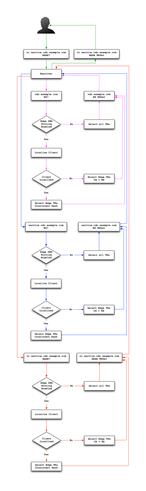

..
..
.. Licensed under the Apache License, Version 2.0 (the "License");
.. you may not use this file except in compliance with the License.
.. You may obtain a copy of the License at
..
..     http://www.apache.org/licenses/LICENSE-2.0
..
.. Unless required by applicable law or agreed to in writing, software
.. distributed under the License is distributed on an "AS IS" BASIS,
.. WITHOUT WARRANTIES OR CONDITIONS OF ANY KIND, either express or implied.
.. See the License for the specific language governing permissions and
.. limitations under the License.
..

.. _tr-admin:

*****************************
Traffic Router Administration
*****************************

Requirements
============
* CentOS 7 or later
* 4 CPUs
* 8GB of RAM
* Successful install of Traffic Ops (usually on another machine)
* Successful install of Traffic Monitor (usually on another machine)
* Administrative access to Traffic Ops

.. Note:: Hardware requirements are generally doubled if :ref:`tr-DNSSEC` is enabled

Installing Traffic Router
=========================
#. If no suitable :term:`Profile` exists, create a new :term:`Profile` for Traffic Router via the :guilabel:`+` button on the :ref:`tp-configure-profiles` page in Traffic Portal

	.. warning:: Traffic Ops will *only* recognize a :term:`Profile` as assignable to a Traffic Router if its :ref:`profile-name` starts with the prefix ``ccr-``. The reason for this is a legacy limitation related to the old name for Traffic Router (Comcast Cloud Router), and will (hopefully) be rectified in the future.

#. Enter the Traffic Router server into Traffic Portal on the :ref:`tp-configure-servers` page (or via the :ref:`to-api`), assign to it a Traffic Router :term:`Profile`, and ensure that its status is set to ``ONLINE``.
#. Ensure the :abbr:`FQDN (Fully Qualified Domain Name)` of the Traffic Router is resolvable in DNS. This :abbr:`FQDN (Fully Qualified Domain Name)` must be resolvable by the clients expected to use this CDN.
#. Install a Traffic Router server package, either from source or using a :file:`traffic_router-{version string}.rpm` package generated using the instructions in :ref:`dev-building`.

	.. versionchanged:: 3.0
		As of version 3.0, Traffic Router depends upon a package called ``tomcat``. This package should have been created when Traffic Router was built. If installing the ``traffic_router`` produces a depenedency error, make sure that the ``tomcat`` package is available in an accessible :manpage:`yum(8)` repository.

#. Edit :file:`/opt/traffic_router/conf/traffic_monitor.properties` and specify the correct online Traffic Monitor(s) for your CDN.

	.. seealso:: :ref:`tr-config-files`

	:file:`traffic_monitor.properties`
		URL that should normally point to this file, e.g. ``traffic_monitor.properties=file:/opt/traffic_router/conf/traffic_monitor.properties``
	:file:`traffic_monitor.properties.reload.period`
		Period to wait (in milliseconds) between reloading this file, e.g. ``traffic_monitor.properties.reload.period=60000``

#. Start Traffic Router. This is normally done by starting its :manpage:`systemd(1)` service. ``systemctl start traffic_router`` , and test DNS lookups against that server to be sure it's resolving properly. with e.g. ``dig`` or ``curl``. Also, because previously taken CDN :term:`Snapshots` will be cached, they need to be removed manually to actually be reloaded. This file should be located at :file:`/opt/traffic_router/db/cr-config.json`. This should be done before starting or restarting Traffic Router.

	.. code-block:: console
		:caption: Starting and Testing Traffic Router

		[root@trafficrouter /]# systemctl start traffic_router
		[root@trafficrouter /]# dig @localhost mycdn.ciab.test

		; <<>> DiG 9.9.4-RedHat-9.9.4-72.el7 <<>> @localhost mycdn.ciab.test
		; (2 servers found)
		;; global options: +cmd
		;; Got answer:
		;; ->>HEADER<<- opcode: QUERY, status: NOERROR, id: 27109
		;; flags: qr aa rd; QUERY: 1, ANSWER: 0, AUTHORITY: 1, ADDITIONAL: 0
		;; WARNING: recursion requested but not available

		;; QUESTION SECTION:
		;mycdn.ciab.test.		IN	A

		;; AUTHORITY SECTION:
		mycdn.ciab.test.	30	IN	SOA	trafficrouter.infra.ciab.test. twelve_monkeys.mycdn.ciab.test. 2019010918 28800 7200 604800 30

		;; Query time: 28 msec
		;; SERVER: ::1#53(::1)
		;; WHEN: Wed Jan 09 21:27:57 UTC 2019
		;; MSG SIZE  rcvd: 104

#. Perform a CDN :term:`Snapshot`.

	.. Note:: Once the :term:`Snapshot` is taken, live traffic will be sent to the new Traffic Routers provided that their status has been set to ``ONLINE``.

#. Ensure that the parent domain (e.g.: ``cdn.local``) for the CDN's top level domain (e.g.: ``ciab.cdn.local``) contains a delegation (Name Server records) for the new Traffic Router, and that the value specified matches the :abbr:`FQDN (Fully Qualified Domain Name)` of the Traffic Router.

Configuring Traffic Router
==========================
.. versionchanged:: 1.5
	Many of the configuration files under :file:`/opt/traffic_router/conf` are now only needed to override the default configuration values for Traffic Router. Most of the given default values will work well for any CDN. Critical values that must be changed are hostnames and credentials for communicating with other Traffic Control components such as Traffic Ops and Traffic Monitor. Pre-existing installations that store configuration files under ``/opt/traffic_router/conf`` will still be used and honored for Traffic Router 1.5 onward.

.. versionchanged:: 3.0
	Traffic Router 3.0 has been converted to a formal Tomcat instance, meaning that is now installed separately from the Tomcat servlet engine. The Traffic Router installation package contains all of the Traffic Router-specific software, configuration and startup scripts including some additional configuration files needed for Tomcat. These new configuration files can all be found in the :file:`/opt/traffic_router/conf` directory and generally serve to override Tomcat's default settings.

For the most part, the configuration files and :term:`Parameters` used by Traffic Router are used to bring it online and start communicating with various Traffic Control components. Once Traffic Router is successfully communicating with Traffic Control, configuration should mostly be performed in Traffic Portal, and will be distributed throughout Traffic Control via CDN :term:`Snapshot` process.

.. _tr-config-files:
.. table:: Traffic Router Configuration File Parameters

	+----------------------------+-------------------------------------------+----------------------------------------------------------------------------------+----------------------------------------------------+
	| Configuration File         | Parameter Name                            | Description                                                                      | Default Value                                      |
	+============================+===========================================+==================================================================================+====================================================+
	| traffic_monitor.properties | traffic_monitor.bootstrap.hosts           | Semicolon-delimited Traffic Monitor                                              | N/A                                                |
	|                            |                                           | :abbr:`FQDN (Fully Qualified Domain Name)`\ s with port numbers as necessary     |                                                    |
	|                            +-------------------------------------------+----------------------------------------------------------------------------------+----------------------------------------------------+
	|                            | traffic_monitor.bootstrap.local           | Use only the Traffic Monitors specified in local configuration files             | ``false``                                          |
	|                            +-------------------------------------------+----------------------------------------------------------------------------------+----------------------------------------------------+
	|                            | traffic_monitor.properties                | Path to file:`traffic_monitor.properties`; used internally to monitor the file   | ``/opt/traffic_router/traffic_monitor.properties`` |
	|                            |                                           | for changes                                                                      |                                                    |
	|                            +-------------------------------------------+----------------------------------------------------------------------------------+----------------------------------------------------+
	|                            | traffic_monitor.properties.reload.period  | The interval in milliseconds for Traffic Router to wait between reloading this   | ``60000``                                          |
	|                            |                                           | configuration file                                                               |                                                    |
	+----------------------------+-------------------------------------------+----------------------------------------------------------------------------------+----------------------------------------------------+
	| dns.properties             | dns.tcp.port                              | TCP port that Traffic Router will use for incoming DNS requests                  | ``53``                                             |
	|                            +-------------------------------------------+----------------------------------------------------------------------------------+----------------------------------------------------+
	|                            | dns.tcp.backlog                           | Maximum length of the queue for incoming TCP connection requests                 | ``0``                                              |
	|                            +-------------------------------------------+----------------------------------------------------------------------------------+----------------------------------------------------+
	|                            | dns.tcp.host                              | IP Address Traffic Router will listen on for incoming TCP DNS requests           | ``0.0.0.0``                                        |
	|                            +-------------------------------------------+----------------------------------------------------------------------------------+----------------------------------------------------+
	|                            | dns.udp.host                              | IP Address Traffic Router will listen on for incoming UDP DNS requests           | ``0.0.0.0``                                        |
	|                            +-------------------------------------------+----------------------------------------------------------------------------------+----------------------------------------------------+
	|                            | dns.udp.port                              | UDP port that Traffic Router will use for incoming DNS requests                  | ``53``                                             |
	|                            +-------------------------------------------+----------------------------------------------------------------------------------+----------------------------------------------------+
	|                            | dns.max-threads                           | Maximum number of threads used to process incoming DNS requests                  | ``1000``                                           |
	|                            +-------------------------------------------+----------------------------------------------------------------------------------+----------------------------------------------------+
	|                            | dns.queue-depth                           | Maximum number of threads allowed to queue when all workers threads are busy.    | ``1000``                                           |
	|                            |                                           | To disable the queue, set to 0, or to allow an unlimited sized queue, set to -1. |                                                    |
	|                            +-------------------------------------------+----------------------------------------------------------------------------------+----------------------------------------------------+
	|                            | dns.zones.dir                             | Path to automatically generated zone files for reference                         | ``/opt/traffic_router/var/auto-zones``             |
	+----------------------------+-------------------------------------------+----------------------------------------------------------------------------------+----------------------------------------------------+
	| traffic_ops.properties     | traffic_ops.username                      | Username with which to access the :ref:`to-api`                                  | ``admin``                                          |
	|                            |                                           | (must have the ``admin`` :term:`Role`)                                           |                                                    |
	|                            +-------------------------------------------+----------------------------------------------------------------------------------+----------------------------------------------------+
	|                            | traffic_ops.password                      | Password for the user specified in ``traffic_ops.username``                      | N/A                                                |
	+----------------------------+-------------------------------------------+----------------------------------------------------------------------------------+----------------------------------------------------+
	| cache.properties           | cache.geolocation.database                | Full path to the local copy of a geographic IP mapping database                  | ``/opt/traffic_router/db/GeoIP2-City.mmdb``        |
	|                            |                                           | (usually MaxMind's GeoIP2)                                                       |                                                    |
	|                            +-------------------------------------------+----------------------------------------------------------------------------------+----------------------------------------------------+
	|                            | cache.geolocation.database.refresh.period | The interval in milliseconds for Traffic Router to wait between polling for      | ``604800000``                                      |
	|                            |                                           | changes to the GeoIP2 database                                                   |                                                    |
	|                            +-------------------------------------------+----------------------------------------------------------------------------------+----------------------------------------------------+
	|                            | cache.czmap.database                      | Full path to the local copy of the coverage zone file                            | ``/opt/traffic_router/db/czmap.json``              |
	|                            +-------------------------------------------+----------------------------------------------------------------------------------+----------------------------------------------------+
	|                            | cache.czmap.database.refresh.period       | The interval in milliseconds for Traffic Router to wait between polling for a    | ``10800000``                                       |
	|                            |                                           | new coverage zone file                                                           |                                                    |
	|                            +-------------------------------------------+----------------------------------------------------------------------------------+----------------------------------------------------+
	|                            | cache.dczmap.database                     | Full path to the local copy of the deep coverage zone file                       | ``/opt/traffic_router/db/dczmap.json``             |
	|                            +-------------------------------------------+----------------------------------------------------------------------------------+----------------------------------------------------+
	|                            | cache.dczmap.database.refresh.period      | The interval in milliseconds for Traffic Router to wait between polling for a    | ``10800000``                                       |
	|                            |                                           | new deep coverage zone file                                                      |                                                    |
	|                            +-------------------------------------------+----------------------------------------------------------------------------------+----------------------------------------------------+
	|                            | cache.health.json                         | Full path to the local copy of the health state                                  | ``/opt/traffic_router/db/health.json``             |
	|                            +-------------------------------------------+----------------------------------------------------------------------------------+----------------------------------------------------+
	|                            | cache.health.json.refresh.period          | The interval in milliseconds which Traffic Router will poll for a new health     | ``1000``                                           |
	|                            |                                           | state file                                                                       |                                                    |
	|                            +-------------------------------------------+----------------------------------------------------------------------------------+----------------------------------------------------+
	|                            | cache.config.json                         | Full path to the locally cached copy of the CDN :term:`Snapshot`                 | ``/opt/traffic_router/db/cr-config.json``          |
	|                            +-------------------------------------------+----------------------------------------------------------------------------------+----------------------------------------------------+
	|                            | cache.config.json.refresh.period          | The interval in milliseconds which Traffic Router will poll for a new            | ``60000``                                          |
	|                            |                                           | :term:`Snapshot`                                                                 |                                                    |
	+----------------------------+-------------------------------------------+----------------------------------------------------------------------------------+----------------------------------------------------+
	| startup.properties         | various parameters                        | This configuration is used by :manpage:`systemd(1)` to set environment variables | N/A                                                |
	|                            |                                           | when the ``traffic_router`` service is started. It primarily consists of command |                                                    |
	|                            |                                           | line settings for the Java process                                               |                                                    |
	+----------------------------+-------------------------------------------+----------------------------------------------------------------------------------+----------------------------------------------------+
	| log4j2.xml                 | various parameters                        | Configuration of ``log4j`` is documented on                                      | N/A                                                |
	|                            |                                           | `their site <http://logging.apache.org/log4j/2.x/index.html>`_; adjust as needed |                                                    |
	|                            |                                           | Log rotation is handled by logrotate. Relevant files are in /etc/logrotate.d and |                                                    |
	|                            |                                           | in /etc/cron.daily.                                                              |                                                    |
	+----------------------------+-------------------------------------------+----------------------------------------------------------------------------------+----------------------------------------------------+
	| server.xml                 | various parameters                        | Traffic Router specific configuration for Apache Tomcat. See the Apache Tomcat   | N/A                                                |
	|                            |                                           | `documentation <https://tomcat.apache.org/tomcat-9.0-doc/index.html>`_           |                                                    |
	+----------------------------+-------------------------------------------+----------------------------------------------------------------------------------+----------------------------------------------------+
	| web.xml                    | various parameters                        | Default settings for all Web Applications running in the Traffic Router instance | N/A                                                |
	|                            |                                           | of Tomcat                                                                        |                                                    |
	+----------------------------+-------------------------------------------+----------------------------------------------------------------------------------+----------------------------------------------------+

.. _tr-profile:

The Traffic Router Profile
--------------------------
Much of a Traffic Router's configuration can be obtained through the :term:`Parameters` on its :term:`Profile`. The :term:`Parameters` of a Traffic Router's :term:`Profile` that have meaning (others are just ignored) are detailed in the :ref:`tr-profile-parameters`.

.. _tr-profile-parameters:

.. table:: The Parameters of a Traffic Router Profile

	+-----------------------------------------+------------------------------+---------------------------------------------------------------------------------------------------------------------------------------+
	| :ref:`parameter-name`                   | :ref:`parameter-config-file` | :ref:`parameter-value` Description                                                                                                    |
	+=========================================+==============================+=======================================================================================================================================+
	| ecsEnable                               | CRConfig.json                | Boolean value to enable or disable EDNS0 client subnet extensions.                                                                    |
	|                                         |                              | This is a universal value for the CDN but can be set on the :term:`Delivery Service` level through the :ref:`ds-ecs` field.           |
	+-----------------------------------------+------------------------------+---------------------------------------------------------------------------------------------------------------------------------------+
	| geolocation.polling.url                 | CRConfig.json                | The location (URL) where a geographic IP mapping database may be found.                                                               |
	+-----------------------------------------+------------------------------+---------------------------------------------------------------------------------------------------------------------------------------+
	| geolocation.polling.interval            | CRConfig.json                | How often - in milliseconds - Traffic Router should check for an updated geographic IP mapping database.                              |
	+-----------------------------------------+------------------------------+---------------------------------------------------------------------------------------------------------------------------------------+
	| certificates.polling.interval           | CRConfig.json                | How often - in milliseconds - Traffic Router should check for Delivery Service certificates.                                          |
	+-----------------------------------------+------------------------------+---------------------------------------------------------------------------------------------------------------------------------------+
	| certificate.api.url                     | CRConfig.json                | The location (URL) where Traffic Router can request Delivery Service certificates from.                                               |
	+-----------------------------------------+------------------------------+---------------------------------------------------------------------------------------------------------------------------------------+
	| regional_geoblock.polling.interval      | CRConfig.json                | How often - in milliseconds - Traffic Router should check for Regional Geo-blocking rules.                                            |
	+-----------------------------------------+------------------------------+---------------------------------------------------------------------------------------------------------------------------------------+
	| regional_geoblock.polling.url           | CRConfig.json                | The location (URL) where Traffic Router can request Regional Geo-blocking rules from.                                                 |
	+-----------------------------------------+------------------------------+---------------------------------------------------------------------------------------------------------------------------------------+
	| anonymousip.policy.configuration        | CRConfig.json                | The location (URL) where Traffic Router can request the Anonymous IP Blocking configuration file from.                                |
	+-----------------------------------------+------------------------------+---------------------------------------------------------------------------------------------------------------------------------------+
	| anonymousip.polling.url                 | CRConfig.json                | The location (URL) where Traffic Router can request the Anonymous IP Database from.                                                   |
	+-----------------------------------------+------------------------------+---------------------------------------------------------------------------------------------------------------------------------------+
	| anonymousip.polling.interval            | CRConfig.json                | How often - in milliseconds - Traffic Router should check for the Anonymous IP Blocking configuration and database                    |
	+-----------------------------------------+------------------------------+---------------------------------------------------------------------------------------------------------------------------------------+
	| coveragezone.polling.interval           | CRConfig.json                | How often - in milliseconds - Traffic Router should check for an updated :term:`Coverage Zone Map`.                                   |
	+-----------------------------------------+------------------------------+---------------------------------------------------------------------------------------------------------------------------------------+
	| coveragezone.polling.url                | CRConfig.json                | The location (URL) where a :term:`Coverage Zone Map` may be found.                                                                    |
	+-----------------------------------------+------------------------------+---------------------------------------------------------------------------------------------------------------------------------------+
	| deepcoveragezone.polling.interval       | CRConfig.json                | How often - in milliseconds - Traffic Router should check for an updated :term:`Deep Coverage Zone Map`                               |
	+-----------------------------------------+------------------------------+---------------------------------------------------------------------------------------------------------------------------------------+
	| deepcoveragezone.polling.url            | CRConfig.json                | The location (URL) where a :term:`Deep Coverage Zone Map` may be found.                                                               |
	+-----------------------------------------+------------------------------+---------------------------------------------------------------------------------------------------------------------------------------+
	| strip.special.query.params              | CRConfig.json                | If "true", Traffic Router will strip its special query parameters (namely "trred" and "fakeClientIpAddress") from its responses.      |
	|                                         |                              | Note: the special query parameter "format" is not stripped due to its generality.                                                     |
	+-----------------------------------------+------------------------------+---------------------------------------------------------------------------------------------------------------------------------------+
	| tld.soa.expire                          | CRConfig.json                | The value for the "expire" field the Traffic Router DNS Server will respond with on :abbr:`SOA (Start of Authority)` records.         |
	+-----------------------------------------+------------------------------+---------------------------------------------------------------------------------------------------------------------------------------+
	| tld.soa.minimum                         | CRConfig.json                | The value for the minimum field the Traffic Router DNS Server will respond with on :abbr:`SOA (Start of Authority)` records.          |
	+-----------------------------------------+------------------------------+---------------------------------------------------------------------------------------------------------------------------------------+
	| tld.soa.admin                           | CRConfig.json                | The DNS Start of Authority administration email address, which clients will be directed to contact for support if DNS is not working  |
	|                                         |                              | correctly.                                                                                                                            |
	+-----------------------------------------+------------------------------+---------------------------------------------------------------------------------------------------------------------------------------+
	| tld.soa.retry                           | CRConfig.json                | The value for the "retry" field the Traffic Router DNS Server will respond with on :abbr:`SOA (Start of Authority)` records.          |
	+-----------------------------------------+------------------------------+---------------------------------------------------------------------------------------------------------------------------------------+
	| tld.soa.refresh                         | CRConfig.json                | The value for the "refresh" field the Traffic Router DNS Server will respond with on :abbr:`SOA (Start of Authority)` records.        |
	+-----------------------------------------+------------------------------+---------------------------------------------------------------------------------------------------------------------------------------+
	| tld.ttls.NS                             | CRConfig.json                | The :abbr:`TTL (Time To Live)` the Traffic Router DNS Server will respond with on NS records.                                         |
	+-----------------------------------------+------------------------------+---------------------------------------------------------------------------------------------------------------------------------------+
	| tld.ttls.SOA                            | CRConfig.json                | The :abbr:`TTL (Time To Live)` the Traffic Router DNS Server will respond with on :abbr:`SOA (Start of Authority)` records.           |
	+-----------------------------------------+------------------------------+---------------------------------------------------------------------------------------------------------------------------------------+
	| tld.ttls.AAAA                           | CRConfig.json                | The :abbr:`TTL (Time To Live)` the Traffic Router DNS Server will respond with on AAAA records.                                       |
	+-----------------------------------------+------------------------------+---------------------------------------------------------------------------------------------------------------------------------------+
	| tld.ttls.A                              | CRConfig.json                | The :abbr:`TTL (Time To Live)` the Traffic Router DNS Server will respond with on A records.                                          |
	+-----------------------------------------+------------------------------+---------------------------------------------------------------------------------------------------------------------------------------+
	| tld.ttls.DNSKEY                         | CRConfig.json                | The :abbr:`TTL (Time To Live)` the Traffic Router DNS Server will respond with on DNSKEY records.                                     |
	+-----------------------------------------+------------------------------+---------------------------------------------------------------------------------------------------------------------------------------+
	| tld.ttls.DS                             | CRConfig.json                | The :abbr:`TTL (Time To Live)` the Traffic Router DNS Server will respond with on DS records.                                         |
	+-----------------------------------------+------------------------------+---------------------------------------------------------------------------------------------------------------------------------------+
	| api.port                                | server.xml                   | The TCP port on which Traffic Router servers the :ref:`tr-api`.                                                                       |
	+-----------------------------------------+------------------------------+---------------------------------------------------------------------------------------------------------------------------------------+
	| api.cache-control.max-age               | CRConfig.json                | The value of the ``Cache-Control: max-age=`` HTTP header in the of the :ref:`tr-api`.                                                 |
	+-----------------------------------------+------------------------------+---------------------------------------------------------------------------------------------------------------------------------------+
	| api.auth.url                            | CRConfig.json                | The URL of the authentication endpoint of the :ref:`to-api` (:ref:`to-api-user-login`). The actual                                    |
	|                                         |                              | :abbr:`FQDN (Fully Qualified Domain Name)` can be subsituted with ``${tmHostname}`` to have Traffic Router automatically fill it in,  |
	|                                         |                              | e.g. ``https://${tmHostname}/api/4.0/user/login``.                                                                                    |
	+-----------------------------------------+------------------------------+---------------------------------------------------------------------------------------------------------------------------------------+
	| consistent.dns.routing                  | CRConfig.json                | Control whether :ref:`DNS-routed <ds-types>` :term:`Delivery Services` use `Consistent Hashing`. May improve performance if set to    |
	|                                         |                              | "true"; defaults to "false".                                                                                                          |
	+-----------------------------------------+------------------------------+---------------------------------------------------------------------------------------------------------------------------------------+
	| dnssec.enabled                          | CRConfig.json                | Whether DNSSEC is enabled; this parameter is updated via the DNSSEC administration user interface in Traffic Portal.                  |
	+-----------------------------------------+------------------------------+---------------------------------------------------------------------------------------------------------------------------------------+
	| dnssec.allow.expired.keys               | CRConfig.json                | Allow Traffic Router to use expired DNSSEC keys to sign zones; default is "true". This helps prevent DNSSEC related outages due to    |
	|                                         |                              | failed Traffic Control components or connectivity issues.                                                                             |
	+-----------------------------------------+------------------------------+---------------------------------------------------------------------------------------------------------------------------------------+
	| dynamic.cache.primer.enabled            | CRConfig.json                | Allow Traffic Router to attempt to prime the dynamic zone cache; defaults to "true".                                                  |
	+-----------------------------------------+------------------------------+---------------------------------------------------------------------------------------------------------------------------------------+
	| dynamic.cache.primer.limit              | CRConfig.json                | Limit the number of permutations to prime when dynamic zone cache priming is enabled; defaults to "500".                              |
	+-----------------------------------------+------------------------------+---------------------------------------------------------------------------------------------------------------------------------------+
	| edge.dns.limit                          | CRConfig.json                | Integer that controls the default number of records returned when edge.dns.routing is set to true                                     |
	+-----------------------------------------+------------------------------+---------------------------------------------------------------------------------------------------------------------------------------+
	| edge.dns.routing                        | CRConfig.json                | Boolean flag to control whether edge routing is enabled; this controls localization of NS records                                     |
	+-----------------------------------------+------------------------------+---------------------------------------------------------------------------------------------------------------------------------------+
	| edge.http.limit                         | CRConfig.json                | Integer that controls the default number of records returned when edge.http.routing is set to true; this can be overridden by the     |
	|                                         |                              | maxDnsAnswers delivery service setting                                                                                                |
	+-----------------------------------------+------------------------------+---------------------------------------------------------------------------------------------------------------------------------------+
	| edge.http.routing                       | CRConfig.json                | Boolean flag to control whether edge routing is enabled; this controls localization of traffic router routing names for HTTP delivery |
	|                                         |                              | service records                                                                                                                       |
	+-----------------------------------------+------------------------------+---------------------------------------------------------------------------------------------------------------------------------------+
	| keystore.maintenance.interval           | CRConfig.json                | The interval in seconds which Traffic Router will check the :ref:`to-api` for new DNSSEC keys.                                        |
	+-----------------------------------------+------------------------------+---------------------------------------------------------------------------------------------------------------------------------------+
	| keystore.api.url                        | CRConfig.json                | The URL of the DNSSEC key management endpoint of the :ref:`to-api` (:ref:`to-api-cdns-name-name-dnsseckeys`). The actual              |
	|                                         |                              | :abbr:`FQDN (Fully Qualified Domain Name)` may be substituted with ``${tmHostname}`` to and the name of a CDN may be substituted with |
	|                                         |                              | ``${cdnName}`` to have Traffic Router automatically fill them in.                                                                     |
	+-----------------------------------------+------------------------------+---------------------------------------------------------------------------------------------------------------------------------------+
	| keystore.fetch.timeout                  | CRConfig.json                | The timeout in milliseconds for requests to the DNSSEC Key management endpoint of the :ref:`to-api`                                   |
	|                                         |                              | (:ref:`to-api-cdns-name-name-dnsseckeys`).                                                                                            |
	+-----------------------------------------+------------------------------+---------------------------------------------------------------------------------------------------------------------------------------+
	| keystore.fetch.retries                  | CRConfig.json                | The number of times Traffic Router will attempt to load DNSSEC keys before giving up; defaults to "5".                                |
	+-----------------------------------------+------------------------------+---------------------------------------------------------------------------------------------------------------------------------------+
	| keystore.fetch.wait                     | CRConfig.json                | The number of milliseconds Traffic Router will wait in between attempts to load DNSSEC keys                                           |
	+-----------------------------------------+------------------------------+---------------------------------------------------------------------------------------------------------------------------------------+
	| signaturemanager.expiration.multiplier  | CRConfig.json                | Multiplier used in conjunction with a zone's maximum :abbr:`TTL (Time To Live)` to calculate DNSSEC signature durations; defaults to  |
	|                                         |                              | "5".                                                                                                                                  |
	+-----------------------------------------+------------------------------+---------------------------------------------------------------------------------------------------------------------------------------+
	| zonemanager.threadpool.scale            | CRConfig.json                | Multiplier used to determine the number of CPU cores to use for zone signing operations; defaults to "0.75".                          |
	+-----------------------------------------+------------------------------+---------------------------------------------------------------------------------------------------------------------------------------+
	| zonemanager.cache.maintenance.interval  | CRConfig.json                | The interval in seconds on which Traffic Router will check for zones that need to be re-signed or if dynamic zones need to be expired |
	|                                         |                              | from its cache.                                                                                                                       |
	+-----------------------------------------+------------------------------+---------------------------------------------------------------------------------------------------------------------------------------+
	| zonemanager.dynamic.response.expiration | CRConfig.json                | A duration (e.g.: "300s") that defines how long a dynamic zone will remain valid before expiring.                                     |
	+-----------------------------------------+------------------------------+---------------------------------------------------------------------------------------------------------------------------------------+
	| zonemanager.dynamic.concurrencylevel    | CRConfig.json                | An integer that defines the size of the concurrency level (threads) of the Guava cache used by ZoneManager to store zone material.    |
	+-----------------------------------------+------------------------------+---------------------------------------------------------------------------------------------------------------------------------------+
	| zonemanager.dynamic.initialcapacity     | CRConfig.json                | An integer that defines the initial size of the Guava cache, default is 10000. Too low of a value can lead to expensive resizing.     |
	+-----------------------------------------+------------------------------+---------------------------------------------------------------------------------------------------------------------------------------+
	| zonemanager.init.timeout                | CRConfig.json                | An integer that defines the number of minutes to allow for zone generation; this bounds the zone priming activity.                    |
	+-----------------------------------------+------------------------------+---------------------------------------------------------------------------------------------------------------------------------------+
	| DNSKEY.generation.multiplier            | CRConfig.json                | Used to determine when new DNSSEC keys need to be generated. Keys are re-generated if expiration is less than the generation          |
	|                                         |                              | multiplier multiplied by the :abbr:`TTL (Time To Live)`. If this :term:`Parameter` does not exist, the default is "10".               |
	+-----------------------------------------+------------------------------+---------------------------------------------------------------------------------------------------------------------------------------+
	| DNSKEY.effective.multiplier             | CRConfig.json                | Used when creating an effective date for a new key set. New keys are generated with an effective date of that is the effective        |
	|                                         |                              | multiplier multiplied by the :abbr:`TTL (Time To Live)` less than the old key's expiration date. Default is "2".                      |
	+-----------------------------------------+------------------------------+---------------------------------------------------------------------------------------------------------------------------------------+

.. deprecated:: ATCv4.0
	The use of "CRConfig.xml" as a :ref:`Parameter "Config File" value <parameter-config-file>` has no known meaning, and its use for configuring Traffic Router is deprecated. All configuration (?) that previously used that value should instead use the equivalent :term:`Parameter` with the :ref:`parameter-config-file` value "CRConfig.json".

.. _consistent-hashing:

Consistent Hashing
==================
Traffic Router does special optimization for some requests to ensure that requests for specific content are consistently fetched from a small number (often exactly one, but dependent on :ref:`ds-initial-dispersion`) of :term:`cache servers` - thus ensuring it stays "fresh" in the cache. This is done by performing "consistent hashing" on request paths (when HTTP routing) or names requested for resolution (when DNS routing). To an extent, this behavior is configurable by modifying fields on :term:`Delivery Services`. Consistent hashing acts differently on a :term:`Delivery Service` based on how :term:`Delivery Services` of its :ref:`ds-types` route content.

- HTTP, HTTP_NO_CACHE, HTTP_LIVE, HTTP_LIVE_NATNL, DNS, DNS_LIVE, and DNS_NATNL
	These :ref:`Delivery Service Types <ds-types>` route directly to :term:`cache servers`, so consistent hashing is used to choose a :term:`cache server` to which the client will be redirected.

- STEERING and CLIENT_STEERING
	These :ref:`Delivery Service Types <ds-types>` route to "target" :term:`Delivery Services`, so consistent hashing is used to choose a "target" which will service the client request.

.. seealso:: See `the Wikipedia article on consistent hashing <http://en.wikipedia.org/wiki/Consistent_hashing>`_.

.. _pattern-based-consistenthash:

Consistent Hashing Patterns
---------------------------
.. versionadded:: 4.0

Regular expressions ("patterns") can be provided in the :ref:`ds-consistent-hashing-regex` field of an HTTP-:ref:`routed <ds-types>` Delivery Service to influence what parts of an HTTP request path are considered when performing consistent hashing. These patterns propagate to Traffic Router through :term:`Snapshots`.

.. important:: Consistent Hashing Patterns on STEERING-:ref:`ds-types` :term:`Delivery Services` will be used for Consistent Hashing - the Consistent Hashing Pattern(s) of said :term:`Delivery Service`'s target(s) will **not** be considered. If Consistent Hashing Patterns are important to the routing of content on a STEERING-:ref:`ds-types` or CLIENT_STEERING-:ref:`ds-types` :term:`Delivery Service`, they **must** be defined *on that* :term:`Delivery Service` *itself, and* **not** *on its target(s)*.

How it Works
""""""""""""
The supplied :ref:`ds-consistent-hashing-regex` is applied to the request path to extract matching elements to build a new string *before* consistent hashing is done. For example, using the pattern :regexp:`/.*?(/.*?/).*?(m3u8)` and given the request paths ``/test/path/asset.m3u8`` and ``/other/path/asset.m3u8`` the resulting string used for consistent hashing will be ``/path/m3u8``

.. seealso:: See Oracle's `documentation for the java.util.regex.Pattern <https://docs.oracle.com/javase/7/docs/api/java/util/regex/Pattern.html>`_ implementation in Java.

Testing Pattern-Based Consistent Hashing
""""""""""""""""""""""""""""""""""""""""
In order to test this feature without affecting the delivery of traffic through a CDN, there are several test tools in place.

- :ref:`tr-api`
	Several Traffic Router endpoints exist to test regular expression application against a request path, :term:`cache server` selection, and :term:`Delivery Service` selection.
- :ref:`to-api`
	The :ref:`to-api-consistenthash` endpoint will proxy request data through to one of the Traffic Router endpoints in order to test regular expression application against a request path, in the event that direct access to the :ref:`tr-api` is not possible and/or desired.
- Traffic Portal
	On the :term:`Delivery Service` creation/modification form in Traffic Portal (under :ref:`tp-services-delivery-service`), there is a :guilabel:`Test Regex` section that the user can use to validate a regular expression before saving it to a :term:`Delivery Service`.

Consistent Hash Query Parameters
--------------------------------
Normally, when performing consistent hashing for an HTTP-:ref:`routed <ds-types>` :term:`Delivery Service`, any query parameters present in the request are ignored. That is, if a client requests ``/some/path?key=value`` consistent hashing is only performed on the string '``/some/path``'. However, query parameters that are part of uniquely identifying content can be specified by adding them to the set of :ref:`ds-consistent-hashing-qparams` of a :term:`Delivery Service`. For example, suppose that the file ``/video.mp4`` is available on the :term:`origin server` in different resolutions, which are specified by the ``resolution`` query parameter. This means that ``/video.mp4?resolution=480p`` and ``/video.mp4?resolution=720p`` share a *request path*, but represent different *content*. In that case, adding ``resolution`` to the :term:`Delivery Service`'s :ref:`ds-consistent-hashing-qparams` will cause consistent hashing to be done on e.g. ``/video.mp4?resolution=480p`` instead of just ``/video.mp4`` - however if the client requests e.g. ``/video.mp4?resolution=480p&bitrate=120kbps`` consistent hashing will *only* consider ``/video.mp4?resolution=480p``.

.. note:: `Consistent Hashing Patterns`_ are applied *before* query parameters are considered - i.e. a pattern cannot match against query parameters, and need not worry about query parameters contaminating matches.

.. important:: Consistent Hash Query Parameters on the *targets* of STEERING-:ref:`ds-types` :term:`Delivery Services` will be used for Consistent Hashing - the Consistent Hash Query Parameters of said :term:`Delivery Services` themselves will **not** be considered. If Consistent Hash Query Parameters are important to the routing of content on a STEERING-:ref:`ds-types` or CLIENT_STEERING-:ref:`ds-types` :term:`Delivery Service`, they **must** be defined *on that* :term:`Delivery Service`'s' *target(s), and* **not** *on the* :term:`Delivery Service` *itself*.

.. caution:: Certain query parameters are reserved by Traffic Router for its own use, and thus cannot be present in any Consistent Hash Query Parameters. These reserved parameters are:

	- trred
	- format
	- fakeClientIPAddress

.. _tr-dnssec:

DNSSEC
======
.. seealso:: `The Wikipedia page on Domain Name Security Extensions <https://en.wikipedia.org/wiki/Domain_Name_System_Security_Extensions>`_

Overview
--------
:abbr:`DNSSEC (Domain Name System Security Extensions)` is a set of extensions to DNS that provides a cryptographic mechanism for resolvers to verify the authenticity of responses served by an authoritative DNS server. Several RFCs (:rfc:`4033`, :rfc:`4044`, :rfc:`4045`) describe the low level details and define the extensions, :rfc:`7129` provides clarification around authenticated denial of existence of records, and finally :rfc:`6781` describes operational best practices for administering an authoritative :abbr:`DNSSEC (Domain Name System Security Extensions)`-enabled DNS server. The authenticated denial of existence :rfc:`7129` describes how an authoritative DNS server responds in NXDOMAIN and NODATA scenarios when :abbr:`DNSSEC (Domain Name System Security Extensions)` is enabled. Traffic Router currently supports :abbr:`DNSSEC (Domain Name System Security Extensions)` with :abbr:`NSEC (Next Secure Record)`, however, :abbr:`NSEC3 (Next Secure Record version 3)` and more configurable options are planned for the future.

Operation
---------
Upon startup or a configuration change, Traffic Router obtains keys from the 'keystore' API in Traffic Ops which returns :abbr:`KSK (Key Signing Key)`\ s and :abbr:`ZSK (Zone Signing Key)`\ s for each :term:`Delivery Service` that is a sub-domain of the CDN's :abbr:`TLD (Top Level Domain)` in addition to the keys for the CDN :abbr:`TLD (Top Level Domain)` itself. Each key has timing information that allows Traffic Router to determine key validity (expiration, inception, and effective dates) in addition to the appropriate :abbr:`TTL (Time To Live)` to use for the DNSKEY record(s). All :abbr:`TTL (Time To Live)`\ s are configurable :term:`Parameters` in :ref:`tr-profile`.

Once Traffic Router obtains the key data from the API, it converts each public key into the appropriate record types (DNSKEY, DS) to place in zones and uses the private key to sign zones. DNSKEY records are added to each :term:`Delivery Service`'s zone (e.g.: ``demo1.mycdn.ciab.test``) for every valid key that exists, in addition to the CDN :abbr:`TLD (Top Level Domain)`'s zone. A DS record is generated from each zone's :abbr:`KSK (Key Signing Key)` and is placed in the CDN :abbr:`TLD (Top Level Domain)`'s zone (e.g.: ``mycdn.ciab.test``); the DS record for the CDN :abbr:`TLD (Top Level Domain)` must be placed in its parent zone, which is not managed by Traffic Control.

The DNSKEY to DS record relationship allows resolvers to validate signatures across zone delegation points. With Traffic Control, we control all delegation points below the CDN's :abbr:`TLD (Top Level Domain)`, **however, the DS record for the CDN** :abbr:`TLD (Top Level Domain)` **must be placed in the parent zone** (e.g.: ``ciab.test``), **which is not managed by Traffic Control**. As such, the DS record must be placed in the parent zone prior to enabling :abbr:`DNSSEC (Domain Name System Security Extensions)`, and prior to generating a new CDN KSK. Based on your deployment's DNS configuration, this might be a manual process or it might be automated. Either way, extreme care and diligence must be taken and knowledge of the management of the upstream zone is imperative for a successful :abbr:`DNSSEC (Domain Name System Security Extensions)` deployment.

To enable :abbr:`DNSSEC (Domain Name System Security Extensions)` for a CDN in Traffic Portal, Go to :guilabel:`CDNs` from the sidebar and click on the desired CDN, then toggle the 'DNSSEC Enabled' field to 'true', and click on the green :guilabel:`Update` button to save the changes.

Rolling Zone Signing Keys
-------------------------
Traffic Router currently follows the :abbr:`ZSK (Zone Signing Key)` pre-publishing operational best practice described in :rfc:`6781#section-4.1.1.1`. Once :abbr:`DNSSEC (Domain Name System Security Extensions)` is enabled for a CDN in Traffic Portal, key rolls are triggered by Traffic Ops via the automated key generation process, and Traffic Router selects the active :abbr:`ZSK (Zone Signing Keys)`\ s based on the expiration information returned from the 'keystore' API of Traffic Ops.

.. _tr-edge_traffic_routing:

Edge Traffic Routing
====================

Overview
--------
Edge Traffic Routing is a feature that enables localization for more DNS record types than just the routing name for DNS delivery services. This feature has two main components: localization of HTTP delivery service routing names and localization for CDN-managed NS records. This allows Traffic Router to scale horizontally more easily, as there is a practical limit to how many records can be in an RRset for ``NS``, ``A``, or ``AAAA`` record types. The practical limit is typically an answer size exceeding 512 bytes; we have observed issues where some clients and/or resolvers do not honor larger answer responses, while in some cases, resolvers are unable to use TCP for larger responses. Additionally, this feature allows Traffic Router to serve an RRset containing only Traffic Routers that are near the client (resolver), placing more control over which Traffic Routers a given resolver or client will interact with.

Localizing ``NS`` records reduces latency for the resolver, which, due to caching in DNS is of little utility for ``NS`` records, but it will force resolvers to use the closest Traffic Routers for all queries. This is important for look-ups of CDN routing name records that have very short TTLs, meaning DNS traffic for routing name records is frequent. Like localization for routing names of DNS delivery services, localizing the routing name for HTTP delivery services provides the client (end user) with a list of Traffic Routers that are physically close, reducing latency when the client moves from DNS resolution to the HTTP connection to Traffic Router for the 302 redirect to the edge cache. This feature reduces latency between a resolver and Traffic Router, reduces latency for the client's HTTP request to Traffic Router, and allows Traffic Control to dictate which Traffic Routers are used in any given location when a client can be localized.

Edge DNS Routing
----------------
Edge DNS routing refers to the localization of ``NS`` records in Traffic Router. This can be turned on and off via the ``edge.dns.routing`` parameter; the number of records returned is controlled via ``edge.dns.limit`` and there is a hard-coded default limit of 4 when this feature is enabled. See :ref:`tr-profile` documentation for parameter details.

Edge HTTP Routing
-----------------
Edge HTTP routing refers to the localization of ``A`` and ``AAAA`` records that represent routing names for HTTP delivery services. This can be turned on and off via the ``edge.http.routing`` parameter; the number of records returned is controlled via ``edge.http.limit`` and there is a hard-coded default limit of 4 when this feature is enabled. The default or global limit can be overridden by modifying the ``maxDnsAnswers`` setting on the delivery service. See :ref:`tr-profile` documentation for parameter details.

Edge Traffic Router Selection
-----------------------------
Traffic Router performs localization on client requests in order to determine which Traffic Routers should service a given request. After localization, Traffic Router will perform a consistent hash on the incoming name and will use the value to refine Traffic Router selection. There are two main cases for Traffic Router selection: a localization hit, and a localization miss.

Localization Hit: Consistent Hash (CH)
""""""""""""""""""""""""""""""""""""""
When a client is localized, Traffic Router selects the nearest Traffic Router Location (:term:`Cache Group`) based on proximity. Proximity is determined by using the latitude and longitude of the client, regardless of whether it is a coverage zone or geolocation hit, and the latitude and longitude specified on Traffic Router Locations. Once the location is identified, a consistent hash is performed on the incoming name and the list of Traffic Routers is ordered based upon the consistent hash. Once ordered, the list is limited to the appropriate number based on the limit parameter specified by the hard-coded default (4), ``edge.dns.limit``, ``edge.http.limit``, or ``maxDnsAnswers``, depending on the configuration and request being localized. This approach can be thought of as the :abbr:`CH (consistent hash)` selection process.

Localization Miss: Consistent Hash + Round Robin (CH + RR)
""""""""""""""""""""""""""""""""""""""""""""""""""""""""""
When a client cannot be localized, Traffic Router still needs to produce a list of Traffic Routers to service the request. Because the number of Traffic Routers in the CDN could far exceed the practical limits of what constitutes a "normal" sized answer, a selection algorithm is applied to select Traffic Routers. Much like the localization hit scenario, the incoming request name is consistent hashed and results size is limited by the same parameters. Because no client location is known, Traffic Router must distribute the load across all Traffic Router Locations. To distribute the load, Traffic Router will order all Traffic Routers at each location based on the consistent hash, selecting a Traffic Router at the nth position, incrementing the index, n, after iterating over all locations.

For example, with four Traffic Router Locations each containing 10 Traffic Routers and a limit of 6, the algorithm would:

- Consistent hash the incoming name
- Order the Traffic Routers at each location by the consistent hash
- Select the Traffic Router at at the first position of each location
- Select the Traffic Router at the second position of each location, stopping after selecting the 6th Traffic Router

Because the algorithm employs consistent hashing, the answers should be consistent as long as the topology remains the same. This approach can be thought of as the consistent hash round robin (CH + RR) selection process.

Example Request Flow
""""""""""""""""""""
The following is an example of the request flow when a client requests the routing name for an example delivery service, ``tr.service.cdn.example.com``. The request flow assumes that the resolver is cold and has yet to build a local cache of look-ups, meaning it has to walk the domain hierarchy asking for ``NS`` records until it reaches ``service.cdn.example.com``. This example starts after the resolver has determined which name servers are authoritative for ``cdn.example.com``. Note that the same logic is applied for each of the three queries made by the resolver.

	Example Request Flow for Edge Traffic Routing. Note this picks up when the resolver hits the CDN managed domain.

.. _tr-logs:

Troubleshooting and log files
=============================
Traffic Router log files can be found under :file:`/var/log/traffic_router` and :file:`/var/log/tomcat`. Initialization and shutdown logs are in :file:`/var/log/tomcat/catalina{date}.out`. Application related logging is in :file:`/var/log/traffic_router/traffic_router.log`, while access logs are written to :file:`/var/log/traffic_route/raccess.log`.

Event Log File Format
---------------------

Summary
"""""""
All access events to Traffic Router are logged to the file :file:`/var/log/traffic_router/access.log`. This file grows up to 200MB and gets rolled into older log files, ten log files total are kept (total of up to 2GB of logged events per Traffic Router instance)

Traffic Router logs access events in a format that largely follows :abbr:`ATS (Apache Traffic Service)` `event logging format <https://docs.trafficserver.apache.org/en/6.0.x/admin/event-logging-formats.en.html>`_.

Message Format
""""""""""""""
- Except for the first item, each event that is logged is a series of space-separated key/value pairs.
- The first item is always the Unix epoch in seconds with a decimal field precision of up to milliseconds.
- Each key/value pair is in the form of ``unquoted_string="optionally quoted string"``
- Values that are quoted strings may contain whitespace characters.
- Values that are not quoted should not contains any whitespace characters.

.. Note:: Any value that is a single dash character or a dash character enclosed in quotes represents an empty value

.. table:: Fields Always Present

	+-------+----------------------------------------------------------------------------------+-------------------------------------------------------------------------------------+
	| Name  | Description                                                                      | Data                                                                                |
	+=======+==================================================================================+=====================================================================================+
	| qtype | Whether the request was for DNS or HTTP                                          | Always "DNS" or "HTTP"                                                              |
	+-------+----------------------------------------------------------------------------------+-------------------------------------------------------------------------------------+
	| chi   | The IP address of the requester                                                  | Depends on whether this was a DNS or HTTP request, see other sections               |
	+-------+----------------------------------------------------------------------------------+-------------------------------------------------------------------------------------+
	| rhi   | The IP address of the request source address                                     | Depends on whether this was a DNS or HTTP request, see other sections               |
	+-------+----------------------------------------------------------------------------------+-------------------------------------------------------------------------------------+
	| ttms  | The amount of time in milliseconds it took Traffic Router to process the request | A number greater than or equal to zero                                              |
	+-------+----------------------------------------------------------------------------------+-------------------------------------------------------------------------------------+
	| rtype | Routing result type                                                              | One of ERROR, CZ, DEEP_CZ, GEO, MISS, STATIC_ROUTE, DS_REDIRECT, DS_MISS, INIT, FED |
	+-------+----------------------------------------------------------------------------------+-------------------------------------------------------------------------------------+
	| rloc  | GeoLocation of result                                                            | Latitude and longitude in degrees as floating point numbers                         |
	+-------+----------------------------------------------------------------------------------+-------------------------------------------------------------------------------------+
	| rdtl  | Result details Associated with unusual conditions                                | One of DS_NOT_FOUND, DS_NO_BYPASS, DS_BYPASS, DS_CZ_ONLY, DS_CZ_BACKUP_CG           |
	+-------+----------------------------------------------------------------------------------+-------------------------------------------------------------------------------------+
	| rerr  | Message about an internal Traffic Router error                                   | String                                                                              |
	+-------+----------------------------------------------------------------------------------+-------------------------------------------------------------------------------------+

.. seealso:: If `Regional Geo-Blocking <regionalgeo-qht>`_ is enabled on the :term:`Delivery Service`, an additional field (``rgb``) will appear.

Sample Message
""""""""""""""
Items within brackets are detailed under the HTTP and DNS sections

.. code-block:: text
	:caption: Example Logfile Lines

	144140678.000 qtype=DNS chi=192.168.10.11 rhi=- ttms=789 [Fields Specific to the DNS request] rtype=CZ rloc="40.252611,58.439389" rdtl=- rerr="-" [Fields Specific to the DNS result]
	144140678.000 qtype=HTTP chi=192.168.10.11 rhi=- ttms=789 [Fields Specific to the HTTP request] rtype=GEO rloc="40.252611,58.439389" rdtl=- rerr="-" [Fields Specific to the HTTP result]

.. note:: These samples contain fields that are always present for every single access event to Traffic Router

``rtype`` Meanings
""""""""""""""""""
``-``
	The request was not redirected. This is usually a result of a DNS request to the Traffic Router or an explicit denial for that request
ANON_BLOCK
	The client's IP matched an `Anonymous Blocking <anonymous_blocking-qht>`_ rule and was blocked
CZ
	The result was derived from Coverage Zone data based on the address in the ``chi`` field
DEEP_CZ
	The result was derived from Deep Coverage Zone data based on the address in the ``chi`` field
DS_MISS
	_*HTTP Only*_ No HTTP :term:`Delivery Service` supports either this request's URL path or headers
DS_REDIRECT
	The result is using the Bypass Destination configured for the matched :term:`Delivery Service` when that :term:`Delivery Service` is unavailable or does not have the requested resource
ERROR
	An internal error occurred within Traffic Router, more details may be found in the ``rerr`` field
FED
	_*DNS Only*_ The result was obtained through federated coverage zone data outside of any :term:`Delivery Services`
GEO
	The result was derived from geolocation service based on the address in the ``chi`` field
GEO_REDIRECT
	The request was redirected based on the National Geo blocking (Geo Limit Redirect URL) configured on the :term:`Delivery Service`
GEO_DS
	The request was redirected to the Miss Location configured on the :term:`Delivery Service`, because CZF couldn't resolve the client IP, and Maxmind returned the default coordinates of the country code of the client IP
MISS
	Traffic Router was unable to resolve a DNS request or find a cache for the requested resource
RGALT
	The request was redirected to the `Regional Geo-Blocking <regionalgeo-qht>`_ URL. Regional Geo blocking is enabled on the :term:`Delivery Service` and is configured through the ``regional_geoblock.polling.url`` :term:`Parameter` on the Traffic Router :term:`Profile`
RGDENY
	_*DNS Only*_ The result was obtained through federated coverage zone data outside of any :term:`Delivery Service` - the request was regionally blocked because there was no rule for the request made
STATIC_ROUTE
	_*DNS Only*_ No DNS :term:`Delivery Service` supports the hostname portion of the requested URL

``rdtl`` Meanings
"""""""""""""""""
``-``
	The request was not redirected. This is usually a result of a DNS request to the Traffic Router or an explicit denial for that request
DS_BYPASS
	Used a bypass destination for redirection of the :term:`Delivery Service`
DS_CLIENT_GEO_UNSUPPORTED
	Traffic Router did not find a resource supported by coverage zone data and was unable to determine the geographic location of the requesting client
DS_CZ_BACKUP_CG
	Traffic Router found a backup cache via fall-back (through the ``edgeLocation`` field of a :term:`Snapshot`)  or via coordinates (:term:`Coverage Zone File`) configuration
DS_CZ_ONLY
	The selected :term:`Delivery Service` only supports resource lookup based on coverage zone data
DS_NO_BYPASS
	No valid bypass destination is configured for the matched :term:`Delivery Service` and the :term:`Delivery Service` does not have the requested resource
DS_NOT_FOUND
	Always goes with ``rtypes`` STATIC_ROUTE and DS_MISS
GEO_NO_CACHE_FOUND
	Traffic Router could not find a resource via geographic location data based on the requesting client's location
NO_DETAILS
	This entry is for a standard request
REGIONAL_GEO_ALTERNATE_WITHOUT_CACHE
	This goes with the ``rtype`` RGDENY. The URL is being regionally blocked
REGIONAL_GEO_NO_RULE
	The request was blocked because there was no rule in the :term:`Delivery Service` for the request

HTTP Specifics
--------------
.. code-block:: text
	:caption: Sample Message

	1452197640.936 qtype=HTTP chi=69.241.53.218 rhi=- url="http://foo.test.example.com/some/asset.m3u8" cqhm=GET cqhv=HTTP/1.1 rtype=GEO rloc="40.252611,58.439389" rdtl=- rerr="-" pssc=302 ttms=0 rurl="http://cache1.test.example.com:8090/some/asset.m3u8" rh="Accept: */*" rh="myheader: asdasdasdasfasg"

.. table:: Request Fields

	+------+--------------------------------------------------------------------------------------------------------------------------------------------------+----------------------------------------------+
	| Name | Description                                                                                                                                      | Data                                         |
	+======+==================================================================================================================================================+==============================================+
	| url  | Requested URL with query string                                                                                                                  | A URL String                                 |
	+------+--------------------------------------------------------------------------------------------------------------------------------------------------+----------------------------------------------+
	| cqhm | Http Method                                                                                                                                      | e.g ``GET``, ``POST``                        |
	+------+--------------------------------------------------------------------------------------------------------------------------------------------------+----------------------------------------------+
	| cqhv | Http Protocol Version                                                                                                                            | e.g. ``HTTP/1.1``                            |
	+------+--------------------------------------------------------------------------------------------------------------------------------------------------+----------------------------------------------+
	| rh   | One or more of these key value pairs may exist in a logged event and are controlled by the configuration of the matched :term:`Delivery Service` | Key/value pair of the format ``name: value`` |
	+------+---------------------------------------------------------------------------------------------------------------------------------------------------+---------------------------------------------+

.. table:: Response Fields

	+------+-----------------------------------------------------------+
	| Name | Description                                               |
	+======+===========================================================+
	| rurl | The resulting URL of the resource requested by the client |
	+------+-----------------------------------------------------------+

DNS Specifics
-------------
.. code-block:: text
	:caption: Sample Message

	144140678.000 qtype=DNS chi=192.168.10.11 rhi=- ttms=123 xn=65535 fqdn=www.example.com. type=A class=IN ttl=12345 rcode=NOERROR rtype=CZ rloc="40.252611,58.439389" rdtl=- rerr="-" ans="192.168.1.2 192.168.3.4 0:0:0:0:0:ffff:c0a8:102 0:0:0:0:0:ffff:c0a8:304"

.. _qname: http://www.zytrax.com/books/dns/ch15/#qname

.. _qtype: http://www.zytrax.com/books/dns/ch15/#qtype

.. table:: Request Fields

	+-------+---------------------------------------------------------------------------------+---------------------------------------------------------------------------------------------------+
	| Name  | Description                                                                     | Data                                                                                              |
	+=======+=================================================================================+===================================================================================================+
	| xn    | The ID from the client DNS request header                                       | a whole number between 0 and 65535 (inclusive)                                                    |
	+-------+---------------------------------------------------------------------------------+---------------------------------------------------------------------------------------------------+
	| rhi   | The IP address of the resolver when EDNS0 client subnet extensions are enabled. | An IPv4 or IPv6 string, or dash if request is for resolver only and no client subnet is present   |
	+-------+---------------------------------------------------------------------------------+---------------------------------------------------------------------------------------------------+
	| fqdn  | The qname field from the client DNS request message (i.e. the                   | A series of DNS labels/domains separated by '.' characters and ending with a '.' character        |
	|       | :abbr:`FQDN (Fully Qualified Domain Name)` the client is requesting be          |                                                                                                   |
	+-------+---------------------------------------------------------------------------------+---------------------------------------------------------------------------------------------------+
	| type  | The qtype field from the client DNS request message (i.e. the typeof resolution | Examples are A (IpV4), AAAA (IpV6), :abbr:`NS (Name Service)`,  :abbr:`SOA (Start of Authority)`, |
	|       | that's requested such as IPv4, IPv6)                                            | and :abbr:`CNAME (Canonical Name)`, (see qtype_)                                                  |
	+-------+---------------------------------------------------------------------------------+---------------------------------------------------------------------------------------------------+
	| class | The qclass field from the client DNS request message (i.e. the class of         | Either :abbr:`IN (Internet resource)` or ANY (Traffic Router rejects requests with any other      |
	|       | resource being requested)                                                       | value of class)                                                                                   |
	+-------+---------------------------------------------------------------------------------+---------------------------------------------------------------------------------------------------+

.. table:: Response Fields

	+------+---------------------------------------------------------------------+-----------------------------------------------------+
	|Name  | Description                                                         | Data                                                |
	+======+=====================================================================+=====================================================+
	|ttl   | The 'time to live' in seconds for the answer provided by Traffic    |A whole number between 0 and 4294967295 (inclusive)  |
	|      | Router (clients can reliably use this answer for this long without  |                                                     |
	|      | re-querying traffic router)                                         |                                                     |
	+------+---------------------------------------------------------------------+-----------------------------------------------------+
	|rcode | The result code for the DNS answer provided by Traffic Router       | One of NOERROR (success), NOTIMP (request is not    |
	|      |                                                                     | NOTIMP (request is not  supported),                 |
	|      |                                                                     | REFUSED (request is refused to be answered), or     |
	|      |                                                                     | NXDOMAIN (the domain/name requested does not exist) |
	+------+---------------------------------------------------------------------+-----------------------------------------------------+

.. _deep-cache:

Deep Caching
============

Overview
--------
Deep Caching is a feature that enables clients to be routed to the closest possible "deep" Edge-tier :term:`cache servers` on a per-:term:`Delivery Service` basis. The term "deep" is used in the networking sense, meaning that the Edge-tier :term:`cache servers` are located deep in the network where the number of network hops to a client is as minimal. This deep caching topology is desirable because storing content closer to the client gives better bandwidth savings, and sometimes the cost of bandwidth usage in the network outweighs the cost of adding storage. While it may not be feasible to cache an entire copy of the CDN's contents in every deep location (for the best possible bandwidth savings), storing just a relatively small amount of the CDN's most requested content can lead to very high bandwidth savings.

What You Need
-------------
#. Edge cache deployed in "deep" locations and registered in Traffic Ops
#. A :term:`Deep Coverage Zone File` mapping these deep cache hostnames to specific network prefixes
#. Deep caching :term:`Parameters` in the Traffic Router :term:`Profile`

	- ``deepcoveragezone.polling.interval``
	- ``deepcoveragezone.polling.url``

	.. seealso:: See :ref:`tr-profile` for details.

#. Deep Caching enabled on one or more HTTP :term:`Delivery Services` (i.e. 'Deep Caching' field on the :term:`Delivery Service` details page (under :guilabel:`Advanced Options`) set to ``ALWAYS``)

How it Works
------------
Deep Coverage Zone routing is very similar to that of regular Coverage Zone routing, except that the :abbr:`DCZF (Deep Coverage Zone File)` is preferred over the regular :abbr:`CZF (Coverage Zone File)` for :term:`Delivery Services` with Deep Caching enabled. If the client requests a Deep Caching-enabled :term:`Delivery Service` and their IP address gets a "hit" in the :abbr:`DCZF (Deep Coverage Zone File)`, Traffic Router will attempt to route that client to one of the available "deep" :term:`cache servers` in the client's corresponding zone. If there are no "deep" :term:`cache servers` available for a client's request, Traffic Router will fall back to the regular :abbr:`CZF (Coverage Zone File)` and continue regular :abbr:`CZF (Coverage Zone File)` routing from there.

.. _tr-steering:

Steering Feature
================

Overview
--------
A Steering :term:`Delivery Service` is a :term:`Delivery Service` that is used to route a client to another :term:`Delivery Service`. The :ref:`Type <ds-types>` of a Steering :term:`Delivery Service` is either STEERING or CLIENT_STEERING. A Steering :term:`Delivery Service` will have target :term:`Delivery Services` configured for it with weights assigned to them. Traffic Router uses the weights to make a consistent hash ring which it then uses to make sure that requests are routed to a target based on the configured weights. This consistent hash ring is separate from the consistent hash ring used in cache selection.

Special regular expressions - referred to as 'filters' - can also be configured for target :term:`Delivery Services` to pin traffic to a specific :term:`Delivery Service`. For example, if the filter :regexp:`.*/news/.*` for a target called ``target-ds-1`` is created, any requests to Traffic Router with "news" in them will be routed to ``target-ds-1``. This will happen regardless of the configured weights.

Some other points of interest
"""""""""""""""""""""""""""""
- Steering is currently only available for HTTP :term:`Delivery Services` that are a part of the same CDN.
- A new role called STEERING has been added to the Traffic Ops database. Only users with the Steering :term:`Role` or higher can modify steering assignments for a :term:`Delivery Service`.
- Traffic Router uses the steering endpoints of the :ref:`to-api` to poll for steering assignments, the assignments are then used when routing traffic.

A couple simple use-cases for Steering are:

- Migrating traffic from one :term:`Delivery Service` to another over time.
- Trying out new functionality for a subset of traffic with an experimental :term:`Delivery Service`.
- Load balancing between :term:`Delivery Services`

The Difference Between STEERING and CLIENT_STEERING
---------------------------------------------------
The only difference between the STEERING and CLIENT_STEERING :term:`Delivery Service` :term:`Types` is that CLIENT_STEERING explicitly allows a client to bypass Steering by choosing a destination :term:`Delivery Service`. A client can accomplish this by providing the ``X-TC-Steering-Option`` HTTP header with a value of the ``xml_id`` of the target :term:`Delivery Service` to which they desire to be routed. When Traffic Router receives this header it will route to the requested target :term:`Delivery Service` regardless of weight configuration. This header is ignored by STEERING :term:`Delivery Services`.

Configuration
-------------
The following needs to be completed for Steering to work correctly:

#. Two target :term:`Delivery Services` are created in Traffic Ops. They must both be HTTP :term:`Delivery Services` part of the same CDN.
#. A :term:`Delivery Service` with type STEERING or CLIENT_STEERING is created in Traffic Portal.
#. Target :term:`Delivery Services` are assigned to the Steering :term:`Delivery Service` using Traffic Portal.
#. A user with the role of Steering is created.
#. The Steering user assigns weights to the target :term:`Delivery Services`.
#. If desired, the Steering user can create filters for the target :term:`Delivery Services`.

.. seealso:: For more information see :ref:`steering-qht`.

HTTPS for HTTP Delivery Services
================================
.. versionadded:: 1.7
	Traffic Router now has the ability to allow HTTPS traffic between itself and clients on a per-HTTP :term:`Delivery Service` basis.

.. Note:: As of version 3.0 Traffic Router has been integrated with native OpenSSL. This makes establishing HTTPS connections to Traffic Router much less expensive than previous versions. However establishing an HTTPS connection is more computationally demanding than an HTTP connection. Since each client will in turn get redirected to an :abbr:`ATS (Apache Traffic Server)` instance, Traffic Router is most always creating a new HTTPS connection for all HTTPS traffic. It is likely to mean that an existing Traffic Router may have some decrease in performance if you wish to support a lot of HTTPS traffic. As noted for :abbr:`DNSSEC (DNS Security Extensions)`, you may need to plan to scale Traffic Router vertically and/or horizontally to handle the new load.

The HTTPS set up process is:

#. Select one of '1 - HTTPS', '2 - HTTP AND HTTPS', or '3 - HTTP TO HTTPS' for the :term:`Delivery Service`
#. Generate private keys for the :term:`Delivery Service` using a wildcard domain such as ``*.my-delivery-service.my-cdn.example.com``
#. Obtain and import signed certificate chain
#. Perform a CDN :term:`Snapshot`

Clients may make HTTPS requests to :term:`Delivery Services` only after the CDN :term:`Snapshot` propagates to Traffic Router and it receives the certificate chain from Traffic Ops.

Protocol Options
----------------
HTTP
	Any secure client will get an SSL handshake error. Non-secure clients will experience the same behavior as prior to 1.7
HTTPS
	Traffic Router will only redirect (send a ``302 Found`` response) to clients communicating with a secure connection, all other clients will receive a ``503 Service Unavailable`` response
HTTP AND HTTPS
	Traffic Router will redirect both secure and non-secure clients
HTTP TO HTTPS
	Traffic Router will redirect non-secure clients with a ``302 Found`` response and a location that is secure (i.e. an ``https://`` URL instead of an ``http://`` URL), while secure clients will be redirected immediately to an appropriate target or :term:`cache server`.

Certificate Retrieval
---------------------
.. Warning:: If you have HTTPS :term:`Delivery Services` in your CDN, Traffic Router will not accept **any** connections until it is able to fetch certificates from Traffic Ops and load them into memory. Traffic Router does not persist certificates to the Java Keystore or anywhere else.

Traffic Router fetches certificates into memory:

* At startup time
* When it receives a new CDN :term:`Snapshot`
* Once an hour starting whenever the most recent of the last of the above occurred

.. Note:: To adjust the frequency at which Traffic Router fetches certificates add the :term:`Parameter` ``certificates.polling.interval`` with the ConfigFile "CRConfig.json" and set it to the desired duration in milliseconds.

.. Note:: Taking a CDN :term:`Snapshot` may be used at times to avoid waiting the entire polling cycle for a new set of certificates.

.. Warning:: If a CDN :term:`Snapshot` is taken that involves a :term:`Delivery Service` missing its certificates, Traffic Router will ignore **ALL** changes in that CDN :term:`Snapshot` until one of the following occurs:

	* It receives certificates for that :term:`Delivery Service`
	* Another CDN :term:`Snapshot` is taken and the :term:`Delivery Service` without certificates is changed such that its HTTP protocol is set to 'http'

Certificate Chain Ordering
--------------------------
The ordering of certificates within the certificate bundle matters. It must be:

#. Primary Certificate (e.g. the one created for ``*.my-delivery-service.my-cdn.example.com``)
#. Intermediate Certificate(s)
#. Root Certificate from a :abbr:`CA (Certificate Authority)` (optional)

.. Warning:: If something is wrong with the certificate chain (e.g. the order of the certificates is backwards or for the wrong domain) the client will get an SSL handshake. Inspection of ``/opt/tomcat/logs/catalina.log`` is likely to yield information to reveal this.

To see the ordering of certificates you may have to manually split up your certificate chain and use :manpage:`openssl(1ssl)` on each individual certificate

Automatic Certificate Management Environment
--------------------------------------------
Automatic Certificate Management Environment (ACME) is a protocol for automatically generating, renewing, and revoking SSL certificates.  Currently, :abbr:`ACME (Automatic Certificate Management Environment)` can be used through :ref:`lets_encrypt` or through :ref:`external_account_binding`.

.. _external_account_binding:

External Account Binding
------------------------
External account binding allows the user to use an existing account with an :abbr:`ACME (Automatic Certificate Management Environment)` provider to obtain, renew, and revoke SSL certificates.
To use this functionality, fill in the fields in :ref:`cdn.conf` for the :abbr:`ACME (Automatic Certificate Management Environment)` provider with which the account is set up.
The first time this is used for a specific :abbr:`ACME (Automatic Certificate Management Environment)` provider (defined by the `acme_provider` and `user_email` fields) the information will be used to get a private key and account URL from the :abbr:`ACME (Automatic Certificate Management Environment)` provider and register the account. These will be stored for later use.
External account binding information can only be used once, so after the first time, the private key and URL will be used.

.. Important:: The `acme_provider` and `user_email` combination must be unique.  The `acme_provider` field must correlate to the `AuthType` field for each certificate to be renewed using that provider.

External account binding can be set up through :ref:`cdn.conf` by updating the following fields:

.. table:: Fields to update for external account binding using :abbr:`ACME (Automatic Certificate Management Environment)` protocol under `acme_accounts`

	+------------------------------+---------+----------+--------------------------------------------------------------------------------------------------------------------------------------------------------------------------------------------------------------------+
	| Name                         | Type    | Required | Description                                                                                                                                                                                                        |
	+==============================+=========+==========+====================================================================================================================================================================================================================+
	| acme_provider                | string  | Yes      | The certificate provider. This field needs to correlate to the AuthType field for each certificate so the renewal functionality knows which provider to use.                                                       |
	+------------------------------+---------+----------+--------------------------------------------------------------------------------------------------------------------------------------------------------------------------------------------------------------------+
	| user_email                   | string  | Yes      | The email used to set up the account with the provider.                                                                                                                                                            |
	+------------------------------+---------+----------+--------------------------------------------------------------------------------------------------------------------------------------------------------------------------------------------------------------------+
	| acme_url                     | string  | Yes      | The URL for the :abbr:`ACME (Automatic Certificate Management Environment)`.                                                                                                                                       |
	+------------------------------+---------+----------+--------------------------------------------------------------------------------------------------------------------------------------------------------------------------------------------------------------------+
	| kid                          | string  | No       | The key ID provided by the :abbr:`ACME (Automatic Certificate Management Environment)` provider for external account binding.                                                                                      |
	+------------------------------+---------+----------+--------------------------------------------------------------------------------------------------------------------------------------------------------------------------------------------------------------------+
	| hmac_encoded                 | string  | No       | The :abbr:`HMAC (Hashed Message Authentication Code)` key provided by the :abbr:`ACME (Automatic Certificate Management Environment)` provider for external account binding. This should be in Base64 URL encoded. |
	+------------------------------+---------+----------+--------------------------------------------------------------------------------------------------------------------------------------------------------------------------------------------------------------------+

.. Note:: The `kid` and `hmac_encoded` fields are required unless the account has already been registered and the information has been stored in the Traffic Ops Database.

.. _lets_encrypt:

Let's Encrypt
-------------
Let’s Encrypt is a free, automated :abbr:`CA (Certificate Authority)` using :abbr:`ACME (Automated Certificate Management Environment)` protocol. Let's Encrypt performs a domain validation before issuing or renewing a certificate. There are several options for domain validation but for this application the DNS challenge is used in order to receive wildcard certificates. Let's Encrypt sends a token to be used as a TXT record at ``_acme-challenge.domain.example.com`` and after verifying that the token is accessible there, will return the newly generated and signed certificate and key. The basic workflow implemented is:

#. ``POST`` to Let's Encrypt and receive the DNS challenge token.
#. Traffic Ops stores the DNS challenge.
#. Traffic Router has a watcher which checks with Traffic Ops for any new challenges or deleted challenges.
#. When a new record appears, Traffic Router temporarily adds a static route for the specified :term:`Delivery Service` with the token from Let's Encrypt at ``_acme-challenge.domain.example.com``.
#. Let's Encrypt continuously attempts to resolve it as a TXT record to verify ownership of the domain.

.. Note:: DNSSec should be turned on for any CDN using Let's Encrypt to guard against a 'Man in the Middle' interference with this transaction.

#. Let's Encrypt returns the signed certificate and key to Traffic Ops.
#. Traffic Ops stores the certificate and key in Traffic Vault and removes the DNS challenge record.
#. The Traffic Router watcher removes the TXT record.

Let's Encrypt can be set up through :ref:`cdn.conf` by updating the following fields:

.. table:: Fields to update for Let's Encrypt under `lets_encrypt`

	+------------------------------+---------+----------+------------------------------------------------------------------------------------------------------------------------------------------------------------------------+
	| Name                         | Type    | Required | Description                                                                                                                                                            |
	+==============================+=========+==========+========================================================================================================================================================================+
	| user_email                   | string  | Yes      | Email to create account with Let's Encrypt or to receive expiration updates.                                                                                           |
	|                              |         |          | If this is not included then `rate limits <https://letsencrypt.org/docs/rate-limits>`_ may apply for the number of certificates.                                       |
	+------------------------------+---------+----------+------------------------------------------------------------------------------------------------------------------------------------------------------------------------+
	| send_expiration_email        | boolean | No       | Option to send email summarizing certificate expiration status                                                                                                         |
	+------------------------------+---------+----------+------------------------------------------------------------------------------------------------------------------------------------------------------------------------+
	| convert_self_signed          | boolean | No       | Option to convert self signed to Let's Encrypt certificates as they expire. Only works for certificates labeled as Self Signed in the Certificate Source field.        |
	+------------------------------+---------+----------+------------------------------------------------------------------------------------------------------------------------------------------------------------------------+
	| renew_days_before_expiration | int     | No       | Number of days before expiration date to renew certificates                                                                                                            |
	+------------------------------+---------+----------+------------------------------------------------------------------------------------------------------------------------------------------------------------------------+
	| environment                  | string  | No       | Let's Encrypt environment to use.  Options are 'staging' or 'production'. Defaults to 'production'.                                                                    |
	+------------------------------+---------+----------+------------------------------------------------------------------------------------------------------------------------------------------------------------------------+

Automatic Certificate Renewal
-----------------------------
If desired, an automated certificate renewal script is located at :file:`/traffic_ops/etc/cron.d/autorenew_certs`. This job is setup to be run, but the file must be updated with the username and password for Traffic Ops in order to be run.  In :ref:`cdn.conf` the following fields can be defined in order to alter the number of days in advance to renew and send a summary email after renewal.

.. note:: In order for this to work, the AuthType field for the certificate must match the ACME provider in the :ref:`cdn.conf`.

.. important:: After the automatic renewal script has run, a queue and snapshot must be run manually in order for the certificates to be used.

.. table:: Fields to update to run the automatic renewal script under `acme_renewal`:

	+------------------------------+---------+----------+----------------------------------------------------------------------------------------------------------------------------+
	| Name                         | Type    | Required | Description                                                                                                                |
	+==============================+=========+==========+============================================================================================================================+
	| summary_email                | boolean | No       | The email address to use for summarizing certificate expiration and renewal status. If it is blank, no email will be sent. |
	+------------------------------+---------+----------+----------------------------------------------------------------------------------------------------------------------------+
	| renew_days_before_expiration | int     | No       | Number of days before expiration date to renew certificates. Default is 30 days.                                           |
	+------------------------------+---------+----------+----------------------------------------------------------------------------------------------------------------------------+

.. table:: Fields to update for sending emails under `smtp`

	+------------+------------------+----------------------------------------------------------------------+
	| Name       | Type             | Description                                                          |
	+============+==================+======================================================================+
	| enabled    | boolean          | Enable sending emails through Simple Mail Transfer Protocol (SMTP)   |
	+------------+------------------+----------------------------------------------------------------------+
	| user       | string           | User for SMTP server access                                          |
	+------------+------------------+----------------------------------------------------------------------+
	| password   | string           | Password for SMTP server access                                      |
	+------------+------------------+----------------------------------------------------------------------+
	| address    | string           | SMTP server address including port                                   |
	+------------+------------------+----------------------------------------------------------------------+

Suggested Way of Setting up an HTTPS Delivery Service With Let's Encrypt Automation
-----------------------------------------------------------------------------------
Assuming you have already created a :term:`Delivery Service` which you plan to modify to use HTTPS, do the following in Traffic Portal:

#. Select one of '1 - HTTPS', '2 - HTTP AND HTTPS', or '3 - HTTP TO HTTPS' for the protocol field of a :term:`Delivery Service` and click the :guilabel:`Update` button
#. Go to :menuselection:`More --> Manage SSL Keys`
#. Click on :menuselection:`More --> Generate SSL Keys`
#. Click on the :guilabel:`Use Let's Encrypt` slider, click on the green :guilabel:`Generate Keys` button, then confirm that you want to make these changes
#. Take a new CDN :term:`Snapshot`

Once this is done you should be able to verify that you are being correctly redirected by Traffic Router using e.g. :manpage:`curl(1)` commands to HTTPS destinations on your :term:`Delivery Service`.

Suggested Way of Setting up an HTTPS Delivery Service With Certificate Authority
--------------------------------------------------------------------------------
Assuming you have already created a :term:`Delivery Service` which you plan to modify to use HTTPS, do the following in Traffic Portal:

#. Select one of '1 - HTTPS', '2 - HTTP AND HTTPS', or '3 - HTTP TO HTTPS' for the protocol field of a :term:`Delivery Service` and click the :guilabel:`Update` button
#. Go to :menuselection:`More --> Manage SSL Keys`
#. Click on :menuselection:`More --> Generate SSL Keys`
#. Fill out the form and click on the green :guilabel:`Generate Keys` button, then confirm that you want to make these changes
#. Copy the contents of the Certificate Signing Request field and save it locally
#. Go back and select 'HTTP' for the protocol field of the :term:`Delivery Service` and click :guilabel:`Save` (to avoid preventing other CDN :term:`Snapshot` updates from being blocked by Traffic Router)
#. Follow your standard procedure for obtaining your signed certificate chain from a :abbr:`CA (Certificate Authority)`
#. After receiving your certificate chain import it into Traffic Ops
#. Edit the :term:`Delivery Service`
#. Restore your original choice for the protocol field and click :guilabel:`Save`
#. Click :menuselection:`More --> Manage SSL Keys`
#. Paste your key information into the appropriate fields
#. Click the green :guilabel:`Update Keys` button
#. Take a new CDN :term:`Snapshot`

Once this is done you should be able to verify that you are being correctly redirected by Traffic Router using e.g. :manpage:`curl(1)` commands to HTTPS destinations on your :term:`Delivery Service`.

Router Load Testing
===================
The Traffic Router load testing tool is located in the `Traffic Control repository under test/router <https://github.com/apache/trafficcontrol/tree/master/test/router>`_. It can be used to simulate a mix of HTTP and HTTPS traffic for a CDN by choosing the number of HTTP :term:`Delivery Services` and the number HTTPS :term:`Delivery Service` the test will exercise.

There are 2 parts to the load test:

* A web server that makes the actual requests and takes commands to fetch data from the CDN, start the test, and return current results.
* A web page that's used to run the test and see the results.

Running the Load Tests
----------------------
#. First, clone the `Traffic Control repository <https://github.com/apache/trafficcontrol>`_.
#. You will need to make sure you have a :abbr:`CA (Certificate Authority)` file on your machine
#. The web server is a Go program, set your ``GOPATH`` environment variable appropriately (we suggest ``$HOME/go`` or ``$HOME/src``)
#. Open a terminal emulator and navigate to the ``test/router/server`` directory inside of the cloned repository
#. Execute the server binary by running ``go run server.go``
#. Using your web browser of choice, open the file ``test/router/index.html``
#. Authenticate against a Traffic Ops host - this should be a nearly instantaneous operation - you can watch the output from ``server.go`` for feedback
#. Enter the Traffic Ops host in the second form and click the button to get a list of CDN's
#. Wait for the web page to show a list of CDN's under the above form, this may take several seconds
#. The List of CDN's will display the number of HTTP- and HTTPS-capable :term:`Delivery Services` that may be exercised
#. Choose the CDN you want to exercise from the drop-down menu
#. Fill out the rest of the form, enter appropriate numbers for each HTTP and HTTPS :term:`Delivery Services`
#. Click :guilabel:`Run Test`
#. As the test runs the web page will occasionally report results including running time, latency, and throughput

Tuning Recommendations
======================
The following is an example of the command line parameters set in :file:`/opt/traffic_router/conf/startup.properties` that has been tested on a multi-core server running under HTTPS load test requests. This is following the general recommendation to use the G1 garbage collector for :abbr:`JVM (Java Virtual Machine)` applications running on multi-core machines. In addition to using the G1 garbage collector the ``InitiatingHeapOccupancyPercent`` was lowered to run garbage collection more frequently which improved overall throughput for Traffic Router and reduced 'Stop the World' garbage collection. Note that any environment variable settings in this file will override those set in :file:`/lib/systemd/system/traffic_router.service`.

.. code-block:: bash
	:caption: Example CATALINA_OPTS Configuration

	CATALINA_OPTS="\
	-server -Xms2g -Xmx8g \
	-Dlog4j.configurationFile=$CATALINA_BASE/conf/log4j2.xml \
	-Djava.library.path=/usr/lib64 \
	-XX:+UseG1GC \
	-XX:+UnlockExperimentalVMOptions \
	-XX:InitiatingHeapOccupancyPercent=30"
