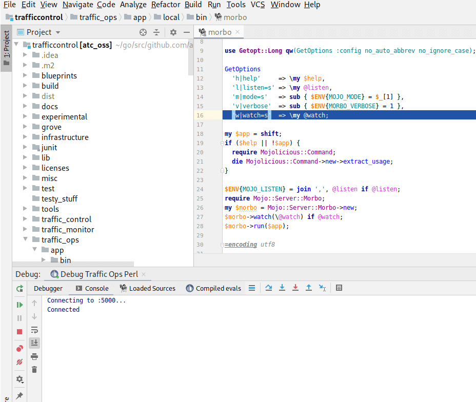

..
..
.. Licensed under the Apache License, Version 2.0 (the "License");
.. you may not use this file except in compliance with the License.
.. You may obtain a copy of the License at
..
..     http://www.apache.org/licenses/LICENSE-2.0
..
.. Unless required by applicable law or agreed to in writing, software
.. distributed under the License is distributed on an "AS IS" BASIS,
.. WITHOUT WARRANTIES OR CONDITIONS OF ANY KIND, either express or implied.
.. See the License for the specific language governing permissions and
.. limitations under the License.
..

.. role:: bash(code)
	:language: bash

.. _dev-debugging-ciab:

*****************************
Debugging inside CDN-in-a-Box
*****************************

Some CDN-in-a-Box components can be used with a debugger to step through lines of code, set breakpoints, see the state of all variables in each scope, etc. at runtime. Components that support debugging:

* `Traffic Monitor`_
* `Traffic Ops (Go)`_
* `Traffic Ops Perl`_
* `Traffic Router`_
* `Traffic Stats`_

Traffic Monitor
===============

* Navigate to the ``infrastructure/cdn-in-a-box`` directory. Remove the existing RPMs because they contain release Go binaries do not include useful debugging information. Rebuild the RPMs with no optimization, for debugging:

.. code-block:: shell
	:caption: Remove release RPMs, then build debug RPMs

	make very-clean
	make debug

.. tip:: If you have gone through the steps to :ref:`dev-building-natively`, you can run ``make debug native`` instead of ``make debug`` to build the RPMs quickly.

* Still in ``infrastructure/cdn-in-a-box``, open ``variables.env`` and set ``TM_DEBUG_ENABLE`` to ``true``.

* Stop CDN-in-a-Box if it is running and remove any existing volumes. Rebuild the ``trafficmonitor`` image to make sure it uses our fresh ``traffic_monitor.rpm``. Then, start CDN-in-a-Box.

.. code-block:: shell
	:caption: docker-compose command for debugging Traffic Monitor

	alias mydc='docker-compose -f docker-compose.yml -f docker-compose.expose-ports.yml optional/docker-compose.debugging.yml'
	mydc down -v
	mydc build trafficmonitor-nondebug trafficmonitor
	mydc up

* Install `an IDE that supports delve <https://github.com/go-delve/delve/blob/master/Documentation/EditorIntegration.md>`_ and create a debugging configuration over port 2344. If you are using VS Code, the configuration should look like this:

.. code-block:: json
	:caption: VS Code launch.json for debugging Traffic Monitor

	{
		"version": "0.2.0",
		"configurations": [
			{
				"name": "Traffic Monitor",
				"type": "go",
				"request": "attach",
				"mode": "remote",
				"port": 2344,
				"cwd": "${workspaceRoot}/traffic_monitor",
				"remotePath": "/tmp/go/src/github.com/apache/trafficcontrol/traffic_monitor",
			}
		]
	}

* Use the debugging configuration you created to start debugging Traffic Monitor. It should connect without first breaking at any line.

For an example of usage, set a breakpoint at `the o.m.RLock() call in ThreadsafeEvents.Get() <https://github.com/apache/trafficcontrol/blob/RELEASE-4.0.0-RC3/traffic_monitor/health/event.go#L69>`_, then visit http://trafficmonitor.infra.ciab.test/publish/EventLog (see :ref:`Traffic Monitor APIs: /publish/EventLog <tm-publish-EventLog>`).

Traffic Ops (Go)
================

* Navigate to the ``infrastructure/cdn-in-a-box`` directory. Remove the existing RPMs because they contain release Go binaries do not include useful debugging information. Rebuild the RPMs with no optimization, for debugging:

.. code-block:: shell
	:caption: Remove release RPMs, then build debug RPMs

	make very-clean
	make debug

.. tip:: If you have gone through the steps to :ref:`dev-building-natively`, you can run ``make debug native`` instead of ``make debug`` to build the RPMs quickly.

* Still in ``infrastructure/cdn-in-a-box``, open ``variables.env`` and set ``TO_DEBUG_ENABLE`` to ``true``.

* Stop CDN-in-a-Box if it is running and remove any existing volumes. Rebuild the ``trafficops-go`` image to make sure it uses our fresh ``traffic_ops.rpm``. Then, start CDN-in-a-Box.

.. code-block:: shell
	:caption: docker-compose command for debugging Traffic Ops

	alias mydc='docker-compose -f docker-compose.yml -f docker-compose.expose-ports.yml optional/docker-compose.debugging.yml'
	mydc down -v
	mydc build trafficops-nondebug trafficops
	mydc up

* Install `an IDE that supports delve <https://github.com/go-delve/delve/blob/master/Documentation/EditorIntegration.md>`_ and create a debugging configuration over port 2345. If you are using VS Code, the configuration should look like this:

.. code-block:: json
	:caption: VS Code launch.json for debugging Traffic Ops

	{
		"version": "0.2.0",
		"configurations": [
			{
				"name": "Traffic Ops",
				"type": "go",
				"request": "attach",
				"mode": "remote",
				"port": 2345,
				"cwd": "${workspaceRoot}/traffic_ops/traffic_ops_golang",
				"remotePath": "/tmp/go/src/github.com/apache/trafficcontrol/traffic_ops/traffic_ops_golang",
			}
		]
	}

* Use the debugging configuration you created to start debugging Traffic Ops. It should connect without first breaking at any line.

For an example of usage, set a breakpoint at `the log.Debugln() call in TOProfile.Read() <https://github.com/apache/trafficcontrol/blob/RELEASE-4.0.0-RC3/traffic_ops/traffic_ops_golang/profile/profiles.go#L129>`_, then visit https://trafficportal.infra.ciab.test/api/1.5/profiles (after logging into :ref:`tp-overview`).

Traffic Ops Perl
================

.. deprecated:: ATCv4

* Go to ``infrastructure/cdn-in-a-box`` and open ``variables.env``:

	- Set ``TO_PERL_DEBUG_ENABLE`` to ``true``
	- Set ``TO_PERL_PORT`` to ``80`` (Camelcadedb will recurse indefinitely if you try debugging requests over HTTPS).
	- Set ``TO_PERL_SCHEME`` to ``http`` (same reason as for ``TO_PERL_PORT``)
	- Save and close ``variables.env``.

* Go to ``traffic_ops/app`` and install the Perl modules.

.. code-block:: shell
	:caption: Install the Perl modules locally

	export PERL5LIB=$(pwd)/local/lib/perl5
	cpanm -l ./local Carton
	local/bin/carton install

* Install IntelliJ IDEA Community Edition.

* Get the `Camelcade <https://github.com/Camelcade/Perl5-IDEA>`_ plugin.

* Make a new Perl Remote Debugging debug configuration:

	- The remote project root should be ``/opt/``
	- Change "Connection mode" to "IDE connects to the perl process".
	- Server host can remain ``localhost`` or be blank.
	- Keep the server port at 5000.

* Next, start CDN-in-a-Box with exposed ports and debugging containers:

.. code-block:: shell
	:caption: docker-compose command for debugging Traffic Ops Perl

	alias mydc='docker-compose -f docker-compose.yml -f docker-compose.expose-ports.yml optional/docker-compose.debugging.yml'
	mydc down -v
	mydc up --build

* Watch the ``trafficops-perl`` container so you know when Perl is listening for the IDE connection:

.. code-block:: shell
	:caption: Watch the ``trafficops-perl`` container's logs

	mydc logs -f trafficops-perl

* Wait until you see this line in the logs. Alternatively, wait about 1 minute after all of the containers start. If you try to debug too early, just wait a few seconds and try again.

	``Listening for the IDE connection at 0.0.0.0:5000...``

* Start debugging using the configuration you created. If everything works so far, your IDE should highlight the line that execution is halted at within ``morbo``, the Perl web server we are using for debugging (see screenshot).

	Debugging connection breakpoint

* Resume/continue execution by pressing F9 or by clicking the "play" button in the debugging panel. At this point, you can set more breakpoints. **Camelcadedb has the limitation that new breakpoints are only recognized if you set them while the debugger is at a breakpoint or before the IDE connects.**

For an example of usage, set a breakpoint at `the $self->success() call at the end of API::Cdn->index() <https://github.com/apache/trafficcontrol/blob/RELEASE-4.0.0-RC3/traffic_ops/app/lib/API/Cdn.pm#L47>`_, restart CDN-in-a-Box, and use the Python client for Traffic Ops (which is installed in the ``cache`` Docker image) to hit the :ref:`to-api-cdns` endpoint:

.. code-block:: shell
	:caption: Authenticates and GETs http://trafficops-perl/api/1.3/cdns

	docker-compose exec mid toget --to-user=admin --to-password=twelve --to-url=http://trafficops-perl cdns

Use the :ref:`routing blacklist feature <admin-routing-blacklist>`  to route from Traffic Ops to Traffic Ops Perl, which will yield more consistent results.

Traffic Router
==============

* Navigate to the ``infrastructure/cdn-in-a-box`` directory.

* In ``variables.env``, set ``TR_DEBUG_ENABLE`` to ``true``.

* Install a debugging-capabe Java IDE or text editor of your choice. If unsure, install IntelliJ IDEA Community Edition.

* At the base of the repository (not in the ``cdn-in-a-box`` directory), open the ``traffic_router`` directory in your IDE.

* Add a new "Remote" (Java) debug configuration. Use port 5005.

* Start CDN-in-a-Box, including the "expose ports" "debugging" compose files:

.. code-block:: shell
	:caption: docker-compose command for debugging Traffic Router

	alias mydc='docker-compose -f docker-compose.yml -f docker-compose.expose-ports.yml -f optional/docker-compose.debugging.yml'
	mydc down -v
	mydc build trafficrouter
	mydc up -d
	mydc logs --follow trafficrouter

* Watch the ``trafficrouter`` container's log. After DNS and certificate operations, the enroller, and Traffic Monitor, Traffic Router will start. Look for ``Listening for transport dt_socket at address: 5005`` in the example log below:

.. code-block:: shell
	:caption: Log of the Docker container for Traffic Router

	        Warning:
	        The JKS keystore uses a proprietary format. It is recommended to migrate to PKCS12 which is an industry standard format using "keytool -importkeystore -srckeystore /opt/traffic_router/conf/keyStore.jks -destkeystore /opt/traffic_router/conf/keyStore.jks -deststoretype pkcs12".
	        Certificate stored in file <trafficrouter.infra.ciab.test.crt>

	        Warning:
	        The JKS keystore uses a proprietary format. It is recommended to migrate to PKCS12 which is an industry standard format using "keytool -importkeystore -srckeystore /opt/traffic_router/conf/keyStore.jks -destkeystore /opt/traffic_router/conf/keyStore.jks -deststoretype pkcs12".
	        Waiting for enroller initial data load to complete....
	        Waiting for enroller initial data load to complete....
	        Waiting for enroller initial data load to complete....
	        Waiting for enroller initial data load to complete....
	        Waiting for enroller initial data load to complete....
	        Waiting for enroller initial data load to complete....
	        Waiting for enroller initial data load to complete....
	        Waiting for enroller initial data load to complete....
	        Waiting for enroller initial data load to complete....
	        Waiting for Traffic Monitor to start...
	        Waiting for Traffic Monitor to start...
	        Waiting for Traffic Monitor to start...
	        Waiting for Traffic Monitor to start...
	        Waiting for Traffic Monitor to start...
	        Waiting for Traffic Monitor to start...
	        Waiting for Traffic Monitor to start...
	        Waiting for Traffic Monitor to start...
	        Waiting for Traffic Monitor to start...
	        Waiting for Traffic Monitor to start...
	        Waiting for Traffic Monitor to start...
	        Waiting for Traffic Monitor to start...
	        Waiting for Traffic Monitor to start...
	        Waiting for Traffic Monitor to start...
	        Waiting for Traffic Monitor to start...
	        Waiting for Traffic Monitor to start...
	        Waiting for Traffic Monitor to start...
	        Waiting for Traffic Monitor to start...
	        Waiting for Traffic Monitor to start...
	        Waiting for Traffic Monitor to start...
	        Waiting for Traffic Monitor to start...
	        Waiting for Traffic Monitor to start...
	        Waiting for Traffic Monitor to start...
	        Waiting for Traffic Monitor to start...
	        Waiting for Traffic Monitor to start...
	        Waiting for Traffic Monitor to start...
	        tail: cannot open '/opt/tomcat/logs/catalina.log' for reading: No such file or directory
	        tail: cannot open '/opt/tomcat/logs/catalina.2020-02-21.log' for reading: No such file or directory
	        ==> /opt/traffic_router/var/log/traffic_router.log <==

	        ==> /opt/traffic_router/var/log/access.log <==
	        Tomcat started.
	        tail: '/opt/tomcat/logs/catalina.log' has appeared;  following end of new file
	        tail: '/opt/tomcat/logs/catalina.2020-02-21.log' has appeared;  following end of new file

	        ==> /opt/traffic_router/var/log/traffic_router.log <==
	        INFO  2020-02-21T05:16:07.557 [Thread-3] com.comcast.cdn.traffic_control.traffic_router.protocol.LanguidPoller - Waiting for state from mbean path traffic-router:name=languidState
	        INFO  2020-02-21T05:16:07.557 [Thread-4] com.comcast.cdn.traffic_control.traffic_router.protocol.LanguidPoller - Waiting for state from mbean path traffic-router:name=languidState
	        INFO  2020-02-21T05:16:07.558 [Thread-5] com.comcast.cdn.traffic_control.traffic_router.protocol.LanguidPoller - Waiting for state from mbean path traffic-router:name=languidState
	        INFO  2020-02-21T05:16:07.559 [Thread-6] com.comcast.cdn.traffic_control.traffic_router.protocol.LanguidPoller - Waiting for state from mbean path traffic-router:name=languidState

	        ==> /opt/tomcat/logs/catalina.log <==
	        Listening for transport dt_socket at address: 5005

	Watch for the line that mentions port 5005 -----------^^^^

	        ==> /opt/tomcat/logs/catalina.2020-02-21.log <==
	        21-Feb-2020 05:16:07.359 WARNING [main] com.comcast.cdn.traffic_control.traffic_router.protocol.LanguidNioProtocol.<clinit> Adding BouncyCastle provider
	        21-Feb-2020 05:16:07.452 WARNING [main] com.comcast.cdn.traffic_control.traffic_router.protocol.LanguidNioProtocol.<init> Serving wildcard certs for multiple domains
	        21-Feb-2020 05:16:07.459 WARNING [main] com.comcast.cdn.traffic_control.traffic_router.protocol.LanguidNioProtocol.<init> Serving wildcard certs for multiple domains
	        21-Feb-2020 05:16:07.459 WARNING [main] com.comcast.cdn.traffic_control.traffic_router.protocol.LanguidNioProtocol.<init> Serving wildcard certs for multiple domains
	        21-Feb-2020 05:16:07.461 INFO [main] com.comcast.cdn.traffic_control.traffic_router.protocol.LanguidNioProtocol.setSslImplementationName setSslImplementation: com.comcast.cdn.traffic_control.traffic_router.protocol.RouterSslImplementation

* When you see that Tomcat is listening for debugger connections on port 5005, start debugging using the debug configuration that you created.

Traffic Stats
===============

* Navigate to the ``infrastructure/cdn-in-a-box`` directory. Remove the existing RPMs because they contain release Go binaries do not include useful debugging information. Rebuild the RPMs with no optimization, for debugging:

.. code-block:: shell
	:caption: Remove release RPMs, then build debug RPMs

	make very-clean
	make debug

.. tip:: If you have gone through the steps to :ref:`dev-building-natively`, you can run ``make debug native`` instead of ``make debug`` to build the RPMs quickly.

* Still in ``infrastructure/cdn-in-a-box``, open ``variables.env`` and set ``TS_DEBUG_ENABLE`` to ``true``.

* Stop CDN-in-a-Box if it is running and remove any existing volumes. Rebuild the ``trafficstats`` image to make sure it uses our fresh ``traffic_stats.rpm``. Then, start CDN-in-a-Box.

.. code-block:: shell
	:caption: docker-compose command for debugging Traffic Stats

	alias mydc='docker-compose -f docker-compose.yml -f docker-compose.expose-ports.yml optional/docker-compose.debugging.yml'
	mydc down -v
	mydc build trafficstats-nondebug trafficstats
	mydc up

* Install `an IDE that supports delve <https://github.com/go-delve/delve/blob/master/Documentation/EditorIntegration.md>`_ and create a debugging configuration over port 2346. If you are using VS Code, the configuration should look like this:

.. code-block:: json
	:caption: VS Code launch.json for debugging Traffic Stats

	{
		"version": "0.2.0",
		"configurations": [
			{
				"name": "Traffic Stats",
				"type": "go",
				"request": "attach",
				"mode": "remote",
				"port": 2346,
				"cwd": "${workspaceRoot}/traffic_stats",
				"remotePath": "/tmp/go/src/github.com/apache/trafficcontrol/traffic_stats",
			}
		]
	}

* Use the debugging configuration you created to start debugging Traffic Stats. It should connect without first breaking at any line.

For an example of usage, set a breakpoint at `the http.Get() call in main.getURL() <https://github.com/apache/trafficcontrol/blob/RELEASE-4.1.0/traffic_stats/traffic_stats.go#L727>`_, then wait 10 seconds for the breakpoint to be hit.

Troubleshooting
===============

* If you are debugging a Golang project and you don't see the values of all variables, or stepping to the next line puts you several lines ahead, rebuild the Docker image with an RPM built using :bash:`make debug`.

* If you are trying to debug Traffic Ops Perl but the page hangs and you see this warning in the ``trafficops-perl`` container's log:

.. code-block:: shell
	:caption: Infinite recursion problem with Devel::Camelcadedb when trying to debug a page served over HTTPS

	Deep recursion on subroutine "DB::_get_reference_descriptor" at /usr/local/share/perl5/Devel/Camelcadedb.pm line 584.

Make sure Traffic Ops Perl is serving pages over HTTP, not HTTPS.
