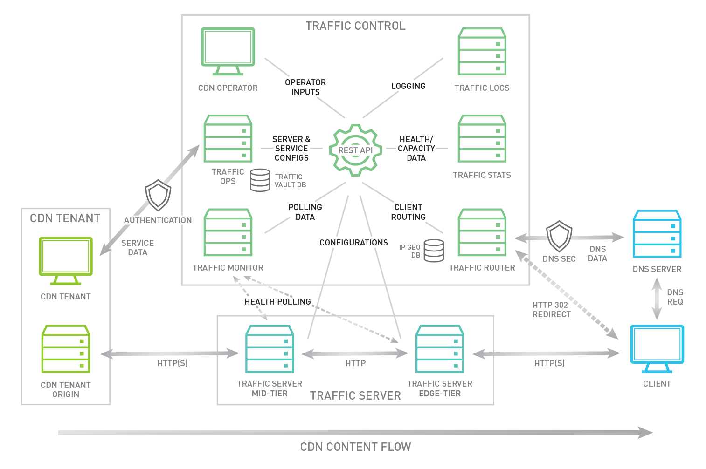

.. 
.. 
.. Licensed under the Apache License, Version 2.0 (the "License");
.. you may not use this file except in compliance with the License.
.. You may obtain a copy of the License at
.. 
..     http://www.apache.org/licenses/LICENSE-2.0
.. 
.. Unless required by applicable law or agreed to in writing, software
.. distributed under the License is distributed on an "AS IS" BASIS,
.. WITHOUT WARRANTIES OR CONDITIONS OF ANY KIND, either express or implied.
.. See the License for the specific language governing permissions and
.. limitations under the License.
.. 

Introduction
============
Traffic Control is a CDN control plane, which includes all of the components listed below. The CDN caching software chosen for Traffic Control is `Apache Traffic Server <http://trafficserver.apache.org/>`_ (ATS). Although the current release only supports ATS as a cache, this may change with future releases. 

Traffic Control was first developed at Comcast for internal use and released to Open Source in April of 2015. Traffic Control moved into the Apache Incubator in August of 2016.

Traffic Control implements the elements illustrated in green in the diagram  below. 

**Traffic Ops**
  *`_Traffic Ops <http://trafficcontrol.apache.org/docs/latest/overview/traffic_ops.html>`_ is used configure Traffic Servers and CDN Delivery Services. It also contains APIs used to access CDN data.

**Traffic Router**
  *`_Traffic Router <http://trafficcontrol.apache.org/docs/latest/overview/traffic_ops.html>`_ is used to route clients with the closest healthy cache by analyzing the state of the Traffic Servers and the the location of the Client.

**Traffic Monitor**
  *`_Traffic Monitor <http://trafficcontrol.apache.org/docs/latest/overview/traffic_monitor.html>`_ does health polling of the Traffic Servers on a very short interval to keep track of which servers should be kept in rotation.

**Traffic Stats**
  *`_Traffic Stats <http://trafficcontrol.apache.org/docs/latest/overview/traffic_stats.html>`_ collects real time traffic statistics aggregated from each of the Traffic Servers. This data is used by the Traffic Router to assess whether a Traffic Server is over taxed.

**Traffic Portal**
  *`_Traffic Portal <http://trafficcontrol.apache.org/docs/latest/overview/traffic_portal.html>`_ is a web application which leverages the Traffic Ops APIs to present CDN data through a web interface.

**Traffic Logs**
*Traffic Logs is currently under construction with the intent of being an aggregator for all Traffic Server request and response logs.  Logs are parsed by service and indexed for search.

In the next sections each of these components will be explained further.
