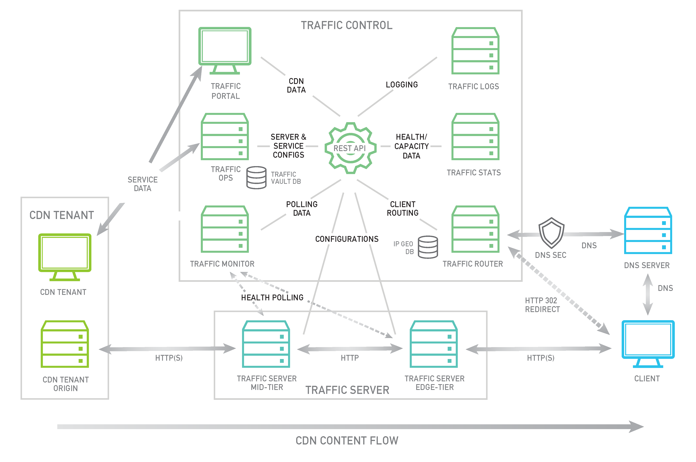

.. 
.. 
.. Licensed under the Apache License, Version 2.0 (the "License");
.. you may not use this file except in compliance with the License.
.. You may obtain a copy of the License at
.. 
..     http://www.apache.org/licenses/LICENSE-2.0
.. 
.. Unless required by applicable law or agreed to in writing, software
.. distributed under the License is distributed on an "AS IS" BASIS,
.. WITHOUT WARRANTIES OR CONDITIONS OF ANY KIND, either express or implied.
.. See the License for the specific language governing permissions and
.. limitations under the License.
.. 

Introduction
============
Traffic Control is a caching server control plane application which is used to aggregate caching servers into a Content Delivery Network (CDN). The CDN caching software chosen for Traffic Control is `Apache Traffic Server <http://trafficserver.apache.org/>`_ (ATS). Although the current release only supports ATS as a cache, this may change with future releases. 

Traffic Control was first developed at Comcast for internal use and released to Open Source in April of 2015. Traffic Control moved into the Apache Incubator in August of 2016.

Traffic Control implements the elements illustrated in green in the diagram  below. 

**Traffic Ops**
  * `Traffic Ops <http://trafficcontrol.apache.org/docs/latest/overview/traffic_ops.html/>`_ is used to configure caching  servers and CDN delivery services. It also contains APIs used to access CDN data.

**Traffic Router**
  * `Traffic Router <http://trafficcontrol.apache.org/docs/latest/overview/traffic_router.html/>`_ is used to route clients requests to the closest healthy cache by analyzing the health, capacity, and state of the caching servers and relative distance from each cache group to the location of the client.

**Traffic Monitor**
  * `Traffic Monitor <http://trafficcontrol.apache.org/docs/latest/overview/traffic_monitor.html/>`_ does health polling of the caching servers on a very short interval to keep track of which servers should be kept in rotation.

**Traffic Stats**
  * `Traffic Stats <http://trafficcontrol.apache.org/docs/latest/overview/traffic_stats.html/>`_ collects real time traffic statistics aggregated from each of the caching servers. This data is used by the Traffic Router to assess the available capacity of each caching server which it uses to balance traffic load and prevent overload.

**Traffic Portal**
  * `Traffic Portal <http://trafficcontrol.apache.org/docs/latest/overview/traffic_portal.html/>`_ is a web application which leverages the Traffic Ops APIs to present CDN data through a web interface.

**Traffic Logs**
  * Traffic Logs is currently under construction and is intended  to aggregate Traffic Server request/response logs as well as other server logs.  Logs will be parsed and indexed for search.

In the next sections each of these components will be explained further.

